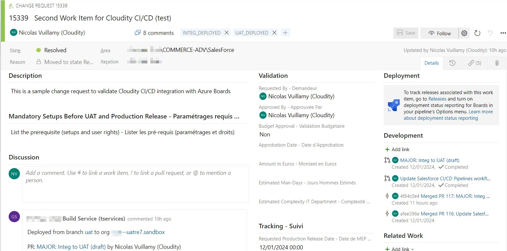

<!-- markdownlint-disable MD013 -->

- [Azure Boards integration](#azure-boards-integration)
  - [Update Work Items](#update-work-items)
- [Technical notes](#technical-notes)

## Azure Boards integration

If you use Azure Boards work items on your project, sfdx-hardis can use them to enrich its integrations.

sfdx-hardis automatically analyzes commits and Pull Request descriptions to collect work item references.

Make sure to link your work items to your Pull Requests before submitting them.

### Update Work Items

Add **comments** and **tags** on work items when they are deployed in a major org.

The default tag is `UPPERCASE(branch_name) + "_DEPLOYED"`.

To override it, define the environment variable **DEPLOYED_TAG_TEMPLATE**, which must contain `{BRANCH}`.

Example: `DEPLOYED_TO_{BRANCH}`

## Technical notes

This integration uses the following variables, which must be available from the pipelines:

- SYSTEM_COLLECTIONURI
- SYSTEM_ACCESSTOKEN
- SYSTEM_TEAMPROJECT
- BUILD_REPOSITORY_ID
