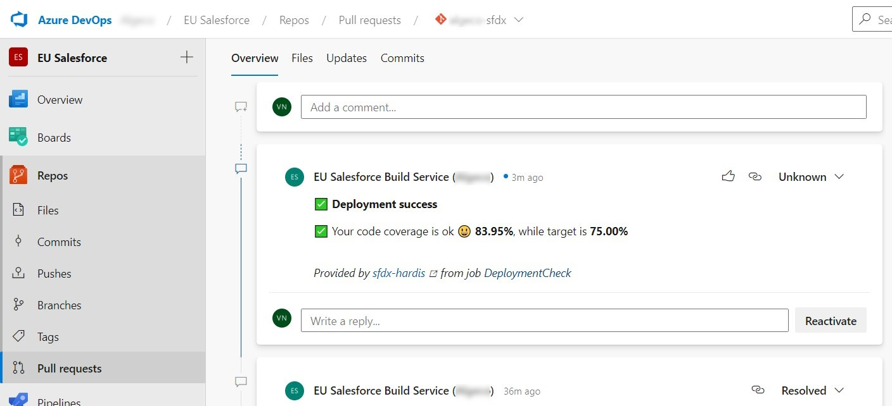

<!-- markdownlint-disable MD013 -->

## Azure Pull Request notes

In order to avoid to have to open job logs to see deployment errors, sfdx-hardis can post them as a thread on the Pull Request UI

To use this capability:

- A build policy must be defined

  - See <https://docs.microsoft.com/en-US/azure/devops/repos/git/branch-policies?view=azure-devops&tabs=browser#build-validation>

- You must allow **Contribute** and **Contribute to Pull Requests** on your Build Service (Settings -> Repositories -> Select your build service)

Everytime you will make a pull request, the CI job will post its result as comment !

- Example with deployment errors

- Example with failing test classes

- Example when all is ok :)

Notes:

- This integration works with sfdx-hardis pipeline, but also on home-made pipelines, just call [sf hardis:source:deploy](https://sfdx-hardis.cloudity.com/hardis/source/deploy/) instead of `sfdx force:source:deploy` !

- This integration use the following variables:
  - SYSTEM_ACCESSTOKEN: $(System.AccessToken)
  - CI_SFDX_HARDIS_AZURE_TOKEN: $(System.AccessToken)
  - SYSTEM_COLLECTIONURI: $(System.CollectionUri)
  - SYSTEM_JOB_DISPLAY_NAME: $(System.JobDisplayName)
  - SYSTEM_JOB_ID: $(System.JobId)
  - SYSTEM_PULLREQUEST_PULLREQUESTID: $(System.PullRequest.PullRequestId)
  - SYSTEM_TEAMPROJECT: $(System.TeamProject)
  - BUILD_BUILD_ID: $(Build.BuildId)
  - BUILD_REPOSITORY_ID: $(Build.Repository.ID)
