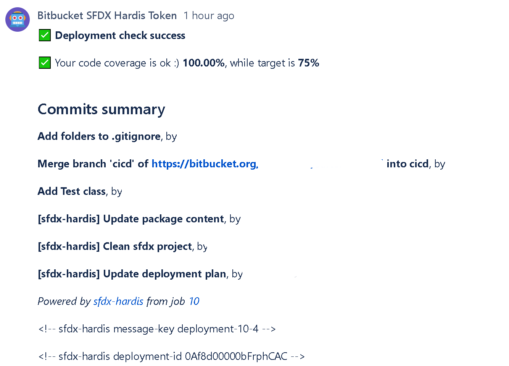

<!-- markdownlint-disable MD013 -->

## Bitbucket Pull Request comments

In order to avoid to have to open job logs to see deployment errors, sfdx-hardis can post them as a comment on the Pull Request UI

To use this capability:

- Go to **Repository Settings -> Access Tokens**  Create Repository Access Token with the following scopes:
  - pullrequest
  - pullrequest:write
  - repository
  - repository:write
- Go to **Repository Settings > Repository Variables** Create a variable named CI_SFDX_HARDIS_BITBUCKET_TOKEN and provide the access token value

Everytime you will make a pull request, the CI job will post its result as a comment !

- Example when all is ok :)

Notes:

- This integration works with sfdx-hardis pipeline, but also on home-made pipelines, just call [sf hardis:source:deploy](https://sfdx-hardis.cloudity.com/hardis/source/deploy/) instead of `sfdx force:source:deploy` !

- This integration uses the following variables:
  - CI_SFDX_HARDIS_BITBUCKET_TOKEN
  - BITBUCKET_WORKSPACE
  - BITBUCKET_REPO_SLUG
  - BITBUCKET_BRANCH
  - BITBUCKET_PR_ID
  - BITBUCKET_BUILD_NUMBER