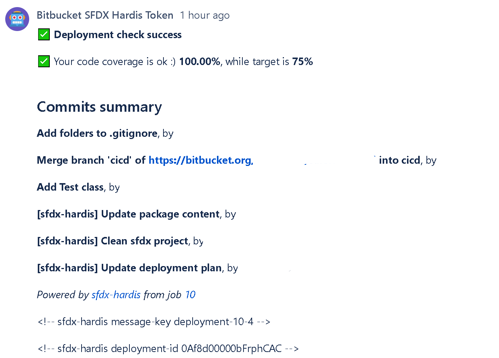

<!-- markdownlint-disable MD013 -->

## Bitbucket Pull Request comments

In order to avoid to have to open job logs to see deployment errors, sfdx-hardis can post them as a comment on the Pull Request UI

To use this capability:

- Go to **Repository Settings -> Access Tokens**  Create Repository Access Token with the following scopes:
  - pullrequest
  - pullrequest:write
  - repository
  - repository:write
- Go to **Repository Settings > Repository Variables** Create a variable named CI_SFDX_HARDIS_BITBUCKET_TOKEN and provide the access token value

Everytime you will make a pull request, the CI job will post its result as a comment !

- Example when all is ok :)


Notes:

- This integration works with sfdx-hardis pipeline, but also on home-made pipelines, just call [sf hardis:project:deploy:start](https://sfdx-hardis.cloudity.com/hardis/project/deploy/start/) instead of `sf project:deploy:start` !

- This integration uses the following variables:
  - CI_SFDX_HARDIS_BITBUCKET_TOKEN
  - BITBUCKET_WORKSPACE
  - BITBUCKET_REPO_SLUG
  - BITBUCKET_BRANCH
  - BITBUCKET_PR_ID
  - BITBUCKET_BUILD_NUMBER

## Instructions for using Coding Agents

When using auto-fix with coding agents, the pipeline must be able to push a fix branch and create/update Pull Requests.

This works for both:

- Bitbucket Cloud
- Bitbucket Data Center / Server (on-premise)

Add this in your pipeline script before running `sf hardis:*` commands:

```yaml
- |
    if [ -n "${CI_SFDX_HARDIS_BITBUCKET_TOKEN:-}" ]; then
      git config user.email "sfdx-hardis-bot@cloudity.com"
      git config user.name "sfdx-hardis Bot"
      ORIGIN_PATH=$(git remote get-url origin | sed -E 's#^https?://##; s#^git@([^:]+):#\1/#; s#^ssh://git@([^/]+)/#\1/#; s#\.git$##')
      git remote set-url origin "https://x-token-auth:${CI_SFDX_HARDIS_BITBUCKET_TOKEN}@${ORIGIN_PATH}.git"
      echo "[sfdx-hardis] Bitbucket push/PR auth enabled for coding agents"
    else
      echo "[sfdx-hardis] Skipping coding-agent Bitbucket auth setup: CI_SFDX_HARDIS_BITBUCKET_TOKEN is not set"
    fi
```

Required secret/variable:

- `CI_SFDX_HARDIS_BITBUCKET_TOKEN`:
  - Go to **Repository Settings -> Access Tokens**.
  - Create a repository access token with scopes: `pullrequest`, `pullrequest:write`, `repository`, `repository:write`.
  - Store it as a secured repository variable named `CI_SFDX_HARDIS_BITBUCKET_TOKEN`.