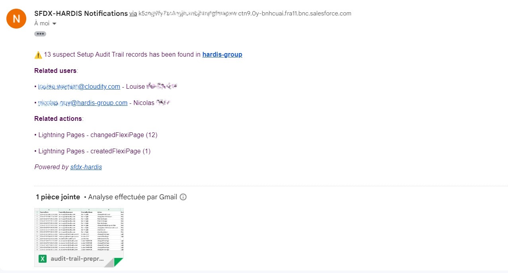
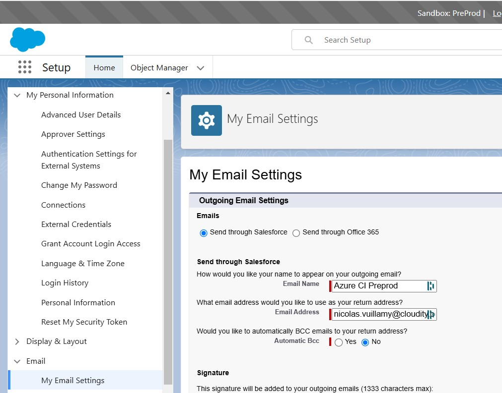

<!-- markdownlint-disable MD013 -->

## Email Integration

You can receive notifications on one or multiple e-mail addresses when sfdx-hardis events are happening:

- Deployment from a major branch to a major Salesforce org (ex: integration git branch to Integration Org)
- Salesforce [Org Monitoring](salesforce-monitoring-home.md)
  - Latest updates
  - Failing apex tests
  - Monitoring checks notifications

Note: Salesforce email sending capabilities are used, so every email will count in your org daily email limit.

## Configuration

Define CI/CD variable **NOTIF_EMAIL_ADDRESS** with the related email(s)

Examples:

- `NOTIF_EMAIL_ADDRESS=admin@cloudity.com`
- `NOTIF_EMAIL_ADDRESS=admin@cloudity.com,another.user@cloudity.com,nico@cloudity.com`

## Troubleshooting

If the emails are not sent, apply the following configuration on the Monitoring / Deployment user settings

- Send through Salesforce

That's all, you're all set !

