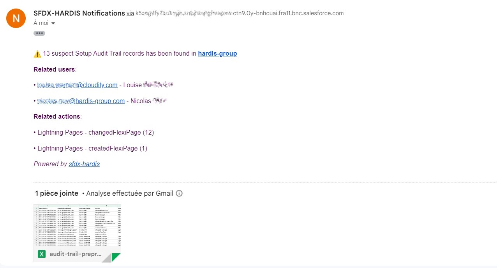
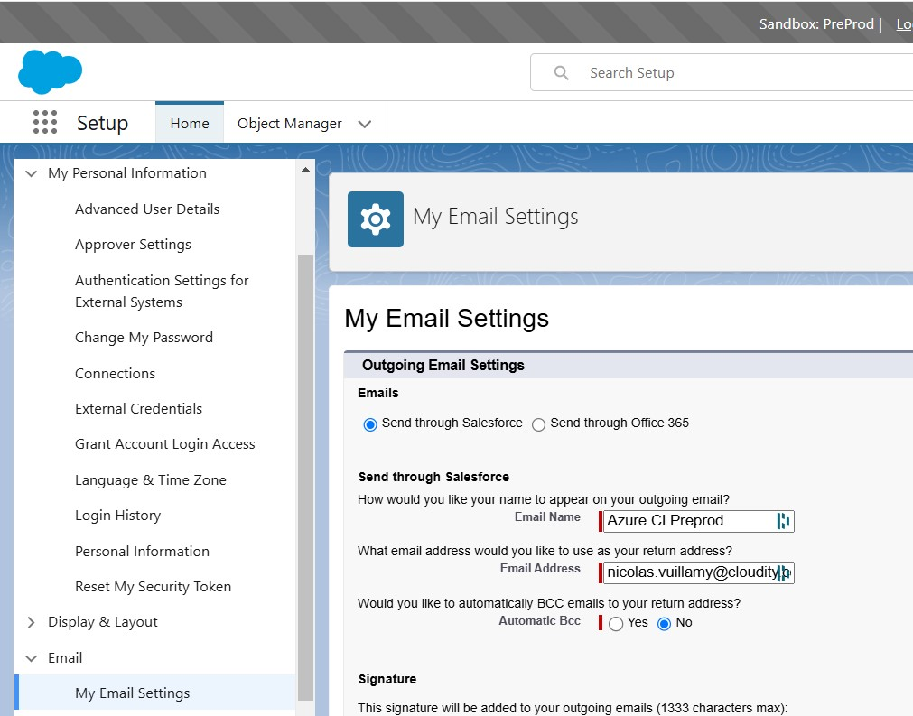

<!-- markdownlint-disable MD013 -->

## Email Integration

You can receive notifications on one or multiple e-mail addresses when sfdx-hardis events are happening:

- Deployment from a major branch to a major Salesforce org (ex: integration git branch to Integration Org)
- Salesforce [Org Monitoring](salesforce-monitoring-home.md)
  - Latest updates
  - Failing apex tests
  - Monitoring checks notifications

Note: Salesforce email sending capabilities are used, so every email will count in your org daily email limit.



## Configuration

Define CI/CD variable **NOTIF_EMAIL_ADDRESS** with the related email(s)

Examples:

- `NOTIF_EMAIL_ADDRESS=admin@cloudity.com`
- `NOTIF_EMAIL_ADDRESS=admin@cloudity.com,another.user@cloudity.com,nico@cloudity.com`

You can also target additional recipients per branch (`NOTIF_EMAIL_ADDRESS_<BRANCH>`) or per notification type (`NOTIF_EMAIL_ADDRESS_<TYPE>`), e.g. `NOTIF_EMAIL_ADDRESS_AUDIT_TRAIL=security@cloudity.com`.

## Per notification type recipients (YAML)

In addition to the env-var-based recipients above, you can configure email recipients directly in `.sfdx-hardis.yml` per notification type, with optional severity threshold. This is useful to redirect a specific notification (e.g. `AUDIT_TRAIL`, `UNSECURED_CONNECTED_APPS`) to a dedicated mailing list without polluting the main recipients.

```yaml
monitoringCommands:
  - key: AUDIT_TRAIL
    notifications:
      email:
        threshold: warning           # only warning / error / critical
        recipients:
          - security@company.com
          - audit-team@company.com
        replaceRecipients: true      # ignore env-var recipients for this type
  - key: BACKUP
    notifications:
      email:
        recipients:
          - devops@company.com       # appended to env-var recipients
```

See [Monitoring configuration](salesforce-monitoring-config-home.md#fine-grained-routing-per-notification-type) for the full per-channel routing model.

## Troubleshooting

If the emails are not sent, apply the following configuration on the Monitoring / Deployment user settings

- Send through Salesforce



That's all, you're all set !


