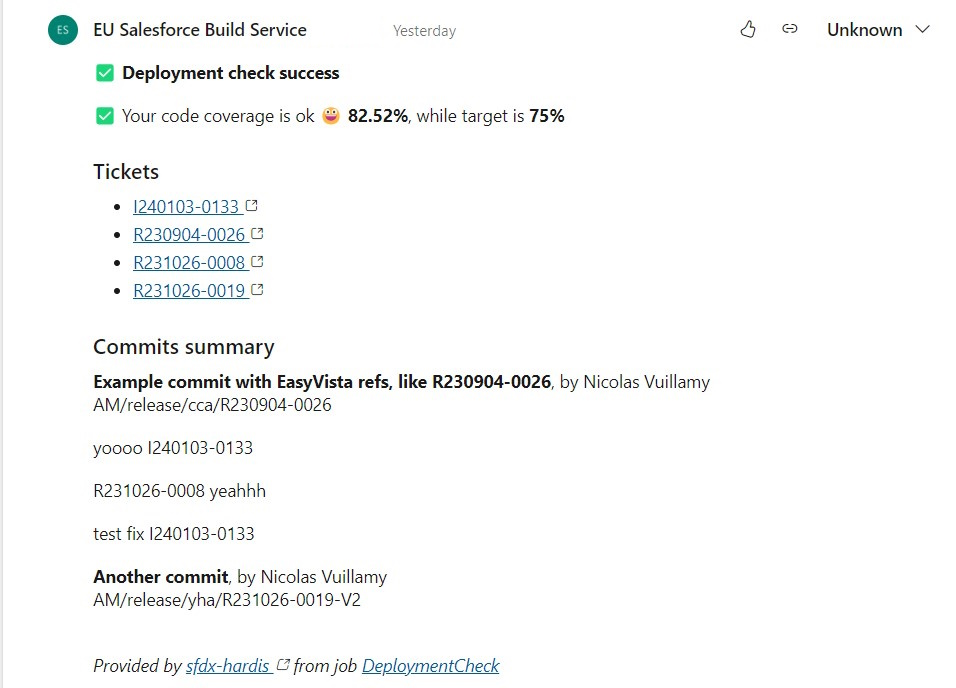

<!-- markdownlint-disable MD013 -->

- [Generic ticketing integration](#generic-ticketing-integration)
- [Configuration](#configuration)
  - [GENERIC_TICKETING_PROVIDER_REGEX](#generic_ticketing_provider_regex)
  - [GENERIC_TICKETING_PROVIDER_URL_BUILDER](#generic_ticketing_provider_url_builder)
- [Gitlab configuration](#gitlab-configuration)
- [Technical notes](#technical-notes)

## Generic ticketing integration

If you use a ticketing system on your project, sfdx-hardis can use it to enrich its integrations

Sfdx-hardis will automatically analyze commits and PR/MR descriptions to collect tickets and build their urls !



## Configuration

You need to define 2 environment variables in your CI/CD configuration

### GENERIC_TICKETING_PROVIDER_REGEX

Regular expression allowing to detect your ticketing system identifiers in the commits / PR texts.

You can use <https://regex101.com/> to check your Regular Expression.

Example: `([R|I][0-9]+-[0-9]+)` to detect EasyVista references, that can look like `I240103-0133` or
`R230904-0026`

### GENERIC_TICKETING_PROVIDER_URL_BUILDER

Template string allowing to build a hyperlink from a ticket identifier.

Must contain a **{REF}** segment that will be replaced by the ticket identifier.

Example: `https://instance.easyvista.com/index.php?ticket={REF}`

## Gitlab configuration

If you are using Gitlab, you need to update the Merge Request Settings

Go to Project -> Settings -> Merge Requests

Update **Merge Commit Message Template** with the following value

```sh
%{title} Merge branch '%{source_branch}' into '%{target_branch}'

%{issues}

See merge request %{reference}

%{description}

%{all_commits}
```

Update **Squash Commit Message Template** with the following value

```sh
%{title} Merge branch '%{source_branch}' into '%{target_branch}'

%{issues}

See merge request %{reference}

%{description}

%{all_commits}
```

## Technical notes

This integration use the following variables, that must be available from the pipelines:

- GENERIC_TICKETING_PROVIDER_REGEX
- GENERIC_TICKETING_PROVIDER_URL_BUILDER
