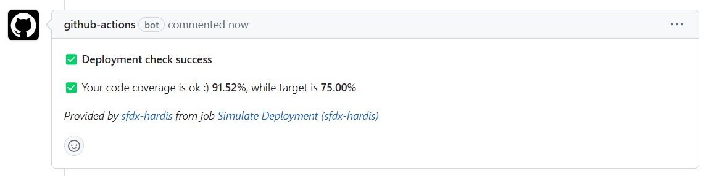
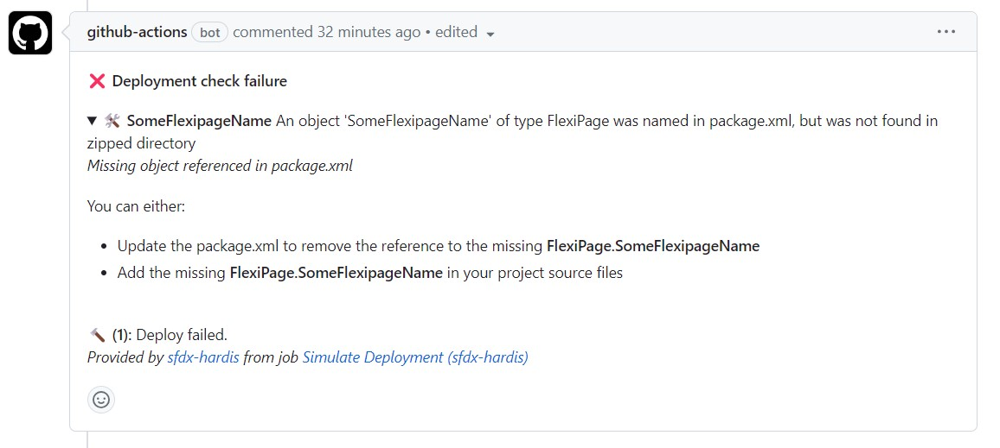

<!-- markdownlint-disable MD013 -->

## GitHub Pull Requests comments

In order to avoid to have to open job logs to see deployment errors, sfdx-hardis can post them as Comment on the Pull Request UI

To use this capability, all you need is to have **permissions on your workflows** and send your **GITHUB_TOKEN** (see [full example](https://github.com/hardisgroupcom/sfdx-hardis/blob/main/defaults/ci/.github/workflows/process-deploy.yml))

```yaml
    permissions:
      pull-requests: write

...
      env:
        GITHUB_TOKEN: ${{ secrets.GITHUB_TOKEN }}
        FORCE_COLOR: "1"
```

Everytime you will make a Pull Request, the CI job will post its result as comment !

- Example with deployment success



- Example with deployment errors



Notes:

- This integration works with sfdx-hardis pipeline, but also on home-made pipelines, just call [sf hardis:source:deploy](https://sfdx-hardis.cloudity.com/hardis/source/deploy/) instead of `sfdx force:source:deploy` !

- This integration use the following variables:

  - GITHUB_TOKEN (provided by GitHub but has to be send as option to the deployment jobs)
