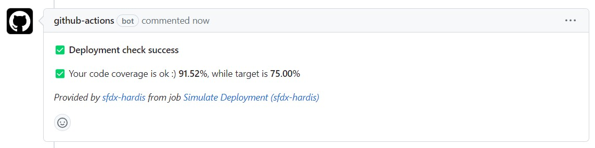
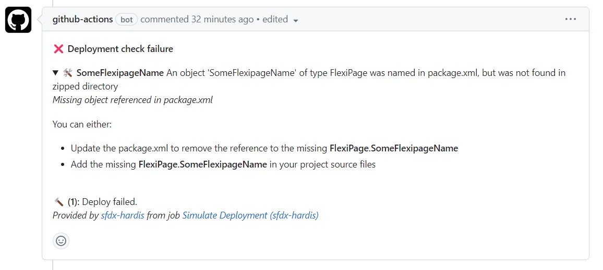

<!-- markdownlint-disable MD013 -->

## GitHub Pull Requests comments

In order to avoid to have to open job logs to see deployment errors, sfdx-hardis can post them as Comment on the Pull Request UI

To use this capability, all you need is to have **permissions on your workflows** and send your **GITHUB_TOKEN** (see [full example](https://github.com/hardisgroupcom/sfdx-hardis/blob/main/defaults/ci/.github/workflows/process-deploy.yml))

```yaml
    permissions:
      pull-requests: write

...
      env:
        GITHUB_TOKEN: ${{ secrets.GITHUB_TOKEN }}
        FORCE_COLOR: "1"
```

Everytime you will make a Pull Request, the CI job will post its result as comment !

- Example with deployment success



- Example with deployment errors



Notes:

- This integration works with sfdx-hardis pipeline, but also on home-made pipelines, just call [sf hardis:project:deploy:start](https://sfdx-hardis.cloudity.com/hardis/project/deploy/start/) instead of `sf project:deploy:start` !

- This integration use the following variables:

  - GITHUB_TOKEN (provided by GitHub but has to be send as option to the deployment jobs)

## Using GitHub integration without Github Actions

You might want to use GitHub integration with other tools than GitHub Actions, like Jenkins or Codefresh

In that case, to still benefit from GitHub integration, you need to make sure that the following variables are set.

| Variable                | Description                                                                                                                                                                    |
|:------------------------|:-------------------------------------------------------------------------------------------------------------------------------------------------------------------------------|
| GITHUB_TOKEN            | You might need to Create a [GitHub Personal Access Token](https://docs.github.com/en/authentication/keeping-your-account-and-data-secure/managing-your-personal-access-tokens) |
| GITHUB_REPOSITORY       | ex: `MyClient/crm-salesforce`                                                                                                                                                  |
| GITHUB_REPOSITORY_OWNER | ex: `MyClient`                                                                                                                                                                 |
| GITHUB_SERVER_URL       | ex: `https://github.mycompanydomain.com`                                                                                                                                       |
| GITHUB_API_URL          | ex: `https://github.mycompanydomain.com/api`                                                                                                                                   |
| GITHUB_GRAPHQL_URL      | ex: `https://github.mycompanydomain.com/api/graphql`                                                                                                                           |
| GITHUB_WORKFLOW         | ex: `Simulate Deployment (sfdx-hardis)`                                                                                                                                        |
| GITHUB_REF              | ex: `refs/pull/503/merge`                                                                                                                                                      |
| GITHUB_REF_NAME         | ex: `503/merge`                                                                                                                                                                |
| GITHUB_RUN_ID           | ex: `14282257027`. If you can't have it, to not set the variable.                                                                                                              |
| PIPELINE_JOB_URL        | Direct link to the page where we can see your job results. ex: `https://yourserver.com/jobs/345`                                                                               |

## Instructions for using Coding Agents

When using auto-fix with coding agents, the pipeline must be able to push a fix branch and create/update Pull Requests.

This works for both:

- GitHub Cloud (`github.com`)
- GitHub Enterprise Server / GitHub Enterprise Cloud custom domains

Add this in your deployment/check workflow step before running `sf hardis:*` commands:

```yaml
env:
  CI_SFDX_HARDIS_GITHUB_PUSH_TOKEN: ${{ secrets.PAT || secrets.GITHUB_TOKEN }}

run: |
  if [ -n "${CI_SFDX_HARDIS_GITHUB_PUSH_TOKEN:-}" ]; then
    git config user.email "sfdx-hardis-bot@cloudity.com"
    git config user.name "sfdx-hardis Bot"
    GITHUB_HOST=$(echo "${GITHUB_SERVER_URL:-https://github.com}" | sed -E 's#^https?://##')
    git remote set-url origin "https://x-access-token:${CI_SFDX_HARDIS_GITHUB_PUSH_TOKEN}@${GITHUB_HOST}/${GITHUB_REPOSITORY}.git"
    echo "[sfdx-hardis] GitHub push/PR auth enabled for coding agents"
  else
    echo "[sfdx-hardis] Skipping coding-agent GitHub auth setup: CI_SFDX_HARDIS_GITHUB_PUSH_TOKEN is not set"
  fi
```

Required secret/variable:

- `CI_SFDX_HARDIS_GITHUB_PUSH_TOKEN` (or `PAT`):
  - Use `secrets.GITHUB_TOKEN` if your workflow permissions include `contents: write` and `pull-requests: write`.
  - Otherwise create a fine-grained PAT with repository scopes `Contents: Read and write` and `Pull requests: Read and write`.

