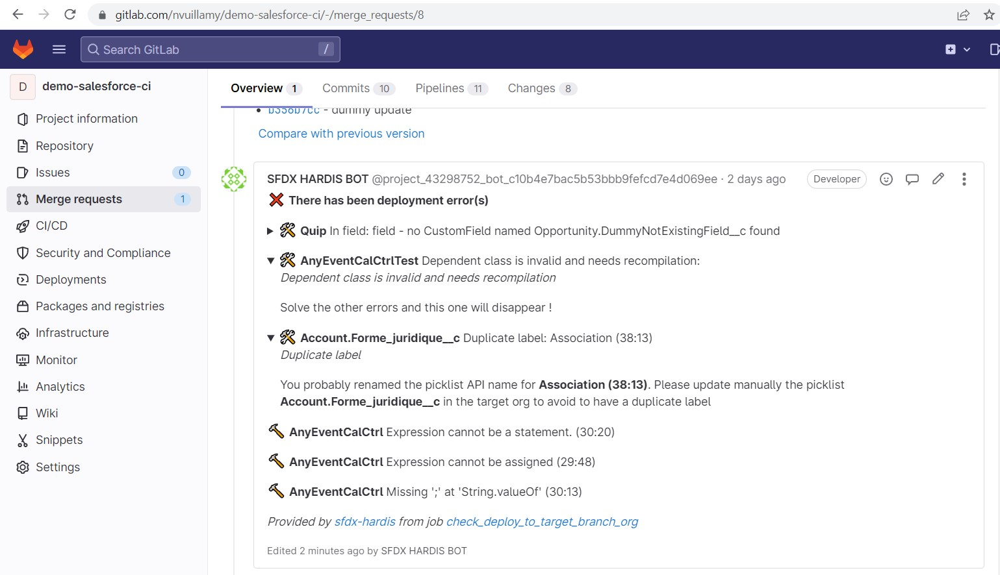

<!-- markdownlint-disable MD013 -->

## Gitlab Merge request notes

In order to avoid to have to open job logs to see deployment errors, sfdx-hardis can post them as Notes on the Merge Request UI

To use this capability:

- Go to Settings -> Access Tokens -> Create a project access token with level **Developer** and scope **api**, and name it **SFDX HARDIS BOT**
- Go to Settings -> CI/CD -> Variables -> Create a variable named **CI_SFDX_HARDIS_GITLAB_TOKEN** and past the access token value

Everytime you will make a pull request, the CI job will post its result as comment !

