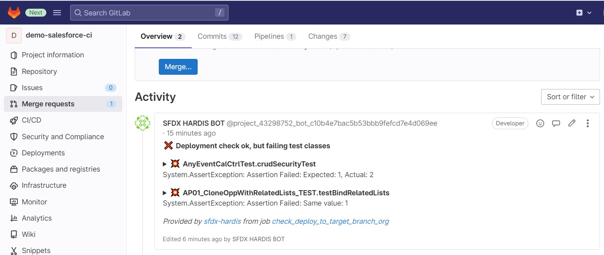

<!-- markdownlint-disable MD013 -->

## Gitlab Merge request notes

In order to avoid to have to open job logs to see deployment errors, sfdx-hardis can post them as Notes on the Merge Request UI

To use this capability:

- Go to Settings -> Access Tokens -> Create a project access token with level **Developer** and scope **api**, and name it **SFDX HARDIS BOT**

- Go to Settings -> CI/CD -> Variables -> Create a variable named **CI_SFDX_HARDIS_GITLAB_TOKEN** and past the access token value

Everytime you will make a merge request, the CI job will post its result as comment !

- Example with deployment errors

- Example with failing test classes

Notes:

- This integration works with sfdx-hardis pipeline, but also on home-made pipelines, just call [sfdx hardis:source:deploy](https://sfdx-hardis.cloudity.com/hardis/source/deploy/) instead of `sfdx force:source:deploy` !

- This integration use the following variables:
  - CI_SFDX_HARDIS_GITLAB_TOKEN
  - CI_SERVER_URL (provided by Gitlab CI)
  - CI_PROJECT_ID (provided by Gitlab CI)
  - CI_MERGE_REQUEST_IID (provided by Gitlab CI)
  - CI_JOB_NAME (provided by Gitlab CI)
  - CI_JOB_URL (provided by Gitlab CI)
