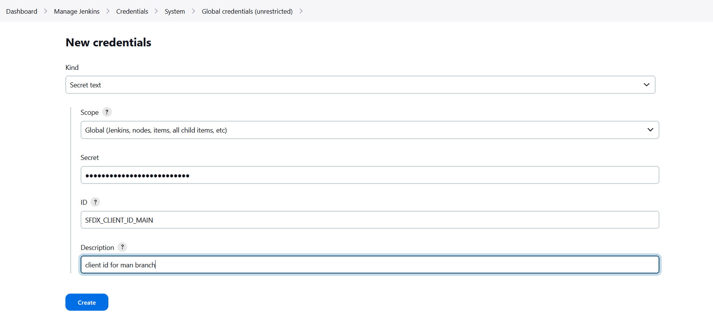

<!-- markdownlint-disable MD013 -->

- [Pre-requisites](#pre-requisites)
  - [Install required Jenkins plugins](#install-required-jenkins-plugins)
- [Run sfdx-hardis configuration command](#run-sfdx-hardis-configuration-command)
- [Add credentials in Jenkins](#add-credentials-in-jenkins)
- [Create the Multibranch Pipeline](#create-the-multibranch-pipeline)
- [Update the Jenkinsfile](#update-the-jenkinsfile)
- [Auto-fix branches](#auto-fix-branches)

## Pre-requisites

### Install required Jenkins plugins

Make sure the following plugins are installed on your Jenkins instance (**Manage Jenkins -> Plugins**):

| Plugin                                                                         | Purpose                                                                             |
|--------------------------------------------------------------------------------|-------------------------------------------------------------------------------------|
| [Docker Pipeline](https://plugins.jenkins.io/docker-workflow/)                 | Run pipeline stages inside a Docker container                                       |
| [Credentials Binding](https://plugins.jenkins.io/credentials-binding/) >= 1.24 | Inject credentials as environment variables (required for `optional: true` support) |
| [Pipeline](https://plugins.jenkins.io/workflow-aggregator/)                    | Declarative / scripted pipeline support                                             |
| [Multibranch Pipeline](https://plugins.jenkins.io/workflow-multibranch/)       | Automatically create one sub-job per branch                                         |

Docker must also be available on the Jenkins node (the pipeline mounts `/var/run/docker.sock` for MegaLinter).

## Run sfdx-hardis configuration command

Run command **Configuration -> Configure CI/CD** in VS Code SFDX Hardis, then follow the instructions.

When prompted to define CI/CD variables, copy the variable names and values into a notepad before continuing. You will need them in the next step.

## Add credentials in Jenkins

For each variable that the configuration command tells you to define, create a **Secret text** credential:

- Go to **Dashboard -> Manage Jenkins -> Credentials -> (global)**
- Click **Add Credentials**
- Kind: **Secret text**
- Secret: paste the value from sfdx-hardis
- ID: the variable name (e.g. `SFDX_CLIENT_ID_INTEGRATION`)
- Click **Create**

Repeat for every required `SFDX_CLIENT_ID_<BRANCH>` / `SFDX_CLIENT_KEY_<BRANCH>` pair.



### Optional credentials

The pipeline also accepts the following optional credentials. Create them if you use the corresponding feature. Missing optional credentials are silently ignored and will NOT crash the pipeline (requires Credentials Binding Plugin >= 1.24).

| Credential ID                                                                                                                                        | Feature                                                                                                                                                                                            |
|------------------------------------------------------------------------------------------------------------------------------------------------------|----------------------------------------------------------------------------------------------------------------------------------------------------------------------------------------------------|
| `SLACK_TOKEN` + `SLACK_CHANNEL_ID`                                                                                                                   | Slack notifications                                                                                                                                                                                |
| `NOTIF_EMAIL_ADDRESS`                                                                                                                                | Email notifications                                                                                                                                                                                |
| `JIRA_HOST` + `JIRA_EMAIL` + `JIRA_TOKEN` / `JIRA_PAT`                                                                                               | JIRA integration                                                                                                                                                                                   |
| `ANTHROPIC_API_KEY` / `OPENAI_API_KEY` / `GEMINI_API_KEY`                                                                                            | AI auto-fix of deployment errors                                                                                                                                                                   |
| one of: `GITHUB_TOKEN`, `CI_SFDX_HARDIS_GITHUB_TOKEN`, `CI_SFDX_HARDIS_GITLAB_TOKEN`, `CI_SFDX_HARDIS_BITBUCKET_TOKEN`, `CI_SFDX_HARDIS_AZURE_TOKEN` | Git provider integration: post deployment comments on PRs/MRs and allow the coding agent to push fix branches and open PRs. See [Git provider integration from Jenkins](#git-provider-integration) |
| `SFDX_AUTH_URL_TECHNICAL_ORG`                                                                                                                        | Technical org authentication (DevHub or scratch org workflows)                                                                                                                                     |

## Create the Multibranch Pipeline

- Go to **Dashboard -> New Item**
- Enter a name (e.g. `salesforce-cicd`)
- Select **Multibranch Pipeline** and click **OK**
- Under **Branch Sources**, add your Git server and point it to your Salesforce project repository
- Under **Build Configuration**, leave the default **by Jenkinsfile** (the `Jenkinsfile` is at the repository root)
- Under **Scan Multibranch Pipeline Triggers**, enable **Periodically if not otherwise run** (e.g. every hour) so Jenkins discovers new branches automatically
- Click **Save** - Jenkins will scan the repository and create one sub-job per branch it finds

## Update the Jenkinsfile

The sfdx-hardis configuration command places a `Jenkinsfile` at the root of your repository. Open it and search for **MANUAL** to find all sections that need your attention.

### 1 - Add your org credentials

In **both** the `Validation` and `Deployment` stages, uncomment and duplicate the credential pairs to match every org you deploy to:

```groovy
withCredentials([
    // MANUAL: Add one pair of credentials per deployment org
    string(credentialsId: 'SFDX_CLIENT_ID_INTEGRATION',  variable: 'SFDX_CLIENT_ID_INTEGRATION'),
    string(credentialsId: 'SFDX_CLIENT_KEY_INTEGRATION', variable: 'SFDX_CLIENT_KEY_INTEGRATION'),
    string(credentialsId: 'SFDX_CLIENT_ID_UAT',          variable: 'SFDX_CLIENT_ID_UAT'),
    string(credentialsId: 'SFDX_CLIENT_KEY_UAT',         variable: 'SFDX_CLIENT_KEY_UAT'),
    // ... add more pairs here
])
```

The credential ID must exactly match the ID you created in Jenkins.

### 2 - Add your deployment branch names

Near the top of the `Jenkinsfile`, before the `pipeline` block, update the `DEPLOYMENT_BRANCHES` list:

```groovy
// MANUAL: List every branch that triggers a real deployment to a Salesforce org
def DEPLOYMENT_BRANCHES = [
    'integration',
    'uat',
    'preprod',
    'main',
    // add more branches here if needed
]
```

The `Deployment` stage automatically uses this list in its `when` condition - no other changes needed when adding or removing branches.

### 3 - Commit and push

Commit the updated `Jenkinsfile` and push. Jenkins will pick up the changes on the next scan or pipeline run.

## How the pipeline works

| Trigger                       | Stages that run                                                                    |
|-------------------------------|------------------------------------------------------------------------------------|
| Pull Request opened / updated | **MegaLinter** (code quality) + **Validation** (check-only deploy) run in parallel |
| Push to a deployment branch   | **Deployment** (real deploy to the target org)                                     |

## Git provider integration

When running on Jenkins, sfdx-hardis **automatically detects** the Jenkins environment and maps its built-in variables (`GIT_URL`, `GIT_BRANCH`, `BUILD_URL`, `BUILD_NUMBER`, `JOB_NAME`, `CHANGE_ID`, etc.) to the native equivalents of your git provider (GitHub, GitLab, Azure DevOps, or Bitbucket).

This means you only need to set the **authentication token** for your git provider - all other CI variables are derived automatically.

| Git provider | Required credential              | Documentation                                                                                                     |
|--------------|----------------------------------|-------------------------------------------------------------------------------------------------------------------|
| GitHub       | `CI_SFDX_HARDIS_GITHUB_TOKEN`    | [GitHub integration](salesforce-ci-cd-setup-integration-github.md#jenkins)                                        |
| GitLab       | `CI_SFDX_HARDIS_GITLAB_TOKEN`    | [GitLab integration](salesforce-ci-cd-setup-integration-gitlab.md#using-gitlab-integration-from-jenkins)          |
| Azure DevOps | `CI_SFDX_HARDIS_AZURE_TOKEN`     | [Azure integration](salesforce-ci-cd-setup-integration-azure.md#using-azure-devops-integration-from-jenkins)      |
| Bitbucket    | `CI_SFDX_HARDIS_BITBUCKET_TOKEN` | [Bitbucket integration](salesforce-ci-cd-setup-integration-bitbucket.md#using-bitbucket-integration-from-jenkins) |

Jenkins variables used for auto-detection:

| Jenkins variable | Purpose                                            |
|------------------|----------------------------------------------------|
| `JENKINS_URL`    | Detect that the CI runner is Jenkins               |
| `GIT_URL`        | Parse server URL, repository owner/name            |
| `GIT_BRANCH`     | Current branch name (fallback: `GIT_LOCAL_BRANCH`) |
| `BUILD_URL`      | Link to the current build page                     |
| `BUILD_NUMBER`   | Build identifier                                   |
| `JOB_NAME`       | Job/workflow name                                  |
| `CHANGE_ID`      | Pull/Merge request number (Multibranch Pipeline)   |
| `CHANGE_BRANCH`  | Source branch of a PR build                        |

## Auto-fix branches

The pipeline skips `sf hardis` commands when the current branch name starts with `auto-fix/`.
This prevents recursive or redundant runs on branches that the coding agent automatically creates.
MegaLinter still runs on auto-fix branches so code quality is always checked.
