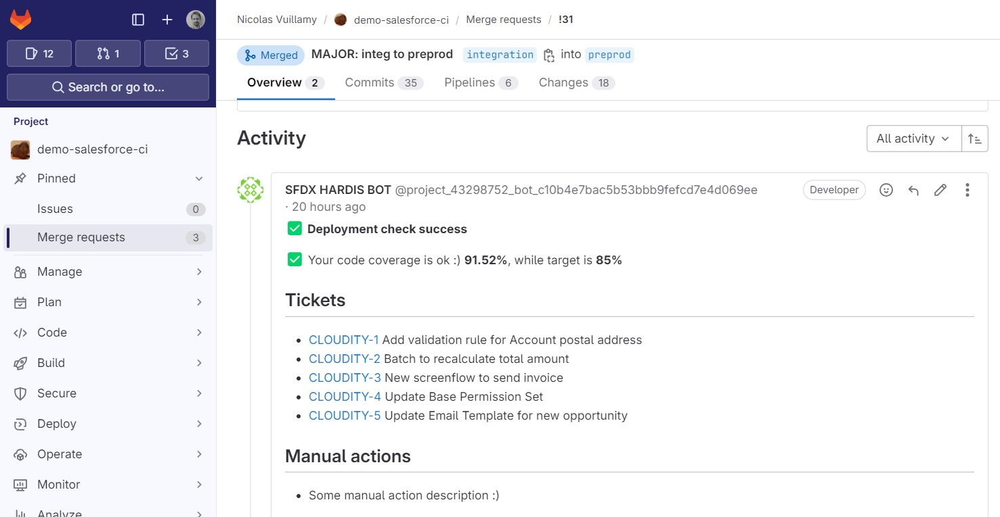
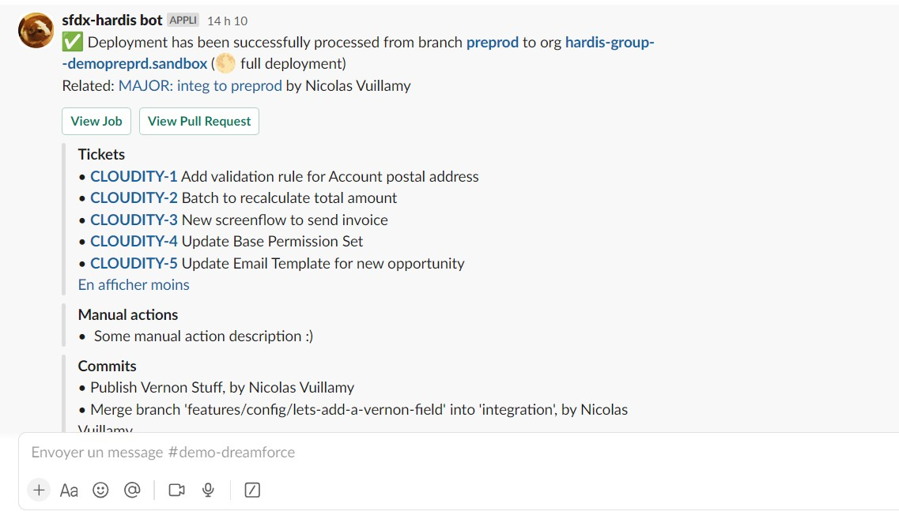
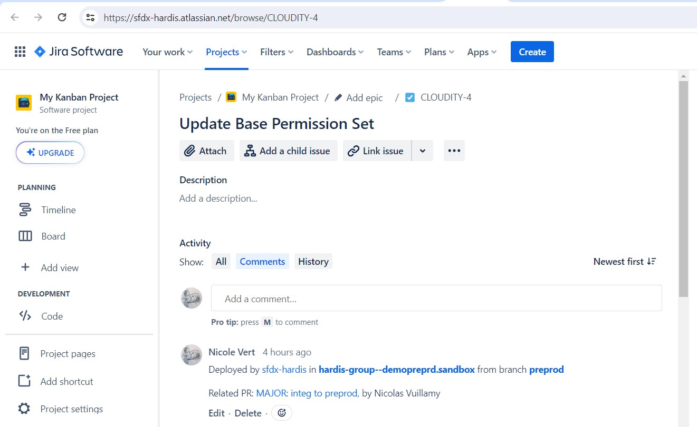

<!-- markdownlint-disable MD013 -->

- [Jira integration](#jira-integration)
  - [For git providers](#for-git-providers)
  - [For notifications providers](#for-notifications-providers)
  - [Update Jira issues](#update-jira-issues)
- [Global Configuration](#global-configuration)
  - [Identify Jira tickets](#identify-jira-tickets)
  - [Jira Cloud](#jira-cloud)
  - [Jira On-Premise](#jira-on-premise)
- [GitLab configuration](#gitlab-configuration)
- [Technical notes](#technical-notes)

## Jira integration

If you use Jira on your project, sfdx-hardis can use it to enrich its integrations.

sfdx-hardis automatically analyzes commits and Pull Request descriptions to collect Jira ticket URLs.

You can **use the full URL of Jira tickets** in your commits and Pull Request descriptions.

> Use `https://sfdx-hardis.atlassian.net/browse/CLOUDITY-4`, not `CLOUDITY-4`.

If you do not use full URLs, a default regular expression is used, which you can override for better accuracy (see [Identify Jira tickets](#identify-jira-tickets)).

> In that case, `CLOUDITY-4` is detected, but make sure that JIRA_HOST is defined.

### For git providers

GitHub, GitLab, Azure, Bitbucket: post references to Jira tickets in Pull Request comments



### For notifications providers

Slack, Microsoft Teams: add deployed Jira tickets to deployment notifications



### Update Jira issues

Add comments and tags on Jira tickets when they are deployed in a major org.

The default tag is `UPPERCASE(branch_name) + "_DEPLOYED"`.

To override it, define the environment variable **DEPLOYED_TAG_TEMPLATE**, which must contain `{BRANCH}`.

Example: `DEPLOYED_TO_{BRANCH}`



## Global configuration

> When possible, define these properties in the **.sfdx-hardis.yml** file, so that the VS Code SFDX Hardis extension can use them for UI features.

### Identify Jira tickets

- .sfdx-hardis.yml property: **jiraTicketRegex** or ENV variable **JIRA_TICKET_REGEX**

Define a regular expression with a capturing group that identifies the Jira tickets of your project in commit and Pull Request titles and bodies, for example `(CLOUDITY-[0-9]+)`.

If not defined, the default value is `(?<=[^a-zA-Z0-9_-]|^)([A-Za-z0-9]{2,10}-\d{1,6})(?=[^a-zA-Z0-9_-]|$)`

### Jira Cloud

Define the following variables:

- .sfdx-hardis.yml property **jiraHost** or ENV variable **JIRA_HOST** (example: `https://sfdx-hardis.atlassian.net/`)

For Basic Auth:

- **JIRA_EMAIL** (example: `nicolas.vuillamy@cloudity.com`)
- **JIRA_TOKEN**, to create by following the [Atlassian documentation](https://support.atlassian.com/atlassian-account/docs/manage-api-tokens-for-your-atlassian-account/)

If you prefer to use Service Accounts with OAuth2, define the following:

- **JIRA_CLIENT_ID**
- **JIRA_CLIENT_SECRET**, to create by following the [Atlassian documentation](https://support.atlassian.com/user-management/docs/create-oauth-2-0-credential-for-service-accounts/)

Remember to grant the right scopes:

- **read:jira-work**: used to read Jira issue data for Pull Request comments.
- **write:jira-work**: used to post comments and update the deployment label on issues.

### Jira On-Premise

_Note: this does not seem to work with every on-premise Jira server._

Define the following CI/CD variables:

- .sfdx-hardis.yml property **jiraHost** or ENV variable **JIRA_HOST** (examples: `https://jira.cloudity.com/`, or with a path like `https://pid.cloudity.com/jira/`)
- **JIRA_PAT**, to create by following the [Atlassian documentation](https://confluence.atlassian.com/enterprise/using-personal-access-tokens-1026032365.html) (section **Creating PATs in the application**)

## GitLab configuration

If you are using GitLab, you need to update the Merge Request settings.

Go to Project -> Settings -> Merge Requests

Update **Merge Commit Message Template** with the following value:

```sh
%{title} Merge branch '%{source_branch}' into '%{target_branch}'

%{issues}

See merge request %{reference}

%{description}

%{all_commits}
```

Update **Squash Commit Message Template** with the following value:

```sh
%{title} Merge branch '%{source_branch}' into '%{target_branch}'

%{issues}

See merge request %{reference}

%{description}

%{all_commits}
```

## Technical notes

This integration uses the following variables, which must be available from the pipelines:

- JIRA_HOST
- JIRA_EMAIL
- JIRA_TOKEN
- JIRA_PAT
- JIRA_CLIENT_ID
- JIRA_CLIENT_SECRET
