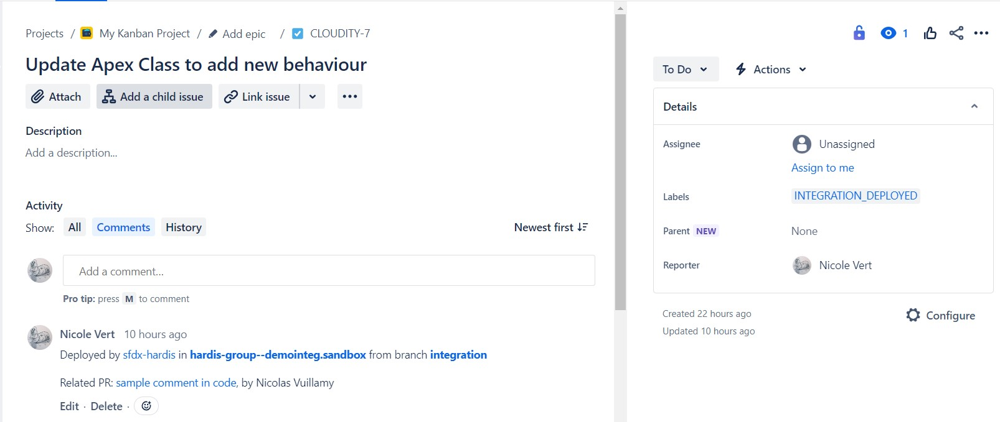

<!-- markdownlint-disable MD013 -->

- [Jira integration](#jira-integration)
  - [For git providers](#for-git-providers)
  - [For notifications providers](#for-notifications-providers)
  - [Update JIRA issues](#update-jira-issues)
- [Authentication](#authentication)
  - [Jira Cloud](#jira-cloud)
  - [Jira On-Premise](#jira-on-premise)
- [Gitlab configuration](#gitlab-configuration)
- [Technical notes](#technical-notes)

## Jira integration

_This feature is currently in beta but can already be used safely !_

If you use JIRA on your project, sfdx-hardis can use it to enrich its integrations

Sfdx-hardis will automatically analyze commits and PR/MR descriptions to collect JIRA tickets URLS !

The only thing you have to make sure is to **use the full URL of JIRA tickets** in your commits and PR/MR descriptions.

> Use `https://sfdx-hardis.atlassian.net/browse/CLOUDITY-4` , not `CLOUDITY-4` !

### For git providers

Github, Gitlab, Azure, Bitbucket: Post references to JIRA tickets in PR/MR comments


### For notifications providers

Slack, MsTeams: Add deployed JIRA tickets in deployment notifications


### Update JIRA issues

Add comments on JIRA tickets when they are deployed in a major org



## Authentication

### Jira Cloud

Define CI/CD variables

- JIRA_HOST (example: `https://sfdx-hardis.atlassian.net/`)
- JIRA_EMAIL (example: `nicolas.vuillamy@cloudity.com`)
- JIRA_TOKEN , to create following [Atlassian documentation](https://support.atlassian.com/atlassian-account/docs/manage-api-tokens-for-your-atlassian-account/)

### Jira On-Premise

_Note: Does not seems to work with every on-premise JIRA servers_

Define CI/CD variables

- JIRA_HOST (example: `https://jira.cloudity.com/`)
- JIRA_PAT, to create following [Atlassian Documentation](https://confluence.atlassian.com/enterprise/using-personal-access-tokens-1026032365.html) (Creating PATs in the application)

## Gitlab configuration

If you are using Gitlab, you need to update the Merge Request Settings

Go to Project -> Settings -> Merge Requests

Update **Merge Commit Message Template** with the following value

```sh
%{title} Merge branch '%{source_branch}' into '%{target_branch}'

%{issues}

See merge request %{reference}

%{description}

%{all_commits}
```

Update **Squash Commit Message Template** with the following value

```sh
%{title} Merge branch '%{source_branch}' into '%{target_branch}'

%{issues}

See merge request %{reference}

%{description}

%{all_commits}
```

## Technical notes

This integration use the following variables, that must be available from the pipelines:
- JIRA_HOST
- JIRA_EMAIL
- JIRA_TOKEN
- JIRA_PAT
