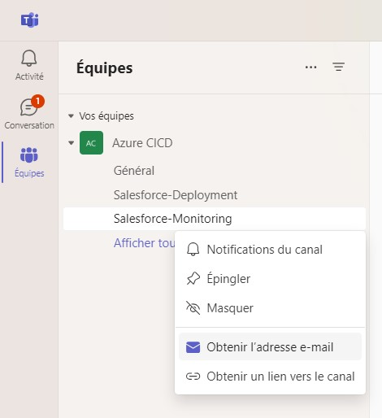
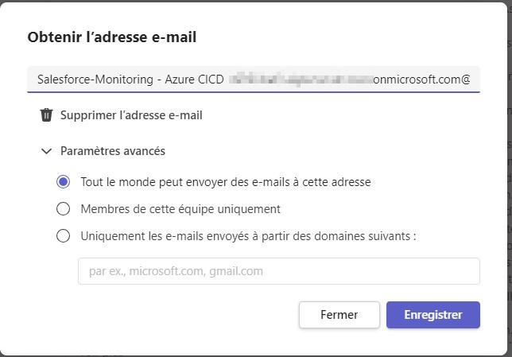

<!-- markdownlint-disable MD013 -->

## Ms Teams Integration

MS Teams Web Hooks have been deprecated my Microsoft so have been removed from sfdx-hardis.

Instead, please use [Email Notifications](https://sfdx-hardis.cloudity.com/salesforce-ci-cd-setup-integration-email/) with the Ms Teams Channel Email as NOTIF_EMAIL_ADDRESS

To get MsTeams email channel, click on the channel contextual menu, then "Get channel E-mail Address"

Then make sure that anyone can send emails to the channel by selecting the first option

