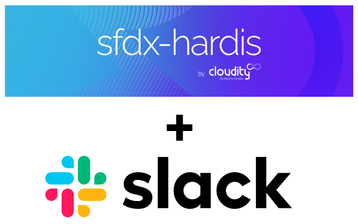
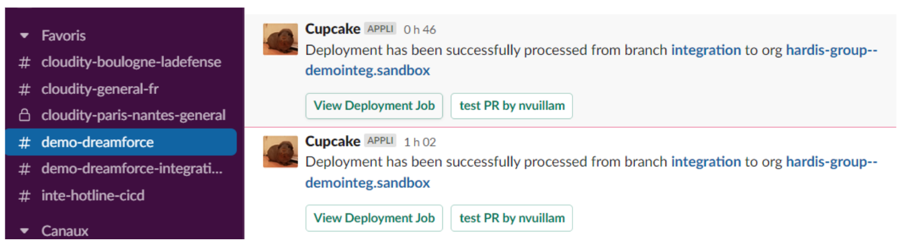

<!-- markdownlint-disable MD013 -->



## Slack Integration

You can receive notifications on Slack channels when sfdx-hardis events happen:

- Deployment from a major branch to a major Salesforce org (e.g. integration git branch to Integration org)
- Salesforce [Org Monitoring](salesforce-monitoring-home.md)
  - Latest updates
  - Failing Apex tests
  - Monitoring checks notifications



## Configure Slack Application

All the following steps are summarized in this video tutorial:

<div style="text-align:center"><iframe width="560" height="315" src="https://www.youtube.com/embed/se292ABGUmI" title="YouTube video player" frameborder="0" allow="accelerometer; autoplay; clipboard-write; encrypted-media; gyroscope; picture-in-picture" allowfullscreen></iframe></div>

### Create slack app

> Follow these steps only if an sfdx-hardis bot has not yet been configured on your Slack workspace. Otherwise, just request the Slack token value from your Slack administrator.

Create a Slack app at <https://api.slack.com/apps>

- Name it `sfdx-hardis bot`, or _any nickname you like_ (your guinea pig's name works too)
- Go to permissions and add the following scopes:
  - chat-write
  - chat-write.customize
  - chat-write.public
- Create an auth token and copy its value

### Configure sfdx-hardis for Slack

- Create a secret value named **SLACK_TOKEN** with the auth token value in your git provider configuration

- Create a Slack channel that will receive all notifications (e.g. _#notifs-sfdx-hardis_)

- Open the channel info, copy its ID and create a secret value named **SLACK_CHANNEL_ID** in your git provider configuration

- Invite the sfdx-hardis bot user to the channel (e.g. `/invite @sfdx-hardis-bot`)

- You can also create branch-scoped channels: create new channels and define the matching variables
  - Example: Channel _#notifs-sfdx-hardis-integration_ and variable **SLACK_CHANNEL_ID_INTEGRATION**

- You can also define an additional channel that receives only warning, error and critical notifications
  - Example: Channel _#notifs-monitor-hot_ and variable **SLACK_CHANNEL_ID_ERRORS_WARNINGS**

- Make sure all those variables are visible to your CI/CD pipelines

That's all, you're all set.

## Per notification type severity threshold

Slack belongs to the `messaging` channel (shared with Microsoft Teams). You can raise the minimum severity required to post a notification on this channel per notification type, directly in `.sfdx-hardis.yml`:

```yaml
monitoringCommands:
  - key: AUDIT_TRAIL
    notifications:
      messaging: warning   # Slack/Teams only on warning, error, critical
  - key: METADATA_STATUS
    notifications:
      messaging: off       # mute Slack/Teams for this type
```

See [Monitoring configuration](salesforce-monitoring-config-home.md#fine-grained-routing-per-notification-type) for the full per-channel routing model.
