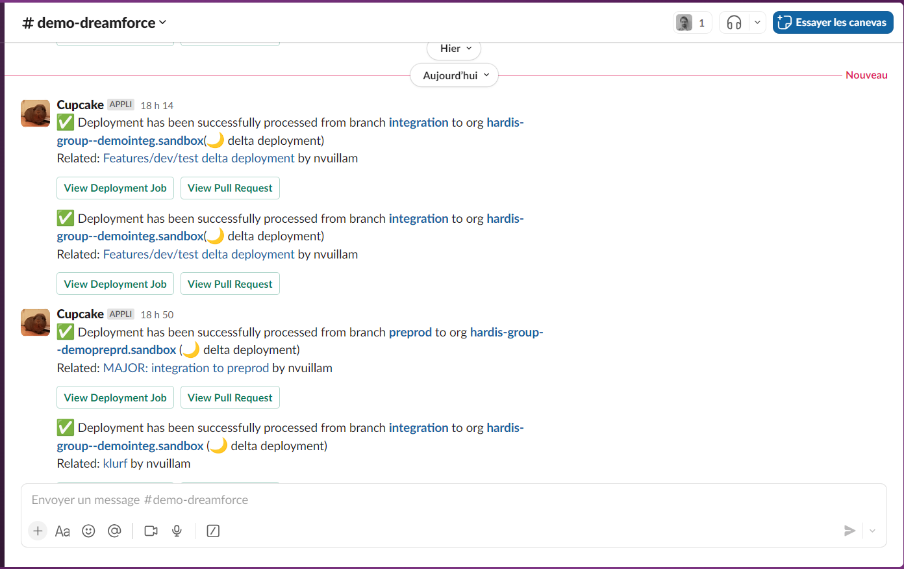

<!-- markdownlint-disable MD013 -->

## Slack Integration

You can receive notifications on slack channels when CI/CD events are happening:

- Deployment from a major branch to a major Salesforce org (ex: integration git branch to Integration Org)
- More soon (ask for them !)

## Configure Slack Application

### Create slack app

> Process only if a sfdx-hardis bot has not yet been configured on your slack. Otherwise, just request the slack token value to your slack administrator

Create a slack app here -> <https://api.slack.com/apps>

- Name it `sfdx-hardis bot`` or _any nickname you like_, like your guinea pig name !
- Go to permissions and add the following scopes
  - chat-write
  - chat-write.customize
  - chat-write.public
- Create auth token and copy its values

### Configure sfdx-hardis for slack

- Create a secret value named **SLACK_TOKEN** with auth token value in your Git provider configuration
- Create a slack channel that will receive all notifications (ex: _#notifs-sfdx-hardis_)
- Open the channel info, copy its ID and create a secret value named **SLACK_CHANNEL_ID** in your git provider configuration
- Additionally, you can create branch-scoped channels by creating new channels and create appropriate variables
  - Example: Channel _#notifs-sfdx-hardis-integration_ and variable **SLACK_CHANNEL_ID_iNTEGRATION**
- Make sure all those variables are visible to your CI/CD pipelines

That's all, you're all set !