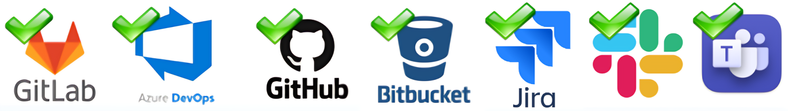

<!-- markdownlint-disable MD013 -->

Every info that sfdx-hardis can provide is available in log files or console terminals.

In order to enhance the user experience, integrations with external tools must be configured.

## Git Providers

Depending of your git provider, configure one of the following integrations.

- [GitHub](salesforce-ci-cd-setup-integration-github.md)
  - Deployment status in Merge Request notes
  - Quick Deploy to enhance performances

- [Gitlab](salesforce-ci-cd-setup-integration-gitlab.md)
  - Deployment status in Merge Request notes
  - Quick Deploy to enhance performances

- [Azure Pipelines](salesforce-ci-cd-setup-integration-azure.md)
  - Deployment status in Pull Request threads
  - Quick Deploy to enhance performances

- [BitBucket](salesforce-ci-cd-setup-integration-bitbucket.md)
  - Deployment status in Pull Request comments
  - Quick Deploy to enhance performance

## Pull Request comments

Whatever the git provider, sfdx-hardis can post up to three different comments on the same Pull Request. Each one starts with a banner telling which comment you are reading, and how it went: green when it succeeded, red when it failed, orange when something is still pending.

### Validation

Posted by the check job, before the merge. It contains the result of the deployment simulation on the target org: deployment errors, Apex test results, code coverage and Flow visual diffs.

### Deployment

Posted by the deployment job, after the merge. It contains the result of the real deployment in the target major org.

### Deployment actions

Updated by both jobs. It tracks the [deployment actions](salesforce-ci-cd-work-on-task-deployment-actions.md) of the Pull Request: which action ran in which org, and the checkboxes of the manual actions that are still waiting to be performed.

### Navigation between the comments

The three comments are posted by different jobs and end up scattered among the other comments of the Pull Request, so each one displays a navigation line just under its title:

> [🔍 Validation](#) | **🚀 Deployment** | [🛠️ Actions](#)

The comment you are reading is in bold, the others are links to their own comment. Comments that do not exist yet are not listed. The same navigation is added at the very beginning of the Pull Request description, so the comments can be reached from the top of the Pull Request.

The description is only modified between the sfdx-hardis navigation markers: the text written by the author is left untouched.

### Environment variables

| Variable | Effect when set to `false` |
| --- | --- |
| `SFDX_HARDIS_PR_COMMENT_BANNERS` | Post the comments without their banner image, for example when the network blocks `raw.githubusercontent.com` |
| `SFDX_HARDIS_PR_COMMENT_NAV` | Post the comments without the navigation line, and never modify the Pull Request description |
| `SFDX_HARDIS_PR_DESCRIPTION_NAV` | Keep the navigation in the comments, but never modify the Pull Request description |

## Message notifications

- [Slack](salesforce-ci-cd-setup-integration-slack.md)
  - Notifications

- [Microsoft Teams](salesforce-ci-cd-setup-integration-ms-teams.md)
  - Notifications

- [Google Chat](salesforce-ci-cd-setup-integration-google-chat.md)
  - Notifications

- [Email](salesforce-ci-cd-setup-integration-email.md)
  - Notifications

- [API (ex: Grafana)](salesforce-ci-cd-setup-integration-api.md)
  - Notifications

## Ticketing providers

- [Jira](salesforce-ci-cd-setup-integration-jira.md)
  - Enrich MR/PR comments by adding tickets references and links
  - Enrich notifications comments by adding tickets references and links
  - Post a comment and a label on JIRA issues when they are deployed in a major org

- [Azure Boards](salesforce-ci-cd-setup-integration-azure-boards.md)
  - Enrich MR/PR comments by adding work items references and links
  - Enrich notifications comments by adding work items references and links
  - Post a comment and a tag on Azure Work Items when they are deployed in a major org

- [Generic ticketing](salesforce-ci-cd-setup-integration-generic-ticketing.md)
  - Enrich MR/PR comments by adding tickets references and links
  - Enrich notifications comments by adding tickets references and links

## Large Language Models (AI)

- [Agentforce](salesforce-ai-setup.md/#with-agentforce)
  - Deployment Agent
  - Project Documentation

- [OpenAi, Anthropic, Gemini, Ollama](salesforce-ai-setup.md/#with-langchain)
  - Deployment Agent
  - Project Documentation