<!-- markdownlint-disable MD013 MD033 -->

# Smart Deployment Orchestration

The command [`sf hardis:project:deploy:smart`](hardis/project/deploy/smart.md) is the central deployment engine of [sfdx-hardis CI/CD](salesforce-ci-cd-home.md). It orchestrates a sophisticated pipeline that handles **[delta deployments](salesforce-ci-cd-config-delta-deployment.md)**, **[Quick Deploy](https://developer.salesforce.com/docs/atlas.en-us.api_meta.meta/api_meta/meta_quick_deploy.htm)**, **test class selection**, **[package installation](salesforce-ci-cd-work-on-task-install-packages.md)**, **[overwrite management](salesforce-ci-cd-config-overwrite.md)**, **[pre/post commands](salesforce-ci-cd-work-on-task-deployment-actions.md)**, and **[notifications](salesforce-ci-cd-setup-integrations-home.md)**, all in a single, unified flow.

---

## End-to-End Flow

```mermaid
%%{init: {"theme": "base", "themeVariables": {"primaryColor": "#eaf5fe", "primaryTextColor": "#032d60", "primaryBorderColor": "#0176d3", "lineColor": "#0176d3", "secondaryColor": "#f3f3f3", "tertiaryColor": "#ffffff", "fontFamily": "Salesforce Sans, Arial, sans-serif"}}}%%
flowchart TD
    START([Smart Deploy Start]) --> INIT[Initialize: parse flags,<br/>load config, resolve org]

    subgraph Preparation
        INIT --> TESTS[Resolve Test Level<br/>& Test Classes]
        TESTS --> PKG[Install Packages<br/>if configured]
        PKG --> SUMMARY[Build Commit Summary<br/>for PR if check-only]
        SUMMARY --> MANIFEST[Resolve package.xml<br/>& destructiveChanges.xml]
    end

    subgraph "Delta Processing"
        MANIFEST --> DELTA{Delta<br/>enabled & allowed?}
        DELTA -->|Yes| GIT_DELTA[Run sfdx-git-delta<br/>to compute changed metadata]
        GIT_DELTA --> INTERSECT[Intersect delta<br/>with full package.xml]
        INTERSECT --> SMART{Smart Tests:<br/>only non-impacting<br/>metadata?}
        SMART -->|Yes & not prod| NO_TEST[Skip tests]
        SMART -->|No| KEEP_TESTS[Keep test level]
        DELTA -->|No| KEEP_TESTS
    end

    subgraph "Overwrite Filtering"
        NO_TEST --> OVERWRITE
        KEEP_TESTS --> OVERWRITE[Filter package.xml]
        OVERWRITE --> OW1[Remove items already<br/>in org via no-overwrite]
    end

    subgraph "Core Deployment"
        OW1 --> PRE[Run Pre-Deploy Commands]
        PRE --> QD{Quick Deploy<br/>available?}
        QD -->|Yes| QUICK[Quick Deploy<br/>skip full deploy]
        QD -->|No| DEPLOY["Full Deploy<br/>sf project deploy start"]
        QUICK --> POST
        DEPLOY --> COVERAGE[Check Code Coverage]
        COVERAGE --> POST[Run Post-Deploy Commands]
        POST --> PR[Post PR Comment<br/>with full results]
    end

    subgraph "Post-Deployment"
        PR --> NOTIFY[Send Notifications<br/>Slack / Teams / Email]
        NOTIFY --> TICKETS[Update Ticketing<br/>Jira / etc.]
    end

    TICKETS --> END([Done])

    click INIT "#initialization"
    click TESTS "#test-level--test-class-resolution"
    click PKG "#package-installation"
    click MANIFEST "#packagexml--destructive-changes-resolution"
    click DELTA "#delta-processing"
    click GIT_DELTA "#delta-processing"
    click INTERSECT "#delta-processing"
    click SMART "#delta-processing"
    click NO_TEST "#delta-processing"
    click KEEP_TESTS "#delta-processing"
    click OVERWRITE "#overwrite-filtering"
    click OW1 "#overwrite-filtering"
    click PRE "#prepost-deployment-commands"
    click QD "#quick-deploy"
    click QUICK "#quick-deploy"
    click DEPLOY "#deployment-engine-smartdeploy"
    click COVERAGE "#deployment-engine-smartdeploy"
    click POST "#prepost-deployment-commands"
    click PR "#post-deployment"
    click NOTIFY "#post-deployment"
    click TICKETS "#post-deployment"

    classDef sfStart fill:#d8edff,stroke:#032d60,color:#032d60,stroke-width:3px
    classDef sfAction fill:#eaf5fe,stroke:#0176d3,color:#032d60,stroke-width:1.5px,cursor:pointer
    classDef sfDecision fill:#ffffff,stroke:#0176d3,color:#032d60,stroke-width:2px,cursor:pointer
    classDef sfSuccess fill:#cdefc4,stroke:#2e844a,color:#194e31,stroke-width:1.5px,cursor:pointer
    classDef sfWarn fill:#fef0cd,stroke:#fe9339,color:#5f3e02,stroke-width:1.5px

    class START,END sfStart
    class INIT,TESTS,PKG,SUMMARY,MANIFEST,GIT_DELTA,INTERSECT,OVERWRITE,OW1,PRE,DEPLOY,COVERAGE,POST,PR,NOTIFY,TICKETS sfAction
    class DELTA,SMART,QD sfDecision
    class QUICK,KEEP_TESTS,NO_TEST sfSuccess
```

Each section below details one part of this flow.

---

## Preparation

### Initialization

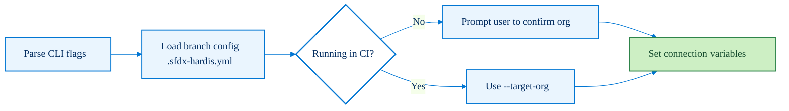

The command reads its configuration from `config/.sfdx-hardis.yml` (or branch-specific files like `config/branches/.sfdx-hardis-BRANCHNAME.yml`). See [CI/CD Configuration](salesforce-ci-cd-config-home.md) for details. Key flags include:

| Flag           | Description                                                                                                                                                                     |
|:---------------|:--------------------------------------------------------------------------------------------------------------------------------------------------------------------------------|
| `--check`      | Simulate deployment (dry-run / validation)                                                                                                                                      |
| `--testlevel`  | [Apex test level](https://developer.salesforce.com/docs/atlas.en-us.api_meta.meta/api_meta/meta_deploy.htm#deploy_options) (RunLocalTests, RunRepositoryTests, NoTestRun, etc.) |
| `--runtests`   | Specific test classes or regex filter                                                                                                                                           |
| `--delta`      | Force delta deployment from CLI                                                                                                                                                 |
| `--packagexml` | Custom path to package.xml                                                                                                                                                      |

### Test Level & Test Class Resolution

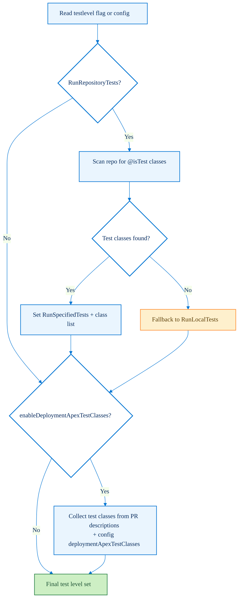

**Test level modes:**

- **RunLocalTests** (default, highly recommended): Runs all local [test classes](https://developer.salesforce.com/docs/atlas.en-us.apexcode.meta/apexcode/apex_testing.htm) in the target org. This is the safest option and the [Salesforce best practice](https://developer.salesforce.com/docs/atlas.en-us.sfdx_dev.meta/sfdx_dev/sfdx_dev_testing.htm) for production deployments.
- **RunRepositoryTests** / **RunRepositoryTestsExceptSeeAllData**: Scans the repo for `@isTest` classes, converts to `RunSpecifiedTests` with the discovered list. The `ExceptSeeAllData` variant excludes test classes annotated with [`@isTest(SeeAllData=true)`](https://developer.salesforce.com/docs/atlas.en-us.apexcode.meta/apexcode/apex_testing_seealldata_using.htm).
- **[RunRelevantTests](https://developer.salesforce.com/docs/atlas.en-us.api_meta.meta/api_meta/meta_deploy.htm#deploy_options)**: Lets Salesforce determine which tests to run based on the deployed metadata.
- **NoTestRun**: Skips all tests. Only valid for [non-production orgs](https://developer.salesforce.com/docs/atlas.en-us.sfdx_dev.meta/sfdx_dev/sfdx_dev_sandbox.htm). Should not be used manually, it is set automatically by Smart Deployment Tests when appropriate.

**Test options:**

- **Custom Apex Test Classes**: When `enableDeploymentApexTestClasses: true`, collects test classes declared in config and across all PR descriptions in scope, and overrides the test level to `RunSpecifiedTests` with the collected class list.
- **Smart Deployment Tests**: When enabled, automatically downgrades the test level to `NoTestRun` if only non-impacting metadata types are present in the delta and the target is not a production org (see [Delta Processing](#delta-processing)).

### Package Installation

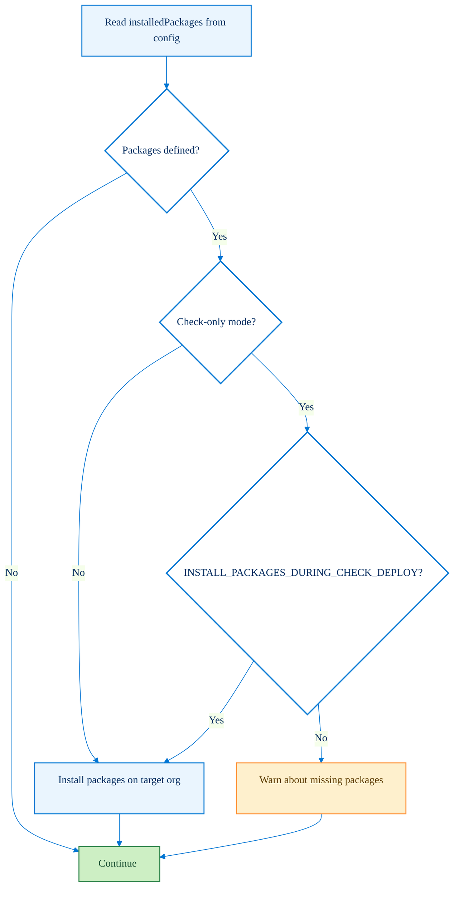

Packages with `installDuringDeployments: true` in config are installed before the main deployment. In check-only mode, installation is skipped unless explicitly enabled. Use [`sf hardis:org:retrieve:packageconfig`](hardis/org/retrieve/packageconfig.md) to automatically populate the `installedPackages` property from an existing org. See [Package Installation](salesforce-ci-cd-work-on-task-install-packages.md) for more details.

### Package.xml & Destructive Changes Resolution

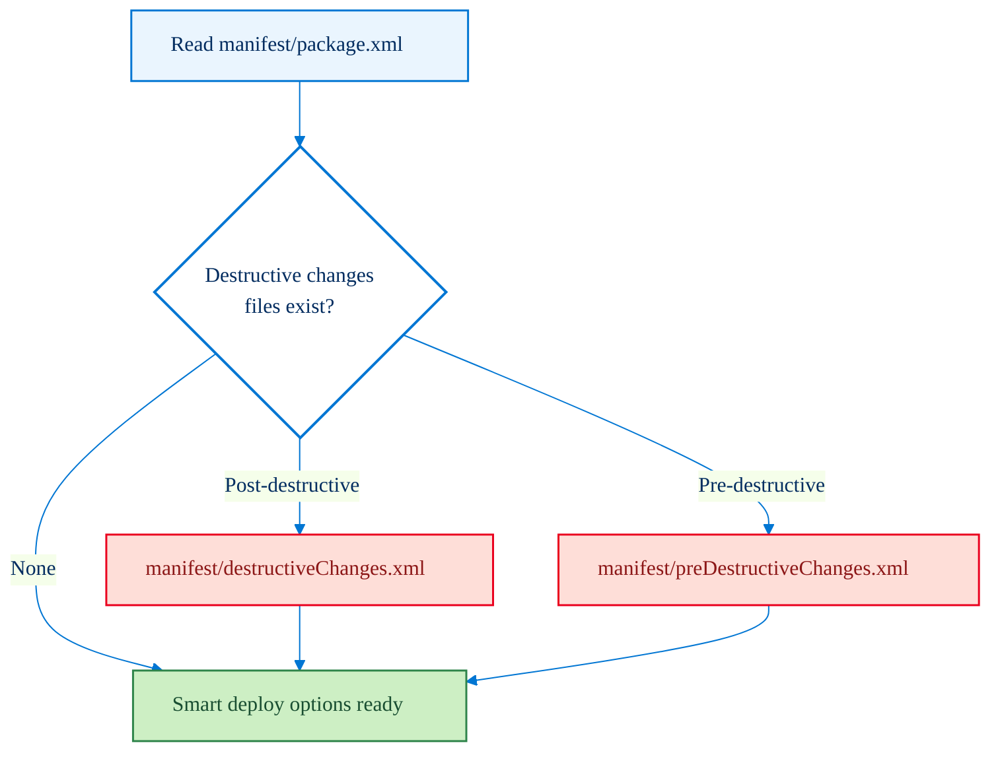

---

## Delta Processing

Delta deployment reduces the deployment scope to only the metadata that changed between the source and target branches, using [sfdx-git-delta](https://github.com/scolladon/sfdx-git-delta). See [Delta Deployment Configuration](salesforce-ci-cd-config-delta-deployment.md) for setup instructions.

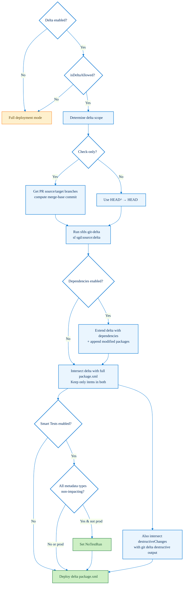

### Delta eligibility rules (isDeltaAllowed)

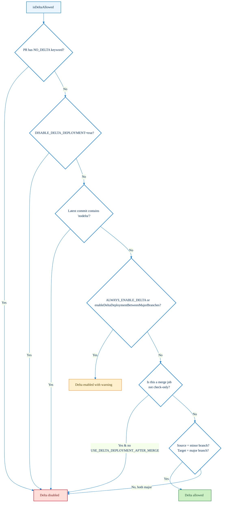

**Non-impacting metadata types** (deployment tests can be skipped if delta contains only these):

> ActionLinkGroupTemplate, AppMenu, AuraDefinitionBundle, ContentAsset, CustomApplication, CustomLabel, CustomTab, Dashboard, Document, EmailTemplate, ExperienceBundle, FlexiPage, Layout, LightningComponentBundle, ListView, NavigationMenu, QuickAction, Report, StaticResource, Translations, and more.

---

## Overwrite Filtering

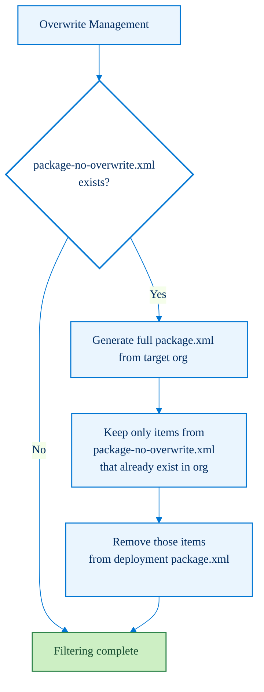

| File                                | Behavior                                                                                                                                                                                                |
|:------------------------------------|:--------------------------------------------------------------------------------------------------------------------------------------------------------------------------------------------------------|
| `manifest/package-no-overwrite.xml` | Items are deployed **only if they don't already exist** in the target org. Useful for ListViews that clients customize in production. See [Overwrite management](salesforce-ci-cd-config-overwrite.md). |

---

## Core Deployment

### PR-Driven Additional Options

Before deployment starts, the PR description is scanned for special keywords and YAML overrides.

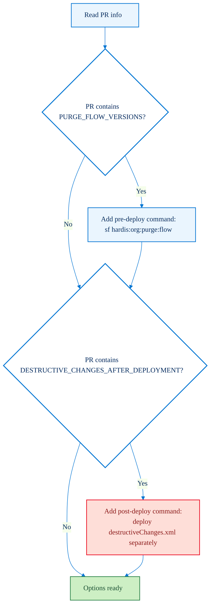

Pull Request descriptions can also override config properties using YAML blocks (see [Deployment Actions](salesforce-ci-cd-work-on-task-deployment-actions.md)):

- `deploymentApexTestClasses`: override test classes
- `commandsPreDeploy`: add pre-deployment commands
- `commandsPostDeploy`: add post-deployment commands

### Pre/Post Deployment Commands

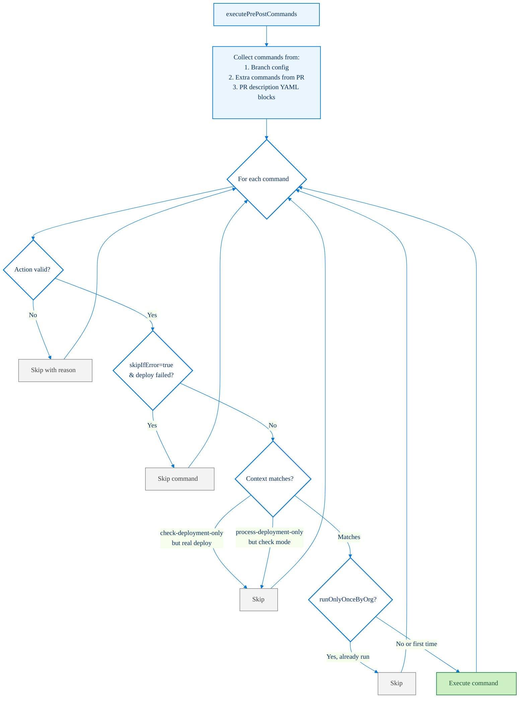

**Action types:**

| Type                | Description                                                                                                                                                      | Key parameters                                                                                                                     |
|:--------------------|:-----------------------------------------------------------------------------------------------------------------------------------------------------------------|:-----------------------------------------------------------------------------------------------------------------------------------|
| `command` (default) | Runs any CLI command (sf, sfdx, shell...)                                                                                                                        | `command`: the command line to execute                                                                                             |
| `data`              | Imports data using an [SFDMU](https://help.sfdmu.com/) project workspace                                                                                         | `parameters.sfdmuProject`: name of the [SFDMU data workspace](https://help.sfdmu.com/full-documentation/configuration/basic-usage) |
| `apex`              | Executes an [anonymous Apex](https://developer.salesforce.com/docs/atlas.en-us.apexcode.meta/apexcode/apex_anonymous_block.htm) script file                      | `parameters.apexScript`: path to the `.apex` script file                                                                           |
| `publish-community` | Publishes an [Experience Cloud](https://developer.salesforce.com/docs/atlas.en-us.communities_dev.meta/communities_dev/communities_dev_intro.htm) community/site | `parameters.communityName`: name of the community to publish                                                                       |
| `schedule-batch`    | Schedules (or re-schedules) a [Schedulable](https://developer.salesforce.com/docs/atlas.en-us.apexcode.meta/apexcode/apex_scheduler.htm) Apex batch              | `parameters.className`: Apex class name, `parameters.cronExpression`: cron schedule, `parameters.jobName` (optional)               |
| `manual`            | Records manual instructions in the deployment report (not executed automatically)                                                                                | `parameters.instructions`: text instructions for the operator                                                                      |

All action types support the following common properties: `id`, `label`, `context`, `skipIfError`, `allowFailure`, `runOnlyOnceByOrg`, and `customUsername` (to run the action as a different user).

Command context options:

- `all` (default), runs in both check and process modes
- `check-deployment-only`, runs only during `--check`
- `process-deployment-only`, runs only during actual deployment

### Quick Deploy

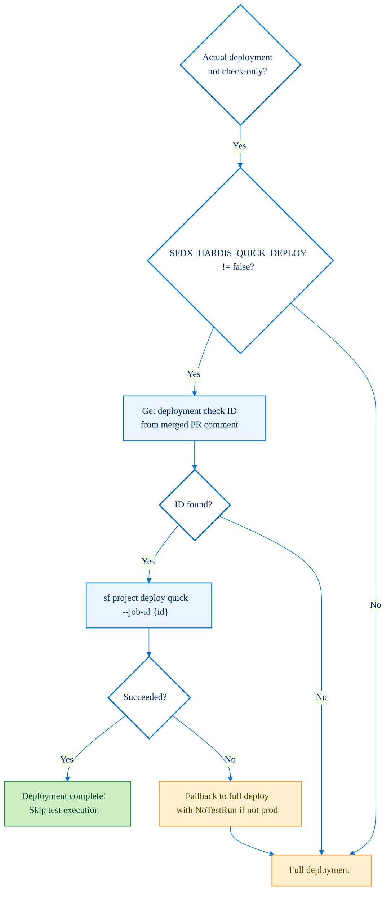

[Quick Deploy](https://developer.salesforce.com/docs/atlas.en-us.api_meta.meta/api_meta/meta_quick_deploy.htm) reuses a previously validated deployment check, skipping the full deployment and test execution. The deployment check ID is stored in the PR comment from the check-only run. See also [`sf hardis:project:deploy:quick`](hardis/project/deploy/quick.md).

### Deployment Engine (smartDeploy)

This is the heart of the deployment process, implemented in [`deployUtils.ts`](https://github.com/hardisgroupcom/sfdx-hardis/blob/main/src/common/utils/deployUtils.ts).

```mermaid
%%{init: {"theme": "base", "themeVariables": {"primaryColor": "#eaf5fe", "primaryTextColor": "#032d60", "primaryBorderColor": "#0176d3", "lineColor": "#0176d3", "fontFamily": "Salesforce Sans, Arial, sans-serif"}}}%%
flowchart TD
    SD_START[smartDeploy called] --> EMPTY_CHECK{package.xml empty?}
    EMPTY_CHECK -->|Yes, no destructive| SKIP_ALL[Run pre/post commands<br/>Post PR comment<br/>Return empty]
    EMPTY_CHECK -->|No| BUILD[Build calculated package.xml]

    BUILD --> FILTER[Apply overwrite filters]
    FILTER --> FILTER_ONCE[Remove items from<br/>package-no-overwrite.xml<br/>already in target org]

    FILTER_ONCE --> PRE_CMD[Execute commandsPreDeploy]

    PRE_CMD --> PKG_EMPTY{Calculated package.xml empty?}
    PKG_EMPTY -->|Yes| POST_CMD
    PKG_EMPTY -->|No| QUICK_CHECK{Check-only = false<br/>& Quick Deploy available?}

    QUICK_CHECK -->|Yes| QUICK[sf project deploy quick<br/>--job-id deploymentCheckId]
    QUICK_CHECK -->|No| FULL_DEPLOY

    QUICK --> QUICK_OK{Quick Deploy succeeded?}
    QUICK_OK -->|Yes| POST_CMD
    QUICK_OK -->|No| FULL_DEPLOY[sf project deploy start<br/>--manifest --test-level<br/>--dry-run if check]

    FULL_DEPLOY --> DEPLOY_OK{Deploy succeeded?}
    DEPLOY_OK -->|Yes| COVERAGE[Check code coverage]
    DEPLOY_OK -->|No| ERR_HANDLE[Analyze errors with deploy tips<br/>Post PR comment<br/>Throw error]

    COVERAGE --> COV_OK{Coverage sufficient?}
    COV_OK -->|Yes| POST_CMD
    COV_OK -->|No & testCoverageNotBlocking| POST_CMD
    COV_OK -->|No| ERR_HANDLE

    POST_CMD[Execute commandsPostDeploy]
    POST_CMD --> PR_COMMENT[Post PR comment with results]
    PR_COMMENT --> SD_END([Return results])

    classDef sfStart fill:#d8edff,stroke:#032d60,color:#032d60,stroke-width:3px
    classDef sfAction fill:#eaf5fe,stroke:#0176d3,color:#032d60,stroke-width:1.5px
    classDef sfDecision fill:#ffffff,stroke:#0176d3,color:#032d60,stroke-width:2px
    classDef sfSuccess fill:#cdefc4,stroke:#2e844a,color:#194e31,stroke-width:1.5px
    classDef sfWarn fill:#fef0cd,stroke:#fe9339,color:#5f3e02,stroke-width:1.5px
    classDef sfError fill:#feded8,stroke:#ea001e,color:#8c1717,stroke-width:1.5px
    classDef sfSkip fill:#f3f3f3,stroke:#706e6b,color:#3e3e3c,stroke-width:1px

    class SD_END sfStart
    class SD_START,BUILD,FILTER,FILTER_ONCE,PRE_CMD,FULL_DEPLOY,COVERAGE,POST_CMD,PR_COMMENT sfAction
    class EMPTY_CHECK,PKG_EMPTY,QUICK_CHECK,QUICK_OK,DEPLOY_OK,COV_OK sfDecision
    class QUICK sfSuccess
    class SKIP_ALL sfSkip
    class ERR_HANDLE sfError
```

---

## Post-Deployment

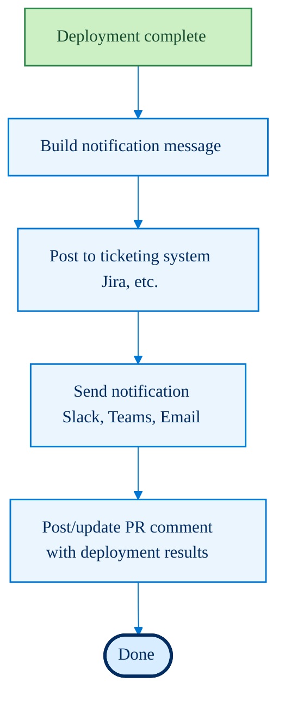

The PR comment includes:

- Deployment errors (with [fix tips](salesforce-ci-cd-solve-deployment-errors.md))
- [Code coverage](https://developer.salesforce.com/docs/atlas.en-us.apexcode.meta/apexcode/apex_code_coverage_intro.htm) report
- [Pre/post command](salesforce-ci-cd-work-on-task-deployment-actions.md) results
- Commit summary
- [Flow visual git diff](hardis/project/generate/flow-git-diff.md) (mermaid diagrams)

---

## Configuration Reference

### .sfdx-hardis.yml properties

| Property                                    | Type     | Description                                                                                                                                                    |
|:--------------------------------------------|:---------|:---------------------------------------------------------------------------------------------------------------------------------------------------------------|
| `useDeltaDeployment`                        | boolean  | Enable [delta deployments](salesforce-ci-cd-config-delta-deployment.md) between minor and major branches                                                       |
| `enableDeltaDeploymentBetweenMajorBranches` | boolean  | Force [delta](salesforce-ci-cd-config-delta-deployment.md) even between major branches (not recommended)                                                       |
| `useSmartDeploymentTests`                   | boolean  | Skip tests if only [non-impacting metadata types](#delta-processing) in delta                                                                                  |
| `testLevel`                                 | string   | Default [test level](#test-level--test-class-resolution)                                                                                                       |
| `enableDeploymentApexTestClasses`           | boolean  | Enable custom [test class list](#test-level--test-class-resolution) from config/PRs                                                                            |
| `deploymentApexTestClasses`                 | string[] | Explicit list of [Apex test classes](https://developer.salesforce.com/docs/atlas.en-us.apexcode.meta/apexcode/apex_testing.htm) to run                         |
| `installedPackages`                         | object[] | [Packages to install](salesforce-ci-cd-work-on-task-install-packages.md) during deployment                                                                     |
| `installPackagesDuringCheckDeploy`          | boolean  | Install [packages](salesforce-ci-cd-work-on-task-install-packages.md) even in check-only mode                                                                  |
| `commandsPreDeploy`                         | object[] | [Commands to run before deployment](salesforce-ci-cd-work-on-task-deployment-actions.md)                                                                       |
| `commandsPostDeploy`                        | object[] | [Commands to run after deployment](salesforce-ci-cd-work-on-task-deployment-actions.md)                                                                        |
| `packageNoOverwritePath`                    | string   | Custom path to [package-no-overwrite.xml](salesforce-ci-cd-config-overwrite.md)                                                                                |
| `testCoverageNotBlocking`                   | boolean  | Allow deployment even with insufficient [code coverage](https://developer.salesforce.com/docs/atlas.en-us.apexcode.meta/apexcode/apex_code_coverage_intro.htm) |
| `skipCodeCoverage`                          | boolean  | Skip [code coverage](https://developer.salesforce.com/docs/atlas.en-us.apexcode.meta/apexcode/apex_code_coverage_intro.htm) reporting                          |

### Environment Variables

See also the [full environment variables reference](all-env-variables.md).

| Variable                               | Description                                                                                 |
|:---------------------------------------|:--------------------------------------------------------------------------------------------|
| `USE_DELTA_DEPLOYMENT`                 | Enable [delta deployment](salesforce-ci-cd-config-delta-deployment.md)                      |
| `ALWAYS_ENABLE_DELTA_DEPLOYMENT`       | Force [delta](salesforce-ci-cd-config-delta-deployment.md) even between major branches      |
| `DISABLE_DELTA_DEPLOYMENT`             | Explicitly disable [delta](salesforce-ci-cd-config-delta-deployment.md)                     |
| `USE_DELTA_DEPLOYMENT_AFTER_MERGE`     | Allow [delta](salesforce-ci-cd-config-delta-deployment.md) for merge jobs (not just checks) |
| `USE_SMART_DEPLOYMENT_TESTS`           | Enable [smart test skipping](#delta-processing)                                             |
| `NOT_IMPACTING_METADATA_TYPES`         | Override the list of [non-impacting types](#delta-processing) (comma-separated)             |
| `SFDX_HARDIS_QUICK_DEPLOY`             | Set to `false` to disable [Quick Deploy](#quick-deploy)                                     |
| `SFDX_DEPLOY_WAIT_MINUTES`             | Deployment wait timeout (default: 120)                                                      |
| `INSTALL_PACKAGES_DURING_CHECK_DEPLOY` | Install [packages](salesforce-ci-cd-work-on-task-install-packages.md) in check-only mode    |
| `SKIP_PACKAGE_DEPLOY_ONCE`             | Skip [package-no-overwrite.xml](salesforce-ci-cd-config-overwrite.md) processing            |
| `FORCE_TARGET_BRANCH`                  | Override target branch for delta scope                                                      |
| `SFDX_HARDIS_DEPLOY_BEFORE_MERGE`      | Use current PR instead of merged PR for notifications                                       |
| `SFDX_DISABLE_FLOW_DIFF`               | Disable [Flow Visual Git Diff](hardis/project/generate/flow-git-diff.md) in PR comments     |

### PR Description Keywords

| Keyword                                | Effect                                                                                                                                                               |
|:---------------------------------------|:---------------------------------------------------------------------------------------------------------------------------------------------------------------------|
| `NO_DELTA`                             | Force full deployment for this PR                                                                                                                                    |
| `PURGE_FLOW_VERSIONS`                  | Purge inactive/obsolete Flow versions after deployment (runs [`sf hardis:org:purge:flow`](hardis/org/purge/flow.md))                                                 |
| `DESTRUCTIVE_CHANGES_AFTER_DEPLOYMENT` | Run [destructiveChanges.xml](https://developer.salesforce.com/docs/atlas.en-us.api_meta.meta/api_meta/meta_deploy_deleting_files.htm) in a separate post-deploy step |
| `nodelta` (in commit message)          | Disable delta for this specific deployment                                                                                                                           |
| `nosmart` (in commit message)          | Disable Smart Deployment Tests for this deployment                                                                                                                   |

---

## Check Mode vs. Process Mode

| Aspect                                                               | Check Mode (`--check`)                   | Process Mode (no flag)                                                                |
|:---------------------------------------------------------------------|:-----------------------------------------|:--------------------------------------------------------------------------------------|
| Deployment                                                           | Dry-run / validation                     | Actual deployment                                                                     |
| [Quick Deploy](#quick-deploy)                                        | Stores deployment ID in PR               | Uses stored deployment ID                                                             |
| [Delta](salesforce-ci-cd-config-delta-deployment.md) scope           | PR source branch → target branch         | HEAD^ → HEAD                                                                          |
| [Packages](salesforce-ci-cd-work-on-task-install-packages.md)        | Warns about missing packages             | Installs packages                                                                     |
| [Post commands](salesforce-ci-cd-work-on-task-deployment-actions.md) | Skips `process-deployment-only` commands | Skips `check-deployment-only` commands                                                |
| [Notifications](salesforce-ci-cd-setup-integrations-home.md)         | Posts check results to PR                | Sends deployment success [notifications](salesforce-ci-cd-setup-integrations-home.md) |
