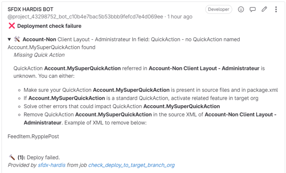
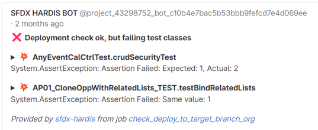

<!-- markdownlint-disable MD013 -->

- [Metadata errors](#metadata-errors)
  - [Fix with new commit](#fix-with-new-commit)
  - [Fix with reset commits then new commit](#fix-with-reset-commits-then-new-commit)
- [Test classes errors](#test-classes-errors)
- [Code Coverage errors](#code-coverage-errors)
- [SOS, I'm lost](#sos-im-lost)

## Metadata errors

sfdx-hardis will display the error and often provide tips about how to solve the error.

### Fix with new commit

You can solve the issue, create a new commit and run again command 

### Fix with reset commits then new commit

If the issue is caused by the fact that you committed files that you finally decided to not publish, you can reset your selection.

-  Click on : that will rollback all the previous commits of your current git branch

- Stage and commit again the elements that you want to publish

- Run command 

## Test classes errors

That's simple: **fix the test classes :)**

If you are an admin, you might need the help of a developer, who will directly work in your branch

## Code Coverage errors

Don't be lazy, **write the missing test classes :)**

You know you'll need them to be able to deploy in production anyway :)

## SOS, I'm lost !

- Call your [release manager](salesforce-ci-cd-release-home.md), he/she's here to help you !
- Google / ChatGPT / Bard the issue
- Ask on Slack #inte-hotline-cicd if you work at [Cloudity](https://cloudity.com/)
- Ask on [Salesforce StackExchange](https://salesforce.stackexchange.com/)
