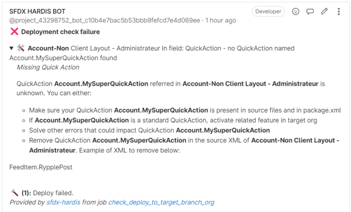
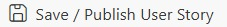
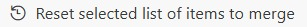
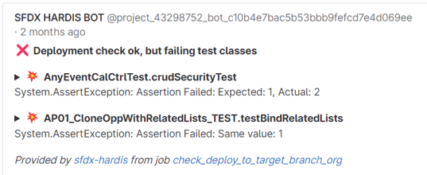

<!-- markdownlint-disable MD013 -->

- [Reading the deployment job log](#reading-the-deployment-job-log)
- [Metadata errors](#metadata-errors)
  - [Fix with a new commit](#fix-with-a-new-commit)
  - [Fix with reset commits then a new commit](#fix-with-reset-commits-then-a-new-commit)
- [Test classes errors](#test-classes-errors)
- [Code coverage errors](#code-coverage-errors)
- [SOS, I am lost](#sos-i-am-lost)

## Solve deployment errors

### Reading the deployment job log

At the end of a deployment or a deployment check, sfdx-hardis displays a short summary instead of the complete Salesforce deployment response, which can be several hundred thousand characters long on big orgs.

```text
Deployment check summary for calculated-package-xml
  Status: Succeeded
  Deployment ID: 0AfG500000PCMG6KAP
  Deployment mode: DELTA
  Components: 26 deployed, 0 failed (26 total)
  Apex tests: 465 completed, 0 failed (465 total)
  Org-wide Apex coverage: 86.82%
  Duration: 0:39:24.000
  Full deployment JSON: hardis-report/deploy-result-calculated-package-xml.json (published in CI job artifacts, hardis-report folder)
  Define NO_TRUNCATE_LOGS=true to display the full deployment JSON in the console again
```

Deployment errors, failed Apex tests and deployment tips are still displayed in full below that summary.

#### Full deployment JSON

The complete deployment response is written in the report directory (`hardis-report` by default), as `deploy-result-<package label>.json`, on success **and** on failure. It contains the component successes, the Apex test details, the coverage details and every other field returned by the Metadata API.

The CI/CD pipelines generated by sfdx-hardis publish that folder as a job artifact. If your repository was created before this feature, add the artifact publication to your existing pipeline:

| Platform        | Add to the deployment job                                                                                                                              |
|-----------------|--------------------------------------------------------------------------------------------------------------------------------------------------------|
| GitLab          | `artifacts:`<br>&nbsp;&nbsp;`when: always`<br>&nbsp;&nbsp;`paths:`<br>&nbsp;&nbsp;&nbsp;&nbsp;`- hardis-report`<br>&nbsp;&nbsp;`expire_in: 1 week`     |
| GitHub          | A step using `actions/upload-artifact@v4` with `if: success() \|\| failure()` and `path: hardis-report`                                                |
| Azure Pipelines | `- publish: $(System.DefaultWorkingDirectory)/hardis-report/`<br>&nbsp;&nbsp;`condition: succeededOrFailed()`<br>&nbsp;&nbsp;`artifact: hardis-report` |
| Bitbucket       | `artifacts:`<br>&nbsp;&nbsp;`- hardis-report/**`                                                                                                       |
| Jenkins         | Already archived by the default Jenkinsfile                                                                                                            |

To get the complete JSON back in the console, define the environment variable `NO_TRUNCATE_LOGS=true` on the job.

### Metadata errors

sfdx-hardis displays each error with a tip about how to solve it. When the project has AI features configured, the [Deployment Agent](salesforce-deployment-agent-home.md) also explains the error and proposes a fix.



#### Fix with a new commit

Solve the issue in your org or in your local files, create a new commit, and run  again. The validation jobs run again on the new commit.

#### Fix with reset commits then a new commit

If the error comes from files that you committed but finally do not want to publish, you can reset your selection.

- Click : it rolls back all the previous commits of your current git branch, without losing your local files.

- Stage and commit again only the elements that you want to publish.

- Run .

### Test classes errors



Fix the test classes: read the error message of each failed test, it usually tells which assertion or which record creation failed.

If you are an admin, you might need the help of a developer, who can work directly in your branch.

### Code coverage errors

Write the missing test classes. You will need them anyway to deploy to production, and the sooner they exist, the easier they are to write.

### SOS, I am lost

- Read the tip sfdx-hardis adds under each error. The [Deployment Agent](salesforce-deployment-agent-home.md) knows the most common Salesforce deployment errors and explains how to fix them.
- Ask your [release manager](salesforce-ci-cd-release-home.md), they are here to help you.
- Search [Salesforce StackExchange](https://salesforce.stackexchange.com/) for the error message.
- If you think the error is caused by sfdx-hardis itself, or if its tip is wrong, [open an issue on GitHub](https://github.com/hardisgroupcom/sfdx-hardis/issues).
