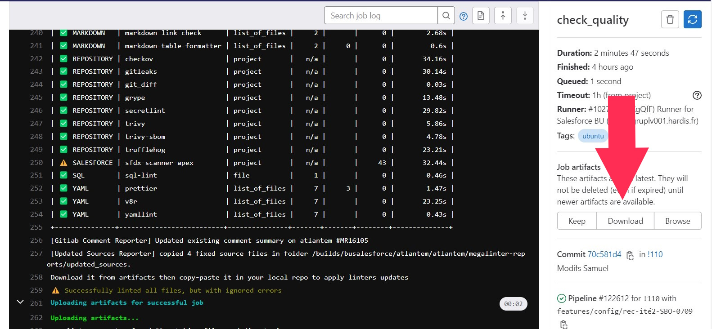
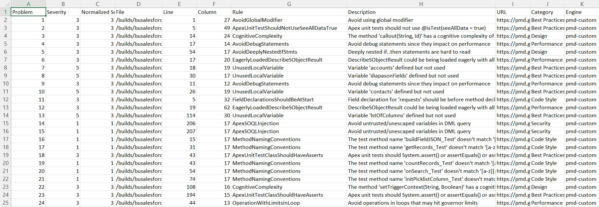

<!-- markdownlint-disable MD013 -->

- [Apex best practices using PMD](#apex-best-practices-using-pmd)
- [LWC best practices using eslint](#lwc-best-practices-using-eslint)
- [Security issues](#security-issues)
- [Excessive copy-pastes](#excessive-copy-pastes)
- [Example of .mega-linter.yml config file](#example-of-mega-linteryml-config-file)

## Apex best practices using PMD

You don't want technical debt on your project !

Download job artifacts that will contain a file `sfdx-scanner-report-apex.csv`.



Open the file to see the errors



- If the errors are in code that has been written by a developer, solve it

- If the errors are from imported or generated classes, you can bypass them by adding annotation `@SuppressWarnings('PMD')` at the top of the classes

- `// NOPMD` at the end of a line will make an issue ignored, but again use it only in case of false positive, never to "Publish more quickly", else you'll create [technical debt](https://en.wikipedia.org/wiki/Technical_debt).
  - If you use `// NOPMD`, specify why as comment . Example: `// NOPMD Strings already escaped before`

## LWC best practices using eslint

sfdx-scanner-lwc embedded in MegaLinter is hard to use.

If you don't succeed, you can define `SALESFORCE_SFDX_SCANNER_LWC` in `DISABLE_LINTERS` property in `.mega-linter.yml` config file.

## Security issues

Solve the security issues if they are critical like hardcoded tokens, or bypass the linters (release manager action only)

## Excessive copy-pastes

Refactor your code to avoid excessive copy-pastes !

## Example of .mega-linter.yml config file

```yaml
# Extend from shared sfdx-hardis Mega-Linter configuration :)
EXTENDS:
  - https://raw.githubusercontent.com/hardisgroupcom/sfdx-hardis/main/config/sfdx-hardis.mega-linter-config.yml

DISABLE_LINTERS:
- SALESFORCE_SFDX_SCANNER_LWC
- SALESFORCE_SFDX_SCANNER_AURA
- CSS_STYLELINT

SALESFORCE_SFDX_SCANNER_APEX_DISABLE_ERRORS_IF_LESS_THAN: 6 # ONLY THE RELEASE MANAGER CAN UPDATE THIS VALUE !
```


