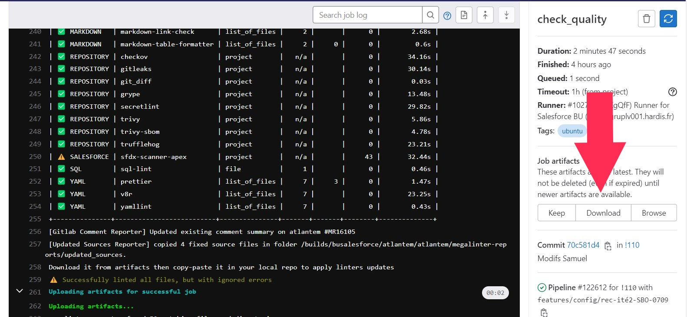
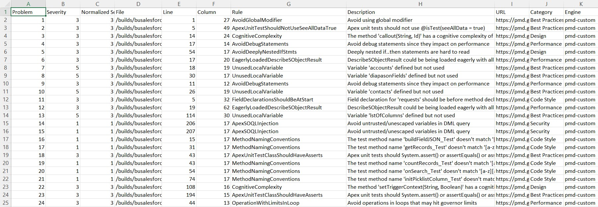

<!-- markdownlint-disable MD013 -->

- [Apex best practices using PMD](#apex-best-practices-using-pmd)
- [LWC best practices using ESLint](#lwc-best-practices-using-eslint)
- [Security issues](#security-issues)
- [Excessive copy-pastes](#excessive-copy-pastes)
- [Example of .mega-linter.yml config file](#example-of-mega-linteryml-config-file)

## Solve MegaLinter errors

MegaLinter posts a comment on your Pull Request (Merge Request on GitLab) with the result of each linter. This page explains how to handle the most common errors.

### Apex best practices using PMD

PMD checks your Apex classes against a list of best practices, to keep technical debt out of the project.

Download the job artifacts: they contain a file named `sfdx-scanner-report-apex.csv`.



Open the file to see the errors.



- If the errors are in code written by a developer of the project, fix the code.

- If the errors are in imported or generated classes, you can bypass them by adding the annotation `@SuppressWarnings('PMD')` at the top of the class.

- `// NOPMD` at the end of a line makes PMD ignore that line. Use it only for false positives, never to publish faster, otherwise you create [technical debt](https://en.wikipedia.org/wiki/Technical_debt).
  - If you use `// NOPMD`, say why in a comment. Example: `// NOPMD Strings already escaped before`

### LWC best practices using ESLint

The LWC scanner embedded in MegaLinter (`sfdx-scanner-lwc`) is hard to configure.

If you cannot make it work, your release manager can add `SALESFORCE_SFDX_SCANNER_LWC` to the `DISABLE_LINTERS` property of the `.mega-linter.yml` config file.

### Security issues

Fix the security issues when they are real, like hardcoded tokens or passwords. If a finding is a false positive, ask your release manager: only the release manager can bypass a linter.

### Excessive copy-pastes

Refactor your code to remove the duplicated blocks.

You can also add exceptions in the `.jscpd.json` file, but only when the duplication really makes sense, not to save time.

### Example of .mega-linter.yml config file

```yaml
# Extend from the shared sfdx-hardis MegaLinter configuration
EXTENDS:
  - https://raw.githubusercontent.com/hardisgroupcom/sfdx-hardis/main/config/sfdx-hardis.mega-linter-config.yml

DISABLE_LINTERS:
- SALESFORCE_SFDX_SCANNER_LWC
- SALESFORCE_SFDX_SCANNER_AURA
- CSS_STYLELINT

SALESFORCE_SFDX_SCANNER_APEX_DISABLE_ERRORS_IF_LESS_THAN: 6 # ONLY THE RELEASE MANAGER CAN UPDATE THIS VALUE
```
