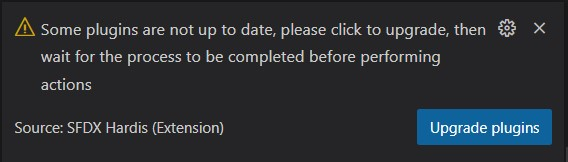
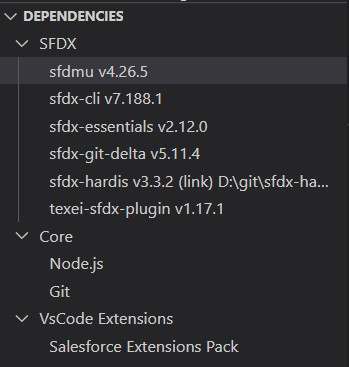

<!-- markdownlint-disable MD013 -->

## Computer Installation user guide

> **If you installed Salesforce DX or Salesforce CLI using Windows installer**, please **uninstall it** using Windows -> Programs > Uninstall

- Install [Visual Studio code](https://code.visualstudio.com/)

- Install VsCode extension [VsCode SFDX Hardis](https://marketplace.visualstudio.com/items?itemName=NicolasVuillamy.vscode-sfdx-hardis) by searching for **Hardis** is VsCode extensions plugin pane.

- Once installed, click on  in VsCode left bar

- Messages will appear at the bottom right of VsCode and ask you to install additional applications and activate settings. Follow all of them until there is none left.
  - When later you'll see such messages again from sfdx-hardis, click to apply them to upgrade applications.

{ align=center }

- When no warning in displayed in the dependencies panel, you're all set !

{ align=center }

>  **_Under the hood_**
>
> The installed applications are the following:
>
> - [Git](https://git-scm.com/)
> - [Node.js](https://nodejs.org/en/)
> - [Salesforce DX](https://developer.salesforce.com/docs/atlas.en-us.sfdx_dev.meta/sfdx_dev/sfdx_dev_develop.htm)
> - Salesforce DX plugins
>   - [sfdx-hardis](https://github.com/hardisgroupcom/sfdx-hardis)
>   - [Salesforce Data Move Utility](https://github.com/forcedotcom/SFDX-Data-Move-Utility)
>   - [SFDX Essentials](https://github.com/nvuillam/sfdx-essentials)
>   - [SFDX Git Delta](https://github.com/scolladon/sfdx-git-delta)
>   - [Texei Sfdx Plugin](https://github.com/texei/texei-sfdx-plugin)

Now your computer is all set, you can [clone your project git repository](salesforce-ci-cd-clone-repository.md) :)

