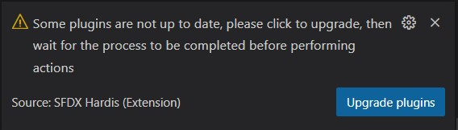
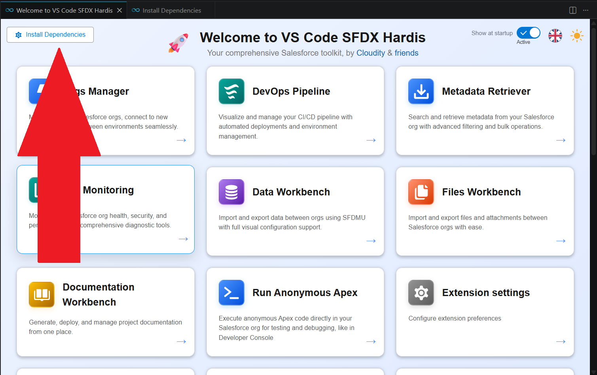
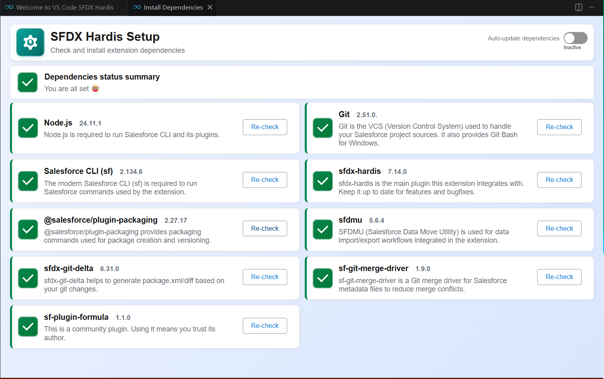
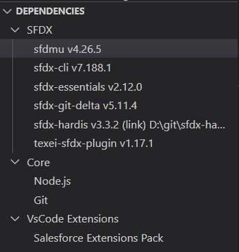

<!-- markdownlint-disable MD013 -->

## Computer Installation user guide

> **If you installed Salesforce DX or Salesforce CLI using Windows installer**, please **uninstall it** using Windows -> Programs > Uninstall

_See tutorial_

<div style="text-align:center"><iframe width="560" height="315" src="https://www.youtube.com/embed/LA8m-t7CjHA" title="YouTube video player" frameborder="0" allow="accelerometer; autoplay; clipboard-write; encrypted-media; gyroscope; picture-in-picture" allowfullscreen></iframe></div>

- Install [Visual Studio code](https://code.visualstudio.com/)

- Install VsCode extension [VsCode SFDX Hardis](https://marketplace.visualstudio.com/items?itemName=NicolasVuillamy.vscode-sfdx-hardis) by searching for **Hardis** is VsCode extensions plugin pane.

- Once installed, click on  in VsCode left bar

- Messages will appear at the bottom right of VsCode and ask you to install additional applications and activate settings. Follow all of them until there is none left.
  - When later you'll see such messages again from sfdx-hardis, click to apply them to upgrade applications.

{ align=center }

You can also click on "Dependencies" button on vscode sfdx-hardis Home page



- **If you are on a Mac**, please read the [Mac users: install dependencies from the Terminal](#mac-users-install-dependencies-from-the-terminal) section below. On Mac, the "Install" buttons in the VsCode dependencies panel often fail silently because they need administrator rights, so you have to install the dependencies yourself using `sudo` in the Terminal.

- When no warning in displayed in the dependencies panel, you're all set !



{ align=center }

>  **_Under the hood_**
>
> The installed applications are the following:
>
> - [Git](https://git-scm.com/)
> - [Node.js](https://nodejs.org/en/)
> - [Salesforce CLI](https://developer.salesforce.com/docs/atlas.en-us.sfdx_dev.meta/sfdx_dev/sfdx_dev_develop.htm)
> - Salesforce DX plugins
>   - [sfdx-hardis](https://github.com/hardisgroupcom/sfdx-hardis)
>   - [SFDX Git Delta](https://github.com/scolladon/sfdx-git-delta)
>   - [Salesforce Data Move Utility](https://github.com/forcedotcom/SFDX-Data-Move-Utility)

Now your computer is all set, you can [clone your project git repository](salesforce-ci-cd-clone-repository.md) :)

---

## Mac users: install dependencies from the Terminal

> This section is for **Mac users only**. Windows and Linux users can skip it.

### Why you need to do this manually

When you click the "Install" buttons in the sfdx-hardis dependencies panel, VsCode runs commands like `npm install @salesforce/cli -g` and `sf plugins install sfdx-hardis` **in the background**.

On a Mac, these global installations require **administrator rights** (`sudo`). The background commands launched by VsCode **cannot ask you for your password**, so they will silently fail or get stuck. You will see things like:

- The dependencies panel keeps showing "missing" or "outdated" no matter how many times you click "Install".
- Errors mentioning `EACCES`, `permission denied`, or `/usr/local/lib`.
- An install spinner that never finishes.

The solution is to **open the Terminal and run the install commands yourself with `sudo`**, so you can type your Mac password when asked.

### Step 1: Open the Terminal app

- Press `Cmd` + `Space`, type `Terminal`, and press `Enter`.

### Step 2: Install the Salesforce CLI

In the Terminal, copy and paste this command and press `Enter`:

```bash
sudo npm install @salesforce/cli -g
```

- The Terminal will ask for your **Mac password**. Type it and press `Enter`.
- You will **not see the characters** as you type the password. This is normal, just keep typing and press `Enter` when done.
- Wait until the command is finished (it can take a minute or two).

Check it worked:

```bash
sf --version
```

### Step 3: Install the sfdx-hardis plugin and other Salesforce plugins

Still in the Terminal, copy and paste these commands **one by one** (press `Enter` after each, and type your password again if asked):

```bash
sudo sf plugins install sfdx-hardis
sudo sf plugins install @salesforce/plugin-packaging
sudo sf plugins install sfdmu
sudo sf plugins install sfdx-git-delta
sudo sf plugins install sf-git-merge-driver
```

If the Terminal asks `Do you want to continue? (y/n)`, type `y` and press `Enter`.

### Step 4: Go back to VsCode

- Quit VsCode completely (`Cmd` + `Q`) and reopen it, so it picks up the newly installed tools.
- Open the sfdx-hardis dependencies panel. All the items should now appear as installed (green).

### Upgrading later

When sfdx-hardis tells you that a new version of a plugin is available, do **not** click the "Upgrade" button in VsCode (it will fail silently for the same reason). Instead, open the Terminal again and re-run the matching `sudo sf plugins install ...` command from Step 3. To upgrade the Salesforce CLI itself, re-run the command from Step 2.

