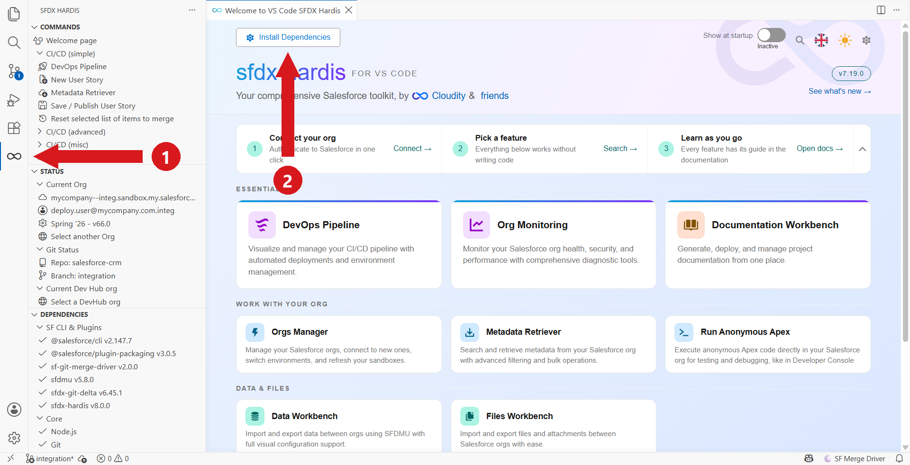
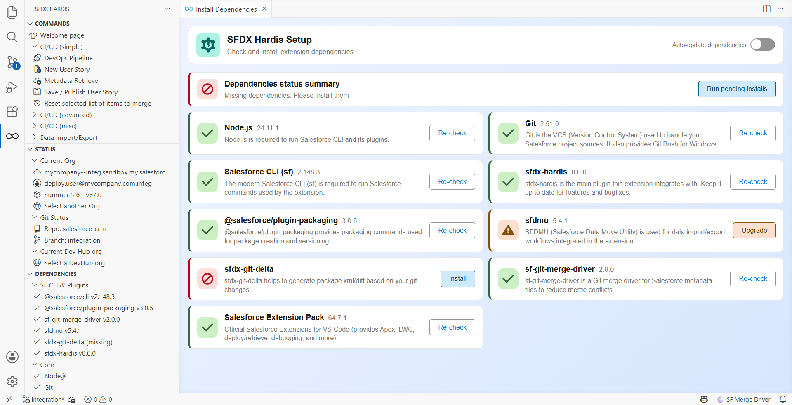
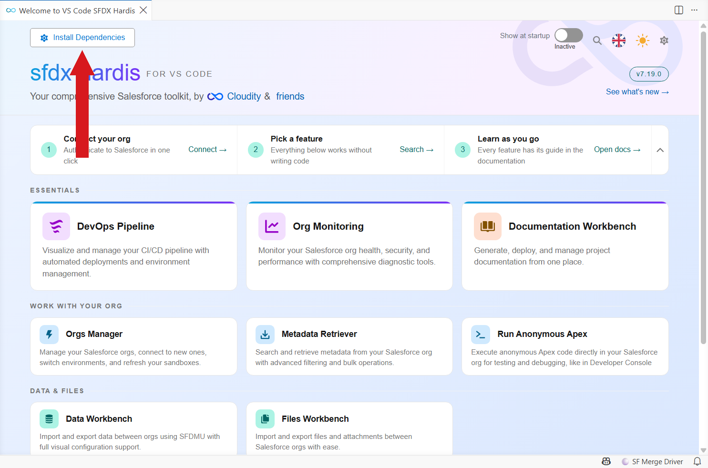
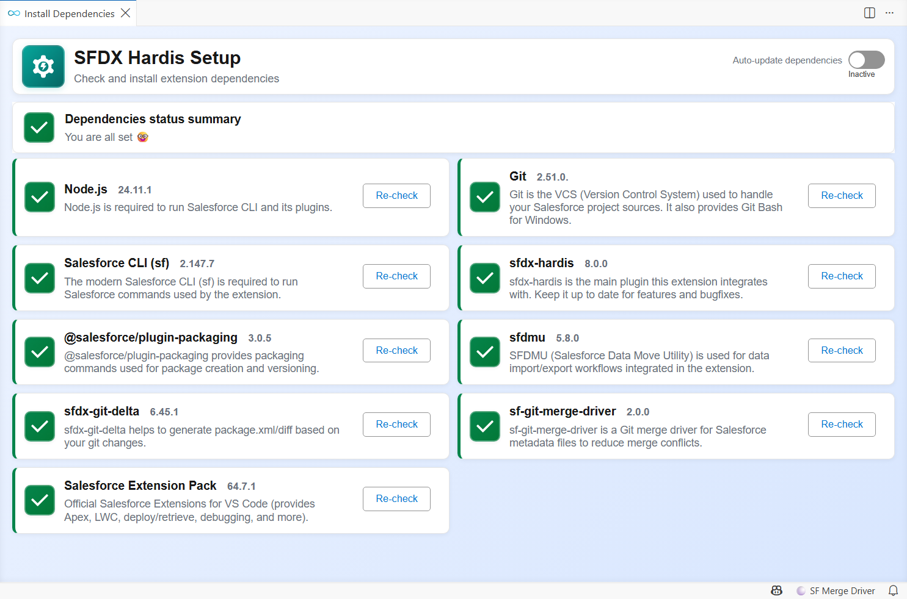
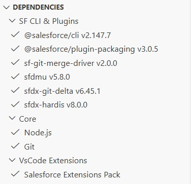

<!-- markdownlint-disable MD013 -->

## Install the tools

This page gets your computer ready to work on a Salesforce CI/CD project. You do it once, it takes about 15 minutes, and the VS Code SFDX Hardis extension installs most of the tools for you.

### 1. Uninstall the native Salesforce CLI installer

> **If you installed Salesforce DX or the Salesforce CLI with the Windows or Mac native installer**, uninstall it first (on Windows: **Settings > Apps > Installed apps**). sfdx-hardis installs the Salesforce CLI with npm, and two installations on the same computer conflict with each other.

If you never installed the Salesforce CLI, skip this step.

### 2. Install Visual Studio Code

Download and install [Visual Studio Code](https://code.visualstudio.com/) (VS Code). It is the editor you will use every day on the project.

### 3. Install the VS Code SFDX Hardis extension

- Open VS Code.
- Open the **Extensions** view (click the Extensions icon in the left bar, or press `Ctrl+Shift+X`).
- Search for **SFDX Hardis** and click **Install** on the [SFDX Hardis extension](https://marketplace.visualstudio.com/items?itemName=NicolasVuillamy.vscode-sfdx-hardis) published by Nicolas Vuillamy.

### 4. Install the dependencies

- Click the  icon in the VS Code left bar to open the extension. The Welcome page opens.
- Click **Install dependencies** on the Welcome page.



- The **SFDX Hardis Setup** panel lists every tool the extension needs, installs the missing ones and upgrades the outdated ones. Wait until every line is green.



- You can open this panel again at any time from the **Dependencies** link of the Welcome page, for example when the extension tells you that a newer version of a tool is available.



> **Mac users**: the Install and Upgrade buttons often fail silently on macOS because they need administrator rights. Read [Mac users: install the dependencies from the Terminal](#mac-users-install-the-dependencies-from-the-terminal) below.

### 5. Check that everything is green

When the Setup panel shows no warning, your computer is ready.



The **Dependencies** section of the SFDX Hardis side bar shows the same information in a compact way.

{ align=center }

>  **_Under the hood_**
>
> The installed tools are the following:
>
> - [Git](https://git-scm.com/)
> - [Node.js](https://nodejs.org/en/)
> - [Salesforce CLI](https://developer.salesforce.com/docs/atlas.en-us.sfdx_dev.meta/sfdx_dev/sfdx_dev_develop.htm) (`sf`)
> - Salesforce CLI plugins
>   - [sfdx-hardis](https://github.com/hardisgroupcom/sfdx-hardis)
>   - [SFDX Git Delta](https://github.com/scolladon/sfdx-git-delta)
>   - [Salesforce Data Move Utility](https://github.com/forcedotcom/SFDX-Data-Move-Utility) (SFDMU)
>   - [@salesforce/plugin-packaging](https://github.com/salesforcecli/plugin-packaging)
>   - [sf-git-merge-driver](https://github.com/jayree/sf-git-merge-driver)
> - The [Salesforce Extension Pack](https://marketplace.visualstudio.com/items?itemName=salesforce.salesforcedx-vscode) for VS Code

### Optional: video tutorial

This video walks through the installation. It was recorded with the previous interface of the extension, so the screens look different, but the steps are the same.

<div style="text-align:center"><iframe width="560" height="315" src="https://www.youtube.com/embed/LA8m-t7CjHA" title="YouTube video player" frameborder="0" allow="accelerometer; autoplay; clipboard-write; encrypted-media; gyroscope; picture-in-picture" allowfullscreen></iframe></div>

### Next step

Your computer is ready. Next: [create a Git access token](salesforce-ci-cd-git-tokens.md), then [clone the repository](salesforce-ci-cd-clone-repository.md) of your project.

---

### Mac users: install the dependencies from the Terminal

> This section is for **Mac users only**. Windows and Linux users can skip it.

#### Why you need to do this manually

When you click the Install buttons in the SFDX Hardis Setup panel, VS Code runs commands like `npm install @salesforce/cli -g` and `sf plugins install sfdx-hardis` in the background.

On a Mac, these global installations need **administrator rights** (`sudo`). The background commands launched by VS Code cannot ask you for your password, so they fail silently or get stuck. You will see things like:

- The Setup panel keeps showing "missing" or "outdated" no matter how many times you click Install.
- Errors mentioning `EACCES`, `permission denied`, or `/usr/local/lib`.
- An install spinner that never finishes.

The solution is to open the Terminal and run the install commands yourself with `sudo`, so you can type your Mac password when asked.

#### Step 1: Open the Terminal app

Press `Cmd` + `Space`, type `Terminal`, and press `Enter`.

#### Step 2: Install the Salesforce CLI

In the Terminal, copy and paste this command and press `Enter`:

```bash
sudo npm install @salesforce/cli -g
```

- The Terminal asks for your **Mac password**. Type it and press `Enter`.
- You will not see the characters as you type the password. This is normal: keep typing and press `Enter` when done.
- Wait until the command is finished (it can take a minute or two).

Check that it worked:

```bash
sf --version
```

#### Step 3: Install the sfdx-hardis plugin and the other Salesforce CLI plugins

Still in the Terminal, copy and paste these commands **one by one** (press `Enter` after each, and type your password again if asked):

```bash
sudo sf plugins install sfdx-hardis
sudo sf plugins install @salesforce/plugin-packaging
sudo sf plugins install sfdmu
sudo sf plugins install sfdx-git-delta
sudo sf plugins install sf-git-merge-driver
```

If the Terminal asks `Do you want to continue? (y/n)`, type `y` and press `Enter`.

#### Step 4: Go back to VS Code

- Quit VS Code completely (`Cmd` + `Q`) and reopen it, so it picks up the newly installed tools.
- Open the SFDX Hardis Setup panel again. Every item should now be green.

#### Upgrading later

When sfdx-hardis tells you that a new version of a plugin is available, do **not** click the Upgrade button in VS Code (it fails silently for the same reason). Instead, open the Terminal again and run the matching `sudo sf plugins install ...` command from Step 3. To upgrade the Salesforce CLI itself, run the command from Step 2 again.
