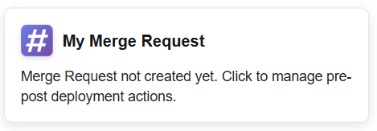
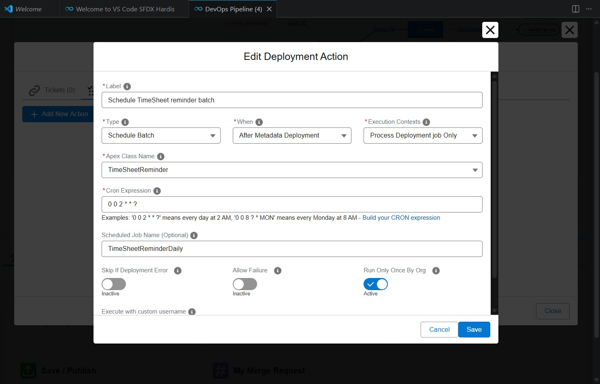
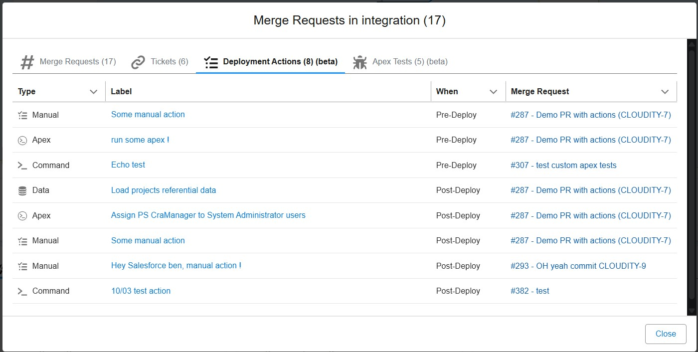

## Deployment actions (beta)

> This feature is currently in beta, but you can start using it right away.

### What are deployment actions ?

Salesforce Deployments are mainly Metadata, but can also be other actions that will be performed before or after Metadata deployment:

- [Run Apex scripts](#run-apex-script)
- [Upsert records (Import SFDMU project)](#import-sfdmu-project)
- [Run command lines](#run-command)
- [Publish Experience Cloud sites](#publish-experience-site)
- [Schedule Apex batch jobs](#schedule-batch)
- [Manual actions that cannot be automated](#manual-step)

You can define them at two levels:

- **Pull Request level**: these actions will be run during the deployment of a feature pull request, but also during deployment of Pull Requests between major branches (ex: `preprod` to `main`)
- **Project level**: The deployment actions will be performed during each deployment

### Use DevOps Pipeline UI

You can display / create / edit deployment actions using **My Pull Request** button in the DevOps pipeline UI.





You can also see deployment actions of already merged Pull Requests by clicking on a major git branch name in the pipeline.



### How to define deployment actions

Actions can be defined in properties `commandsPreDeploy` / `commandsPostDeploy` of .sfdx-hardis.yml config files.

- Pull Request level: `scripts/actions/.sfdx-hardis.<PR_ID>.yml` (ex: `scripts/actions/.sfdx-hardis.372.yml`).
- Repository level: `config/.sfdx-hardis.yml`

Example of a Pull Request level configuration file defining pre-deploy and post-deploy actions:

```yaml
# scripts/actions/.sfdx-hardis.372.yml
commandsPreDeploy:
  - id: runInitApex
    label: Run initialization apex
    type: apex
    parameters:
      apexScript: scripts/apex/init.apex
    context: process-deployment-only
  - id: removeKnowledgeFlag
    label: Remove KnowledgeUser flag
    type: command
    command: >-
      sf data update record --sobject User --where "UserPermissionsKnowledgeUser='true'" --values "UserPermissionsKnowledgeUser='false'" --json
    context: all

commandsPostDeploy:
  - id: importTemplates
    label: Import email templates
    type: data
    parameters:
      sfdmuProject: EmailTemplate
    context: process-deployment-only
  - id: publishSite
    label: Publish Experience site
    type: publish-community
    parameters:
      communityName: "My Experience Site"
    context: process-deployment-only
```

### Configuration: action object shape

Each action is an object with the following required and optional properties.

| Field              | Type    | Required? | Description                                                                                                                                                                                       |
|--------------------|---------|:---------:|---------------------------------------------------------------------------------------------------------------------------------------------------------------------------------------------------|
| `id`               | string  |    Yes    | Unique identifier for the action.                                                                                                                                                                 |
| `label`            | string  |    Yes    | Human-readable description of the action.                                                                                                                                                         |
| `type`             | string  |    Yes    | One of `command`, `data`, `apex`, `publish-community`, `schedule-batch`, `manual`.                                                                                                                |
| `context`          | string  |    Yes    | When the action should run. Allowed values: `all` (default), `check-deployment-only`, `process-deployment-only`.                                                                                  |
| `command`          | string  |    No     | Shell command to run (used by `command` type).                                                                                                                                                    |
| `parameters`       | object  |    No     | Parameters of the action (see action details)                                                                                                                                                     |
| `customUsername`   | string  |    No     | Run the action with a specific username instead of the default target org.                                                                                                                        |
| `skipIfError`      | boolean |    No     | If true and the deployment itself failed, the action will be skipped.                                                                                                                             |
| `allowFailure`     | boolean |    No     | If true and the action fails, the deployment continues but the result is marked failed/allowed.                                                                                                   |
| `runOnlyOnceByOrg` | boolean |    No     | Default: `true`. If true, the action runs only once per target org. Execution state is tracked in a dedicated "Deployment Actions" PR comment (see below) — no Salesforce custom object required. |

### Deployment Actions PR comment

After every action runs, sfdx-hardis creates or updates a dedicated **"Deployment Actions"** comment on the Pull Request. This gives release managers a consolidated view of what has been executed across every org for the lifetime of the PR.

**Comment structure** — one shared comment per PR, across all CI workflows:

```markdown
## Deployment Actions

| Action                      | Org branch  | Status                  | Job                                                     |
|-----------------------------|-------------|-------------------------|---------------------------------------------------------|
| Remove KnowledgeUser flag   | integration | ✅ success (2024-06-01)  | [12345](https://github.com/org/repo/actions/runs/12345) |
| Import email templates      | integration | ✅ success (2024-06-01)  | [12345](https://github.com/org/repo/actions/runs/12345) |
| Publish Experience site     | integration | ❌ failed  (2024-06-02)  | [12501](https://github.com/org/repo/actions/runs/12501) |
| Check external callback URL | integration | 👋 manual  (2024-06-01) | [12345](https://github.com/org/repo/actions/runs/12345) |
| Remove KnowledgeUser flag   | uat         | ✅ success (2024-06-05)  | [12890](https://github.com/org/repo/actions/runs/12890) |
| Import email templates      | uat         | ✅ success (2024-06-05)  | [12890](https://github.com/org/repo/actions/runs/12890) |
```

The table is ordered by org environment (integration → uat → preprod → prod), then chronologically within each org. It also includes a collapsible **Action Details** section with truncated output per action.

**Columns:**

| Column     | Description                                                                     |
|------------|---------------------------------------------------------------------------------|
| Action     | Action label (the `id` is embedded as an HTML comment for machine parsing)      |
| Org branch | Target git branch name (e.g. `integration`, `uat`, `main`) — identifies the org |
| Status     | Icon + status word + date                                                       |
| Job        | Link to the CI run that performed the action                                    |

**Status icons:**

| Icon | Status    | Meaning                                           |
|------|-----------|---------------------------------------------------|
| ✅    | `success` | Executed successfully                             |
| ❌    | `failed`  | Executed but failed — will be retried next run    |
| 👋   | `manual`  | Manual step — requires human action               |
| ⚪    | `skipped` | Skipped (e.g. already run via `runOnlyOnceByOrg`) |

### runOnlyOnceByOrg — skip-on-next-run logic

When `runOnlyOnceByOrg` is `true` (the default), the "Deployment Actions" PR comment is used as the state store:

- If the table already contains a ✅ `success` row for `(actionId, orgBranch)`, the action is **skipped** with a ⚪ status on subsequent deployments.
- ❌ `failed` entries are always **retried** on the next run.
- Each action is tracked per org independently: the same action will run once in `integration` and once in `uat`.

**Requirements for `runOnlyOnceByOrg`:**

- A git provider token must be configured (GitHub: `GITHUB_TOKEN`, GitLab: `CI_SFDX_HARDIS_GITLAB_TOKEN`, Azure DevOps: `SYSTEM_ACCESSTOKEN`, Bitbucket: `CI_SFDX_HARDIS_BITBUCKET_TOKEN`).
- Without a git provider, actions with `runOnlyOnceByOrg: true` are **skipped with a warning** (to avoid untracked re-executions). All other actions still run normally; only the PR comment update is skipped.

**Opt out:** Add `runOnlyOnceByOrg: false` explicitly on any action that should always run.

### Action implementations

| Action type                                     | Purpose                                                          |
|-------------------------------------------------|------------------------------------------------------------------|
| [`command`](#run-command)                       | Run an arbitrary shell or `sf` command.                          |
| [`data`](#import-sfdmu-project)                 | Import a SFDMU project.                                          |
| [`apex`](#run-apex-script)                      | Run an Apex script file through the local `sf apex` integration. |
| [`publish-community`](#publish-experience-site) | Publish an Experience Cloud (community) site.                    |
| [`schedule-batch`](#schedule-batch)             | Schedule an Apex batch job with a cron expression.               |
| [`manual`](#manual-step)                        | Represent a manual step (no CLI execution).                      |

#### Run command

Runs a custom command line. In case of multiple commands, use `&&` to separate them.

| Custom parameter | Description                   | Example                    |
|------------------|-------------------------------|----------------------------|
| `command`        | Command line to run (string). | `echo "My custom command"` |

Example:

```yaml
- id: removeKnowledgeFlag
  label: Remove KnowledgeUser flag
  type: command
  command: >-
    sf data update record --sobject User --where "UserPermissionsKnowledgeUser='true'" --values "UserPermissionsKnowledgeUser='false'" --json
  context: all
```

#### Import SFDMU project

Runs a SFDMU import for the specified project name. Typically used post-deploy to load records such as templates or reference data.

| Custom parameter          | Description                       | Example         |
|---------------------------|-----------------------------------|-----------------|
| `parameters.sfdmuProject` | Name of the SFDMU project to run. | `EmailTemplate` |

Example:

```yaml
- id: importTemplates
  label: Import email templates
  type: data
  parameters:
    sfdmuProject: EmailTemplate
  context: process-deployment-only
```

#### Run Apex script

Executes an Apex script file against the target org using `sf apex run --file`. Useful for initialization scripts or migrations that must run before or after metadata deployment.

| Custom parameter        | Description                                                 | Example                  |
|-------------------------|-------------------------------------------------------------|--------------------------|
| `parameters.apexScript` | Relative path to the `.apex` script file in the repository. | `scripts/apex/init.apex` |

Example:

```yaml
- id: runInitApex
  label: Run initialization apex
  type: apex
  parameters:
    apexScript: scripts/apex/init.apex
  context: process-deployment-only
```

#### Publish Experience site

Publishes the specified Experience Cloud (community) site using `sf community publish`. Use this when deployment changes require a publish step.

| Custom parameter           | Description                                       | Example            |
|----------------------------|---------------------------------------------------|--------------------|
| `parameters.communityName` | Name of the community/Experience site to publish. | `MyExperienceSite` |

Example:

```yaml
- id: publishSite
  label: Publish Experience site
  type: publish-community
  parameters:
    communityName: "My Experience Site"
  context: process-deployment-only
```

#### Schedule batch

Schedules an Apex batch class using `System.schedule()`. The action verifies that the specified Apex class exists in the org, implements the `Schedulable` interface, and has a public no-arg constructor. If the class does not meet these requirements, the action fails with a recommendation to use an [`apex`](#run-apex-script) action instead.

If a scheduled job with the same name and cron expression already exists, the action is skipped (idempotent). If a job with the same name but a **different** cron expression exists, the action fails so you can resolve the conflict manually.

| Custom parameter            | Required? | Description                                                                            | Example            |
|-----------------------------|:---------:|----------------------------------------------------------------------------------------|--------------------|
| `parameters.className`      |    Yes    | Name of the Apex class that implements `Schedulable` with a public no-arg constructor. | `MyBatchScheduler` |
| `parameters.cronExpression` |    Yes    | Cron expression for the schedule (Salesforce format).                                  | `0 0 0 * * ?`      |
| `parameters.jobName`        |    No     | Name of the scheduled job. Defaults to `<className>_Schedule` if omitted.              | `MyBatch_Nightly`  |

Example:

```yaml
- id: scheduleNightlyBatch
  label: Schedule nightly batch
  type: schedule-batch
  parameters:
    className: MyBatchScheduler
    cronExpression: "0 0 0 * * ?"
    jobName: MyBatch_Nightly
  context: process-deployment-only
```

> **Note:** If your Schedulable class requires constructor arguments or has a non-public constructor, use an [`apex`](#run-apex-script) action with a custom `.apex` script instead.

#### Manual step

Marks a manual step that cannot be automated. The PR result will show the instructions and an unchecked box for reviewers/operators to complete.

| Custom parameter          | Description                                                                                                  | Example |
|---------------------------|--------------------------------------------------------------------------------------------------------------|---------|
| `parameters.instructions` | Human-readable instructions or checklist for the operator/reviewer. Use a YAML block to preserve formatting. |         |

Example:

```yaml
- id: url-check
  label: Check external callback URL
  type: manual
  parameters:
    instructions: |
      Verify that the callback URL in `Setup > Named Credentials` is reachable from the target org and matches the production URL.
  context: process-deployment-only
```


