<!-- markdownlint-disable MD013 -->

## Deployment actions

### What are deployment actions?

Deploying a User Story is not always just about metadata. Sometimes something else must happen around the deployment: load reference records, run an Apex script, publish an Experience Cloud site, schedule a batch job, or simply remind someone to activate a setting in Setup.

**Deployment actions** let you declare these steps once, together with your Pull Request. sfdx-hardis then runs them automatically in every org your work is deployed to (integration, uat, preprod, production...), in the right order, exactly once per org, and keeps a visible record of what has been done where. Even the steps a human must perform are declared the same way, so they are replayed identically from one org to the next instead of living in someone's memory or in a chat message.

You can automate (or track) the following kinds of steps:

- [Run a command](#run-a-command)
- [Import data (SFDMU)](#import-data-sfdmu)
- [Run an Apex script](#run-an-apex-script)
- [Publish an Experience Cloud site](#publish-an-experience-cloud-site)
- [Schedule an Apex batch](#schedule-an-apex-batch)
- [Remove items from package.xml](#remove-items-from-packagexml)
- [Manual step](#manual-step) (something a person must do)

Actions can be attached to a **Pull Request** (they follow your User Story from org to org) or to the **whole project** (they run at every deployment).

### Manage your actions from VS Code

Everything can be done with clicks in the [VS Code SFDX Hardis extension](https://sfdx-hardis.cloudity.com/vscode-extension/), from the **DevOps Pipeline** panel:

1. Open the **DevOps Pipeline** and click the **My Pull Request** card.

    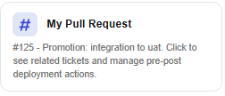

2. In the window that opens, go to the **Deployment Actions** tab. It lists the actions already attached to your Pull Request (Merge Request on GitLab), with their type and when they run.

    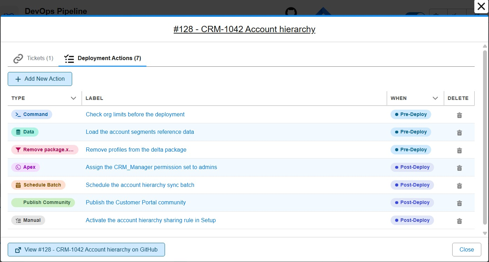

3. Click **Add New Action** to create an action, or click an existing action to view and edit it.

    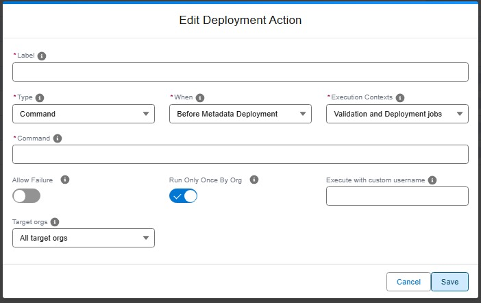

Deployment actions are declared on the Pull Requests of User Stories (feature or fix branches). A Pull Request between two major branches, like a promotion from `integration` to `uat`, carries no action of its own: its **Deployment Actions** tab lists, read-only, the actions of the User Story Pull Requests it brings along, with their author and Pull Request.

You can also review the deployment actions of already merged Pull Requests: click a major branch (like `integration`) in the pipeline diagram, then open its **Deployment Actions** tab.

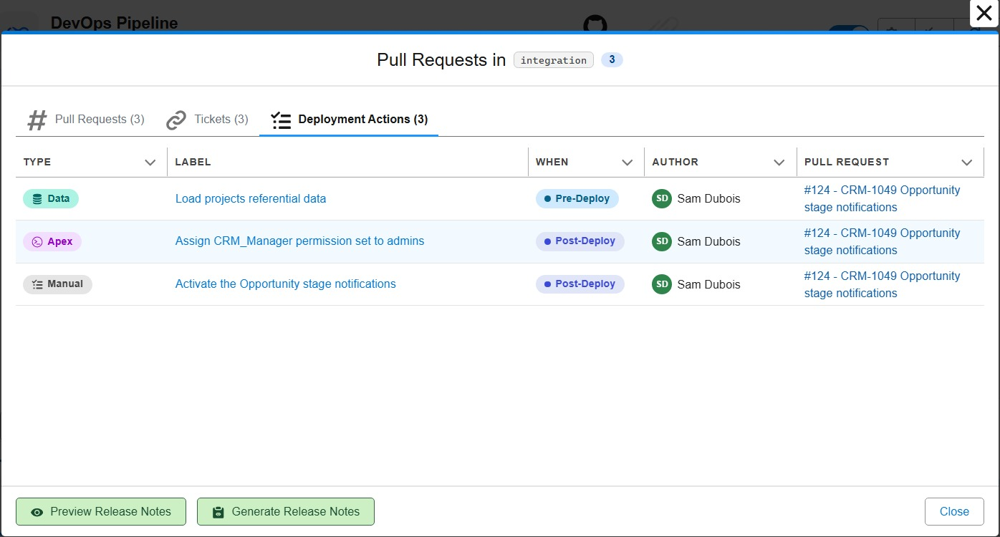

<details markdown="1"><summary>Technical: where actions are stored (YAML)</summary>

Actions are stored in properties `commandsPreDeploy` / `commandsPostDeploy` of `.sfdx-hardis.yml` config files. The VS Code extension reads and writes these files for you, but you can also edit them by hand.

- Pull Request level: `scripts/actions/.sfdx-hardis.<PR_ID>.yml` (ex: `scripts/actions/.sfdx-hardis.372.yml`).
- Repository level: `config/.sfdx-hardis.yml`

Example of a Pull Request level configuration file defining pre-deploy and post-deploy actions:

```yaml
# scripts/actions/.sfdx-hardis.372.yml
commandsPreDeploy:
  - id: runInitApex
    label: Run initialization apex
    type: apex
    parameters:
      apexScript: scripts/apex/init.apex
    context: process-deployment-only
  - id: removeKnowledgeFlag
    label: Remove KnowledgeUser flag
    type: command
    command: >-
      sf data update record --sobject User --where "UserPermissionsKnowledgeUser='true'" --values "UserPermissionsKnowledgeUser='false'" --json
    context: all

commandsPostDeploy:
  - id: importTemplates
    label: Import email templates
    type: data
    parameters:
      sfdmuProject: EmailTemplate
    context: process-deployment-only
  - id: publishSite
    label: Publish Experience site
    type: publish-community
    parameters:
      communityName: "My Experience Site"
    context: process-deployment-only
```

Each action is an object with the following required and optional properties.

| Field                   | Type    | Required? | Description                                                                                                                                                                                      |
|-------------------------|---------|:---------:|--------------------------------------------------------------------------------------------------------------------------------------------------------------------------------------------------|
| `id`                    | string  |    Yes    | Unique identifier for the action.                                                                                                                                                                |
| `label`                 | string  |    Yes    | Human-readable description of the action.                                                                                                                                                        |
| `type`                  | string  |    Yes    | One of `command`, `data`, `apex`, `publish-community`, `schedule-batch`, `remove-packagexml-items`, `manual`.                                                                                    |
| `context`               | string  |    Yes    | When the action should run. Allowed values: `all` (default), `check-deployment-only`, `process-deployment-only`.                                                                                 |
| `command`               | string  |    No     | Shell command to run (used by `command` type).                                                                                                                                                   |
| `parameters`            | object  |    No     | Parameters of the action (see action types)                                                                                                                                                      |
| `customUsername`        | string  |    No     | Run the action with a specific username instead of the default target org.                                                                                                                       |
| `includeTargetBranches` | array   |    No     | Run the action only when the deployment targets one of these branches. See [Choose the target orgs](#choose-the-target-orgs).                                                                    |
| `excludeTargetBranches` | array   |    No     | Run the action on every target branch except these ones. See [Choose the target orgs](#choose-the-target-orgs).                                                                                  |
| `allowFailure`          | boolean |    No     | If true and the action fails, the deployment continues and the action is reported as a warning (⚠️) instead of a failure. It runs again on the next deployment, like a failed action.            |
| `runOnlyOnceByOrg`      | boolean |    No     | Default: `true`. If true, the action runs only once per target org. Execution state is tracked in a dedicated "Deployment Actions" PR comment (see below), no Salesforce custom object required. |

</details>

### When do they run?

For each action you choose two simple things, visible in the editor:

- **When**: before or after the metadata deployment.
- **Execution Contexts**: run it during **validation jobs** (the simulated deployment when the Pull Request is checked), during **deployment jobs** (the real deployment after the merge), or both.

By default, an action **runs only once per org**: once it has been performed in `uat`, it will not run there again, but it will still run in `preprod` and production when your work gets promoted. Failed actions are automatically retried at the next deployment. Manual steps wait until someone confirms them (see below).

> Post-deployment actions are never run when the metadata deployment failed. They are proposed again during the next successful deployment.

<details markdown="1"><summary>Technical: execution contexts, run-once tracking and Pull Request scope</summary>

**Execution contexts** map to the `context` property: `all` (default), `check-deployment-only` (validation job of the Pull Request), `process-deployment-only` (real deployment after merge).

**runOnlyOnceByOrg: skip-on-next-run logic**

When `runOnlyOnceByOrg` is `true` (the default), the "Deployment Actions" PR comment is used as the state store:

- If the table already contains a ✅ `success` row for `(actionId, orgBranch)`, the action is **skipped** with a ⚪ status on subsequent deployments.
- ❌ `failed` entries are always **retried** on the next run.
- Each action is tracked per org independently: the same action will run once in `integration` and once in `uat`.

Requirements:

- A git provider token must be configured (GitHub: `GITHUB_TOKEN`, GitLab: `CI_SFDX_HARDIS_GITLAB_TOKEN`, Azure DevOps: `SYSTEM_ACCESSTOKEN`, Bitbucket: `CI_SFDX_HARDIS_BITBUCKET_TOKEN`).
- Without a git provider, actions with `runOnlyOnceByOrg: true` are **skipped with a warning** (to avoid untracked re-executions). All other actions still run normally; only the PR comment update is skipped.

Opt out by adding `runOnlyOnceByOrg: false` explicitly on any action that should always run.

**Which Pull Requests are in scope**

The actions collected for a deployment depend on the branch the merged Pull Request comes from. The validation job of a Pull Request applies the same rule to the Pull Request being checked, so the check comment of a feature Pull Request lists only its own actions.

| Merge                                                              | Scope                                              |
|--------------------------------------------------------------------|----------------------------------------------------|
| From a feature branch (ex: `feature/my-story` to `integration`)    | Only the Pull Request that has just been merged    |
| Between major branches (ex: `integration` to `uat`)                | Every Pull Request merged since the previous merge |
| From a retrofit branch (ex: `retrofit/from-main` to `integration`) | Every Pull Request merged since the previous merge |

- Between major branches, the batch is every Pull Request merged into the source major branch since its last promotion.
- Into the production branch (which has no promotion target), the batch is every Pull Request carried by the go-live merge itself.
- Pull Requests merged into upstream branches are part of the batch as soon as their commits arrive in the window: a hotfix merged into `main` is collected when a retrofit branch brings it down to `integration`, so its actions run there too.

In every case, `runOnlyOnceByOrg` state tracking makes sure each action runs only in the orgs where it has not been performed yet. The same scope applies to the Apex test classes selected from Pull Requests when `enableDeploymentApexTestClasses` is active.

The resolved scope is visible in two places:

- In job logs, as a single line: `Pull Request scope: 5 Pull Request(s) (#4491, #4494, ...)`. Each Running/Skipping line then shows the Pull Request that defines the action.
- In the check and deployment Pull Request comments, which state which Pull Requests the deployment actions and Apex test classes were collected from, with links.

> If the deployment job of a feature branch fails, its actions are not picked up by the next merged Pull Request. Re-run the failed deployment job, or open a new Pull Request carrying the actions of the previous one.

</details>

### Choose the target orgs

By default, an action runs in every org your work is deployed to. In the editor, the **Target orgs** field lets you restrict it: run it **everywhere**, only on **some major branches** (for example only `uat`), or **everywhere except** a few (for example everywhere but production). You can also target **developer sandboxes** specifically.

Choose **Only these branches** when the action makes sense in a few orgs only. In the example below, the ERP is connected to the uat and production orgs only, so the action that enables the integration runs in `uat` and `main`, and nowhere else.

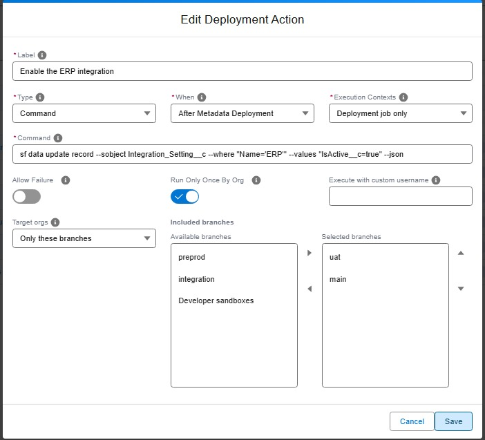

Choose **All except these branches** when the action must run everywhere but a few orgs, most often production. In the example below, the Apex script that upserts the sample records used to test the agents runs in every org except `main`.

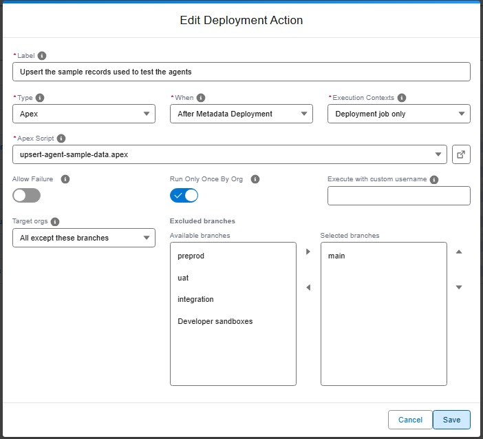

<details markdown="1"><summary>Technical: includeTargetBranches / excludeTargetBranches</summary>

Two mutually exclusive properties control the target orgs:

- `includeTargetBranches`: the action runs only when the deployment targets one of the listed branches.
- `excludeTargetBranches`: the action runs everywhere except on the listed branches.

```yaml
commandsPostDeploy:
  # Runs on UAT and preprod only
  - id: publishCommunity
    label: Publish the customer community
    type: publish-community
    parameters:
      communityName: Customer
    context: process-deployment-only
    includeTargetBranches:
      - uat
      - preprod

  # Runs everywhere except production
  - id: seedDemoData
    label: Import demo records
    type: data
    parameters:
      sfdmuProject: DemoData
    context: process-deployment-only
    excludeTargetBranches:
      - main
```

Branch names are matched exactly, ignoring case. There are no wildcards: list each branch you mean.

**The `dev-sandboxes` virtual branch**

A deployment does not always target a major branch. `sf hardis:work:backpromote` deploys to a developer sandbox, and so does a local `sf hardis:project:deploy:start` run from a feature branch. In those cases the name `dev-sandboxes` matches, so you can target developer sandboxes without knowing their branch names:

```yaml
commandsPreDeploy:
  # Never runs when a developer backpromotes into their own sandbox
  - id: lockIntegrationUser
    label: Lock the integration user
    type: apex
    parameters:
      apexScript: scripts/apex/lock-integration-user.apex
    excludeTargetBranches:
      - dev-sandboxes
```

A target counts as `dev-sandboxes` when it has no `config/branches/.sfdx-hardis.<branch>.yml` file. In a repository with no branch config files at all, every deployment therefore counts as a developer sandbox.

**Reporting and validation**

When an action does not apply to the branch being deployed, it is reported as `skipped` in the Deployment Actions Pull Request comment with the reason, and no execution state is stored: the action still runs later on a branch it does target. A manual action skipped this way is not added to the manual checklist.

Setting both properties on the same action is a configuration error. `sf hardis:project:action:create` and `sf hardis:project:action:update` refuse to save it, and a deployment reading such an action from a YAML file fails with an explicit message.

</details>

### Action types

#### Run a command

Runs any command line (a `sf` command, a script, anything your CI runner can execute). Use it for the automations that do not fit any other type.

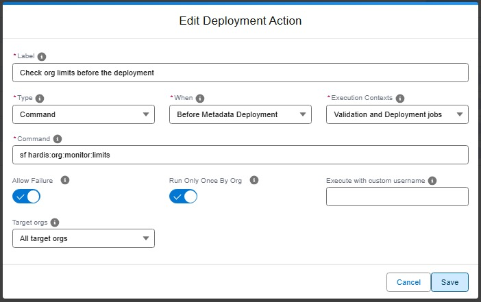

<details markdown="1"><summary>Technical: command action (YAML)</summary>

In case of multiple commands, use `&&` to separate them.

| Custom parameter | Description                   | Example                    |
|------------------|-------------------------------|----------------------------|
| `command`        | Command line to run (string). | `echo "My custom command"` |

```yaml
- id: removeKnowledgeFlag
  label: Remove KnowledgeUser flag
  type: command
  command: >-
    sf data update record --sobject User --where "UserPermissionsKnowledgeUser='true'" --values "UserPermissionsKnowledgeUser='false'" --json
  context: all
```

</details>

#### Import data (SFDMU)

Loads records into the target org using one of the [SFDMU data workspaces](https://sfdx-hardis.cloudity.com/salesforce-ci-cd-config-data/) of your project: reference data, email templates, demo records...

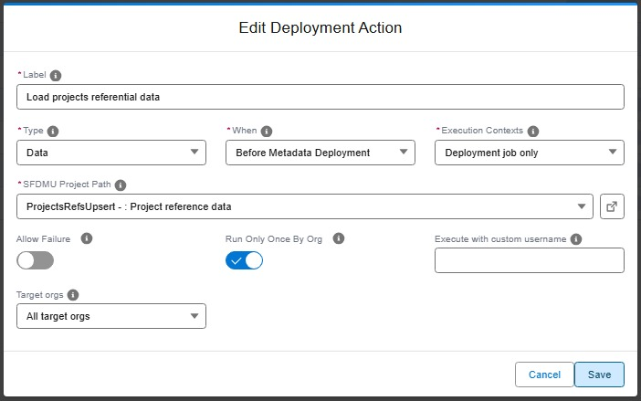

<details markdown="1"><summary>Technical: data action (YAML)</summary>

Runs a SFDMU import for the specified project name. Typically used post-deploy to load records such as templates or reference data.

| Custom parameter          | Description                       | Example         |
|---------------------------|-----------------------------------|-----------------|
| `parameters.sfdmuProject` | Name of the SFDMU project to run. | `EmailTemplate` |

```yaml
- id: importTemplates
  label: Import email templates
  type: data
  parameters:
    sfdmuProject: EmailTemplate
  context: process-deployment-only
```

</details>

#### Run an Apex script

Executes one of the `.apex` script files of your project against the target org. Useful for initialization scripts or migrations, like assigning permission sets or recalculating fields.

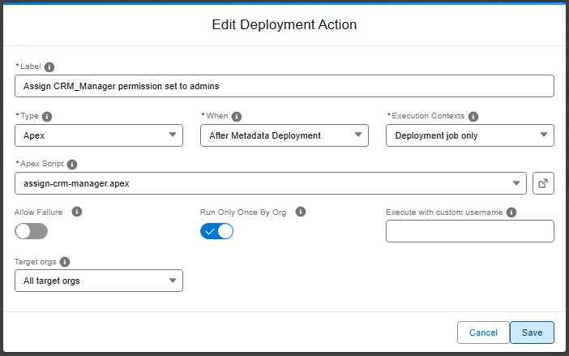

<details markdown="1"><summary>Technical: apex action (YAML)</summary>

Executes an Apex script file against the target org using `sf apex run --file`.

| Custom parameter        | Description                                                 | Example                  |
|-------------------------|-------------------------------------------------------------|--------------------------|
| `parameters.apexScript` | Relative path to the `.apex` script file in the repository. | `scripts/apex/init.apex` |

```yaml
- id: runInitApex
  label: Run initialization apex
  type: apex
  parameters:
    apexScript: scripts/apex/init.apex
  context: process-deployment-only
```

</details>

#### Publish an Experience Cloud site

Publishes an Experience Cloud (community) site of the target org after the deployment, so your changes become visible to its users.

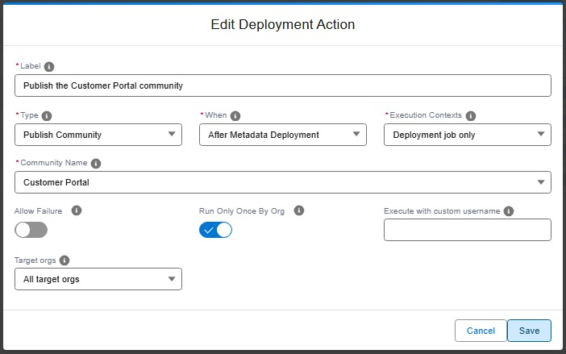

<details markdown="1"><summary>Technical: publish-community action (YAML)</summary>

Publishes the specified Experience Cloud (community) site using `sf community publish`.

| Custom parameter           | Description                                       | Example            |
|----------------------------|---------------------------------------------------|--------------------|
| `parameters.communityName` | Name of the community/Experience site to publish. | `MyExperienceSite` |

```yaml
- id: publishSite
  label: Publish Experience site
  type: publish-community
  parameters:
    communityName: "My Experience Site"
  context: process-deployment-only
```

</details>

#### Schedule an Apex batch

Schedules an Apex batch job in the target org, with a cron expression you can build with a click ("every day at 3 AM"...). The class picker proposes the schedulable classes of the org.

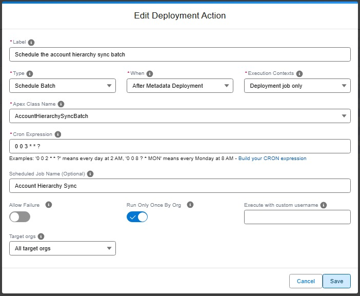

<details markdown="1"><summary>Technical: schedule-batch action (YAML)</summary>

Schedules an Apex batch class using `System.schedule()`. The action verifies that the specified Apex class exists in the org, implements the `Schedulable` interface, and has a public no-arg constructor. If the class does not meet these requirements, the action fails with a recommendation to use an [`apex`](#run-an-apex-script) action instead.

If a scheduled job with the same name and cron expression already exists, the action is skipped (idempotent). If a job with the same name but a **different** cron expression exists, the action fails so you can resolve the conflict manually.

| Custom parameter            | Required? | Description                                                                            | Example            |
|-----------------------------|:---------:|----------------------------------------------------------------------------------------|--------------------|
| `parameters.className`      |    Yes    | Name of the Apex class that implements `Schedulable` with a public no-arg constructor. | `MyBatchScheduler` |
| `parameters.cronExpression` |    Yes    | Cron expression for the schedule (Salesforce format).                                  | `0 0 0 * * ?`      |
| `parameters.jobName`        |    No     | Name of the scheduled job. Defaults to `<className>_Schedule` if omitted.              | `MyBatch_Nightly`  |

```yaml
- id: scheduleNightlyBatch
  label: Schedule nightly batch
  type: schedule-batch
  parameters:
    className: MyBatchScheduler
    cronExpression: "0 0 0 * * ?"
    jobName: MyBatch_Nightly
  context: process-deployment-only
```

> **Note:** If your Schedulable class requires constructor arguments or has a non-public constructor, use an [`apex`](#run-an-apex-script) action with a custom `.apex` script instead.

</details>

#### Remove items from package.xml

Excludes some metadata from the deployment without touching your repository: the listed items are removed from the calculated package.xml just before deploying. Useful for org-specific components that exist in git but must not reach a given org.

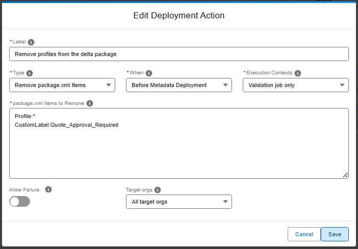

<details markdown="1"><summary>Technical: remove-packagexml-items action (YAML)</summary>

Removes metadata items from the package.xml calculated by `hardis:deploy:smart`, so they are ignored during the metadata deployment step.

Only available as a **pre-deploy** action. The removal applies to the temporary copies of package.xml used by the deployment, never to the manifest files committed in the repository. It is also compatible with delta deployments: items are removed from the calculated delta package.xml.

`runOnlyOnceByOrg` is ignored for this action type: since it only alters the current deployment, it runs at every deployment (check and process).

| Custom parameter             | Description                                                                                                                                                                                                                   | Example                       |
|------------------------------|-------------------------------------------------------------------------------------------------------------------------------------------------------------------------------------------------------------------------------|-------------------------------|
| `parameters.packageXmlItems` | List of items to remove, each in format `TypeName:Member1,Member2`. Use `*` as member to remove a whole type. Member names also support glob wildcards (ex: `Account*`). A single string is also accepted for a single entry. | `ApexClass:MyClass1,MyClass3` |

```yaml
- id: removeLegacyItems
  label: Remove legacy items from deployment package.xml
  type: remove-packagexml-items
  parameters:
    packageXmlItems:
      - ApexClass:MyClass1,MyClass3
      - Layout:MyLayout1,MyLayout2,MyLayout3
  context: all
```

</details>

#### Manual step

Some things cannot be automated: activating a feature that has no API, warning a team, checking an external system. A manual step describes what must be done. sfdx-hardis reminds the right person at the right time, in the Pull Request comments, with a checkbox to tick once it is done.

Before declaring a manual step, check whether it can be scripted: a setting that can be changed with an `sf` command, an Apex anonymous script or a data load belongs in a [command](#run-a-command), [Apex](#run-an-apex-script) or [data](#import-data-sfdmu) action, which runs by itself in every org. Keep `manual` for what really needs a human.

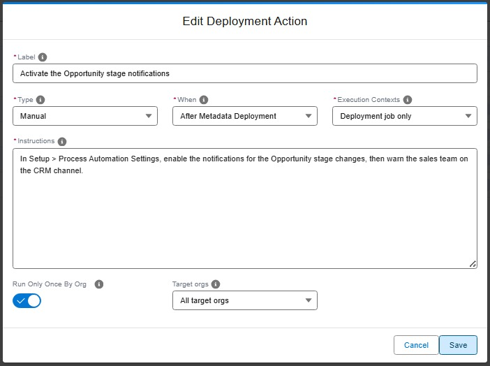

##### Write the instructions click by click

A manual step is performed several times: in integration, then uat, then preprod, then production, sometimes months apart, often by a different person each time. When a manual step goes wrong, it is rarely the action itself: it is a one-line description that assumed the reader already knew which setting and which value.

So the rule is: **describe the manual action as if it was for someone who does not know Salesforce at all.** Good instructions say:

- the **exact Setup path**, starting from the Quick Find box,
- the **exact name** of the item to change (field, setting, named credential, user, permission set...),
- the **exact value** to set, per org if it differs,
- **how to check** that it worked,
- **what to do if it is already done** (usually: nothing, tick the box anyway).

No need to say in which orgs the step applies: that is the job of the **Target orgs** field of the action (see [Choose the target orgs](#choose-the-target-orgs)), and the status matrix shows who still has to do it where.

The release manager reads the manual steps when reviewing the Pull Request, and rejects it when a step is not replayable by someone else (see [Validate a Pull Request](salesforce-ci-cd-validate-merge-request.md#deployment-actions)).

<details markdown="1"><summary>Technical: manual action (YAML)</summary>

The Pull Request comments show the instructions (rendered as markdown) and an unchecked box. Once the operator has performed the action, they tick the box: the next job records the action as done for the org branch and skips it from then on (see [Track what has been done](#track-what-has-been-done)).

| Custom parameter          | Description                                                                                                                      | Example |
|---------------------------|----------------------------------------------------------------------------------------------------------------------------------|---------|
| `parameters.instructions` | Human-readable instructions or checklist for the operator/reviewer, in markdown format. Use a YAML block to preserve formatting. |         |

Too short: which named credential? what is the expected value? how do I know it worked?

```yaml
- id: url-check
  label: Check external callback URL
  type: manual
  parameters:
    instructions: Check that the callback URL is correct in Named Credentials.
  context: process-deployment-only
```

Click by click: anyone can replay it in uat, preprod or production.

```yaml
- id: url-check
  label: Set the ERP callback URL in Named Credential ERP_Callback
  type: manual
  parameters:
    instructions: |
      1. Open **Setup**, type `Named Credentials` in the Quick Find box, then open **Named Credentials**.
      2. Click **ERP_Callback**, then **Edit**.
      3. Set **URL** to the value of the org you are in (ask the integration team if it is not in the list):
         - uat: `https://erp-uat.example.com/callback`
         - preprod: `https://erp-preprod.example.com/callback`
         - production: `https://erp.example.com/callback`
      4. Click **Save**.
      5. Check: open **ERP_Callback** again, the URL shown is the one of the list above.
         If it was already correct, there is nothing to do: tick the box anyway.
  context: process-deployment-only
```

</details>

### Track what has been done

After every deployment, sfdx-hardis creates or updates a **"Deployment Actions"** comment on the Pull Request. At a glance, it shows:

- the **manual steps still waiting** to be performed, as a checklist: tick a box once you have done the action, and sfdx-hardis records it,
- a **status matrix**: one row per action, one column per org, so release managers can see in which orgs each action has been performed, has failed, or is still pending.

This works on GitHub, GitLab, Azure DevOps and Bitbucket.

<details markdown="1"><summary>Technical: the Deployment Actions PR comment format</summary>

**Comment structure**: one shared comment per PR, across all CI workflows:

- A **Pending manual actions** checklist: one checkbox per manual action still waiting to be performed in an org.
- A **Status by org branch** matrix: one row per action, one column per org branch.
- A collapsible **Action Details** section with the action properties (type, context, command or script...) and truncated output per org.

Example of the status matrix:

```markdown
### Status by org branch

| Action                      | When        |          integration           |              uat              |
|-----------------------------|-------------|:------------------------------:|:-----------------------------:|
| Remove KnowledgeUser flag   | pre-deploy  | ✅ 2024-06-01<br/>[12345](...)  | ✅ 2024-06-05<br/>[12890](...) |
| Import email templates      | post-deploy | ✅ 2024-06-01<br/>[12345](...)  | ✅ 2024-06-05<br/>[12890](...) |
| Publish Experience site     | post-deploy | ❌ 2024-06-02<br/>[12501](...)  |               ⬜               |
| Check external callback URL | post-deploy | 👋 2024-06-01<br/>[12345](...) |               ⬜               |

*Legend: ✅ done · ❌ failed · 👋 waiting for manual execution · ⚪ skipped · ⬜ not run in this org branch yet*
```

Columns are ordered from dev to production (integration → uat → preprod → prod), rows follow the deployment order (pre-deploy actions first, then post-deploy). Each cell shows the status icon, the execution date and a link to the CI job that performed the action. A *Last updated* date is displayed under the matrix. The action `id` is embedded in each row as an HTML comment for machine parsing.

**Status icons:**

| Icon | Status    | Meaning                                                          |
|------|-----------|------------------------------------------------------------------|
| ✅    | `success` | Executed successfully (or confirmed as done via its checkbox)    |
| ❌    | `failed`  | Executed but failed, will be retried next run                    |
| 👋   | `manual`  | Manual step - waiting for a human to perform it and tick the box |
| ⚪    | `skipped` | Skipped (e.g. already run via `runOnlyOnceByOrg`)                |
| ⬜    | -         | Not run in this org branch yet                                   |

> Comments written with the previous format (one row per action and org branch pair) are still parsed, and are migrated to the matrix format on their next update.

**Confirming manual actions with checkboxes**

Manual action checklists appear in three kinds of Pull Request comments: check results, deployment results, and the Deployment Actions comment. Every checklist item carries a hidden marker identifying the action and the org branch.

When someone ticks one of these checkboxes (in any of the three comments), the next check or deployment job:

- records the action as done for that org branch in the Deployment Actions comment,
- skips it in later deployments to that org (same behavior as a successful `runOnlyOnceByOrg` action),
- ticks the same checkbox in the other comments where the action appears, so all views stay consistent.

This requires the same git provider token as `runOnlyOnceByOrg` state tracking.

</details>

### Disable deployment actions

On some projects you may want to turn the whole feature off: for example when the repository has a very long Pull Request history and the git provider API takes too long to process it, or when your pipelines must not call the git provider at all.

Set the `disableDeploymentActions` property in `config/.sfdx-hardis.yml` (or in a branch-scoped config file to disable it only for some target branches):

```yaml
disableDeploymentActions: true
```

You can also set the env variable `SFDX_HARDIS_DISABLE_DEPLOYMENT_ACTIONS=true` on a CI job to get the same result without committing a config change (setting it to `false` re-enables the feature even if the config property is `true`).

When disabled:

- `commandsPreDeploy` and `commandsPostDeploy` are not run, whether they are defined in the project / branch config or attached to Pull Requests,
- the Pull Request scope is not computed, so no Merge Request history is fetched from the git provider,
- test classes attached to Pull Requests (`enableDeploymentApexTestClasses`) are not collected, since they would need the Pull Request scope,
- the Deployment Actions comments and manual action checkboxes are neither read nor updated,
- internal actions requested by Pull Request custom behaviors (like `purgeFlowVersions` or `destructiveChangesAfterDeployment`) are skipped too, with a warning in the job logs.
