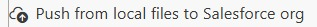

<!-- markdownlint-disable MD013 -->

## Development guidelines

### Update code and XML metadata

- Edit your Apex classes, Lightning Web Components and XML metadata in VS Code.
- When you want to send your local updates to your org, click . Updates made in VS Code are not visible in the org until you push them.
- When you made updates directly in the org (with point and click, or in a Flow), bring them back to your local files before committing. The recommended way is the **Metadata Retriever** (the **Commit changes** card of the DevOps Pipeline panel): its **Recent Changes** tab lists what changed in the org since the last source tracking reset, and you select what to retrieve. The older  command still works and retrieves every tracked change at once.
- When you are done, [publish your User Story](salesforce-ci-cd-publish-task.md).

>  **_Under the hood_**
>
> Push to org runs [hardis:scratch:push](https://sfdx-hardis.cloudity.com/hardis/scratch/push/) and Pull from org runs [hardis:scratch:pull](https://sfdx-hardis.cloudity.com/hardis/scratch/pull/). Both work on scratch orgs and on source-tracked sandboxes.

### Recommendations

- Edit code in VS Code. The online Developer Console is not recommended: its updates are not tracked in your local files until you retrieve them.
- Write your Apex test classes together with your code. Deployments to production require 75% of code coverage, and the Pull Request (Merge Request on GitLab) validation job runs the tests.
- Follow the [configuration guidelines](salesforce-ci-cd-work-on-task-configuration.md): they also apply to developers.
