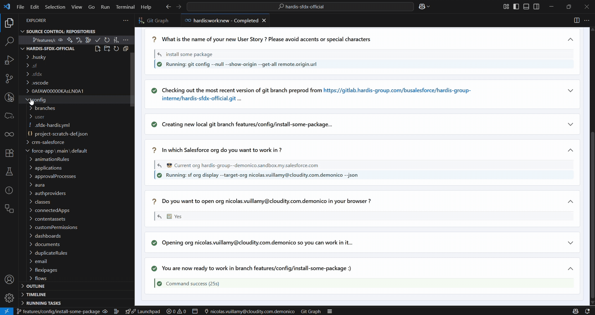

<!-- markdownlint-disable MD013 -->

## Install packages

> Packages (managed or not) must **never be directly installed in a major org** (integration, uat, preprod, production), it has to be done in dev sandbox / scratch orgs

If you installed a package on a dev sandbox or scratch org, use **DevOps Pipeline -> Installed Packages Manager** to retrieve the package configuration **before creating your merge request** (be careful of what you commit in .sfdx-hardis.yml file !)

- Select **Deployments** if you want the package to be automatically installed on major orgs
- Select **Scratch** if you want the package to be automatically installed on new Scratch Orgs

> Once packages are referenced in `.sfdx-hardis.yml`, they will automatically be installed on major orgs during CI/CD deployments

> If you want packages to be installed during deployment check, see with your release manager to define `installPackagesDuringCheckDeploy: true` in your `.sfdx-hardis.yml` config file.
