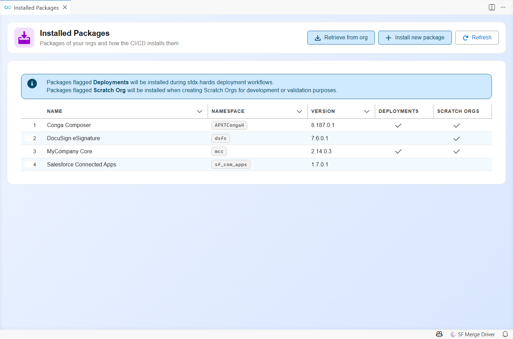
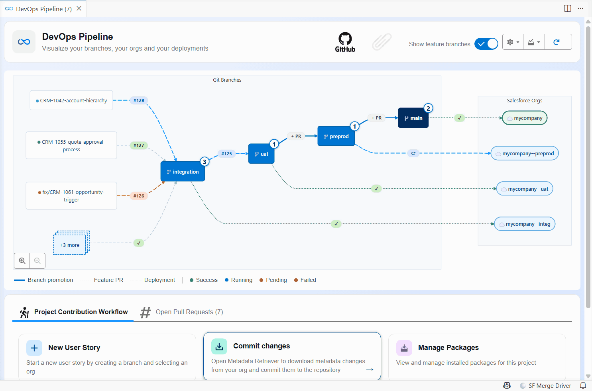

<!-- markdownlint-disable MD013 -->

## Install packages

> Packages (managed or unlocked) must **never be installed directly in a major org** (integration, uat, preprod, production). Install them in your dev sandbox or scratch org, declare them in the project, and let the CI/CD pipeline install them in the major orgs.

### The Installed Packages panel

The **Installed Packages** panel lists the packages of your project and how the CI/CD installs them. Open it with the **Manage Packages** card of the **DevOps Pipeline** panel (or of the Welcome page).

- **Retrieve from org**: reads the packages installed in your current org and adds the missing ones to the list.
- **Install new package**: runs `sf hardis:package:install`, which asks for the package version id (`04t...`) and installs the package in your current org.
- **Refresh**: reloads the list from the project configuration.

Each package has two flags:

- **Deployments**: the CI/CD pipeline installs the package in the major orgs when your work is deployed there.
- **Scratch Orgs**: the package is installed in every new scratch org created for the project.

### Declare a package you installed

1. Install the package in your dev sandbox or scratch org (with **Install new package**, or from the Salesforce installation link of the package).
2. Open the **Installed Packages** panel and click **Retrieve from org** so the package appears in the list.
3. Check **Deployments** if the package must be installed in the major orgs, and **Scratch Orgs** if it must be installed in new scratch orgs. Click **Save**.
4. Do this **before you publish your User Story**: the package list is stored in the `.sfdx-hardis.yml` configuration file of the project, and this file must be part of your commit. Look at what you commit in `.sfdx-hardis.yml`, it also contains other project settings.

> Once a package is declared with the **Deployments** flag, the CI/CD pipeline installs it in the major orgs before deploying your metadata. You never have to install it by hand.
>
> By default, packages are installed by the deployment jobs, not by the Pull Request (Merge Request on GitLab) validation jobs. If the validation of your Pull Request fails because a package is missing, ask your release manager to define `installPackagesDuringCheckDeploy: true` in the `.sfdx-hardis.yml` config file.

Technical details for release managers:

>  **_Under the hood_**
>
> The package list is the `installedPackages` property of `config/.sfdx-hardis.yml`, with the `installDuringDeployments` and `installOnScratchOrgs` flags. The CI/CD pipeline installs the packages flagged for deployments during [hardis:project:deploy:smart](https://sfdx-hardis.cloudity.com/hardis/project/deploy/smart/), and the scratch org creation installs the packages flagged for scratch orgs during [hardis:scratch:create](https://sfdx-hardis.cloudity.com/hardis/scratch/create/).
