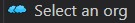

<!-- markdownlint-disable MD013 -->

## Salesforce Configuration

### Open your org

You can use Salesforce Setup to configure your org as you would do on any sandbox.

- Open your Salesforce DX project with Visual Studio Code
- Open VsCode SFDX Hardis extension by clicking on  in VsCode left bar _(loading can task several seconds)_
- Click on  to open your org in browser
  - _If you want to use another org, use menu  to select another one_
- Perform your configurations in the org
- Once you have finished, you can [publish your task](salesforce-ci-cd-pubish-task.jpg)

### Recommendations

Please follow as much as possible these recommendations when you work on a CI/CD Salesforce project:

- **Do not rename API names** (field names, picklist values, pages...)
- **Do not change the type of custom fields**
- Use command  to install package instead of installing them directly with the URL
- Always **use Permission Sets** instead of Profiles. If you need profiles, discuss with your release manager.
- Never link a Metadata directly to a user, but Groups (Queues,Reports...)
- If you need to update Flows, discuss to make sure that no other member of the team is updating the same Flow in another branch/org
  - _If it happens, conflicts are not manageable so one of you will later need to perform the updates again_
- **Never use hardcoded Ids** in Flows and formulas (or anywhere else)
- Use **static resources to store images**

## Salesforce Development

### Update code & XML Metadatas

- You can update code and XML metadatas using VsCode IDE
- When you need to upload the updates to your org, use command 
- If you made updates directly on your org, use command  to retrieve into local files the updates that you performed online with point & click
- Once you have finished, you can [publish your task](salesforce-ci-cd-pubish-task.jpg)

### Recommendations

- Use Visual Studio code editor to update code (online Developer Console is not recommended)
