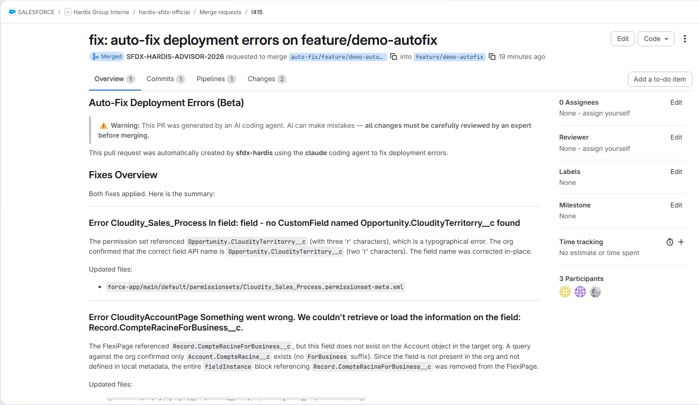
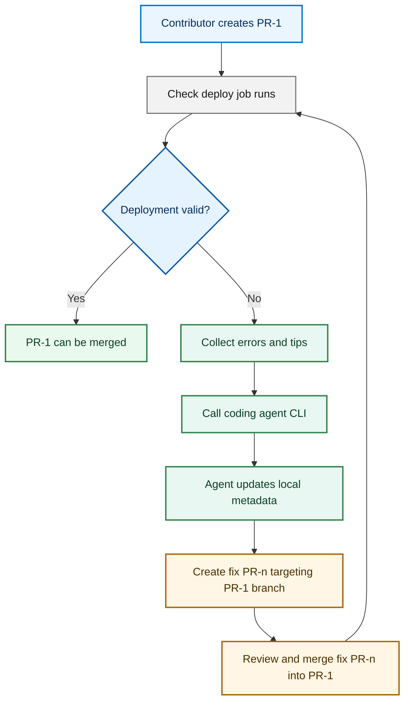

<!-- markdownlint-disable MD013 -->

# Coding Agent Auto-Fix (Beta)

!!! warning "Beta Feature"

> This feature is currently in **beta**. AI coding agents can make mistakes: **all proposed changes must be carefully reviewed by an expert** before merging. Never blindly accept auto-fix Pull Requests.

## Overview

When a deployment fails, sfdx-hardis can automatically invoke a **coding agent CLI** to analyze the errors, modify local metadata files, and create a Pull Request with the proposed fixes.



This feature works with the following coding agent CLIs:

| Agent                  | CLI Package                                                                            | Auth mechanism                                               |
|:-----------------------|:---------------------------------------------------------------------------------------|:-------------------------------------------------------------|
| **Claude** (Anthropic) | [`@anthropic-ai/claude-code`](https://www.npmjs.com/package/@anthropic-ai/claude-code) | `ANTHROPIC_API_KEY` env var                                  |
| **Codex** (OpenAI)     | [`@openai/codex`](https://www.npmjs.com/package/@openai/codex)                         | `OPENAI_API_KEY` or `CODEX_API_KEY` env var                  |
| **Gemini** (Google)    | [`@google/gemini-cli`](https://www.npmjs.com/package/@google/gemini-cli)               | `GEMINI_API_KEY` env var                                     |
| **Copilot** (GitHub)   | [`@github/copilot`](https://www.npmjs.com/package/@github/copilot)                     | `COPILOT_GITHUB_TOKEN`, `GH_TOKEN` or `GITHUB_TOKEN` env var |

## How it works

When `codingAgentAutoFix` is enabled and a deployment fails:

1. sfdx-hardis **analyzes the deployment errors** and collects tips (including AI-generated suggestions if an LLM provider is configured)
2. A **fix branch** is created from the current branch (e.g. `auto-fix/integration/2026-04-15T10-30-00`)
3. The configured **coding agent CLI** is invoked with a detailed prompt describing all errors and failed tests
4. The agent reads, analyzes and **modifies local metadata files** to fix the errors (it does NOT deploy anything)
5. Changes are **committed and pushed** to the fix branch
6. A **Pull Request** is created targeting the original branch, with a description of all errors and applied fixes

### Deployment Agent cinematic



This loop can run multiple times (`PR-2`, `PR-3`, etc.) until the check deploy job is valid and the initial Pull Request can be merged.

## Setup

### 1. Install a coding agent CLI

If you are using the **sfdx-hardis Docker images**, all agent CLIs are pre-installed.

If you run your own CI/CD pipeline, install the CLI(s) you want to use:

```bash
# Pick one (or more):
npm install -g @anthropic-ai/claude-code
npm install -g @openai/codex
npm install -g @google/gemini-cli
npm install -g @github/copilot
```

In the default CI/CD pipeline templates, these lines are present but **commented out**. Uncomment the one(s) you need.

### 2. Enable auto-fix

You can enable auto-fix either via environment variable or via `.sfdx-hardis.yml`.

=== "Environment variable"

    ```bash
    SFDX_HARDIS_CODING_AGENT_AUTO_FIX=true
    ```

=== ".sfdx-hardis.yml"

    ```yaml
    codingAgentAutoFix: true
    ```

### 3. Provide API keys

The coding agent CLI needs to authenticate with its AI provider. You must provide the appropriate API key as a **secure environment variable** in your CI/CD pipeline.

| Agent   | Required env var                                                                          |
|:--------|:------------------------------------------------------------------------------------------|
| Claude  | `ANTHROPIC_API_KEY`                                                                       |
| Codex   | `OPENAI_API_KEY` or `CODEX_API_KEY`                                                       |
| Gemini  | `GEMINI_API_KEY`                                                                          |
| Copilot | `COPILOT_GITHUB_TOKEN`, `GH_TOKEN` or `GITHUB_TOKEN` (usually already available in CI/CD) |

**Tip:** If you already have a LangChain AI provider configured (see [AI setup](salesforce-ai-setup.md)), sfdx-hardis will automatically **reuse** `LANGCHAIN_LLM_MODEL_API_KEY` so you don't need to set a separate key.

### 4. (Optional) Choose a specific agent

By default, sfdx-hardis detects the coding agent automatically:

1. If a **LangChain provider** is configured, it maps to the matching agent (anthropic → Claude, openai → Codex, google-genai → Gemini)
2. Otherwise, it **auto-detects** which CLI is installed, in priority order: Claude, Codex, Gemini, Copilot

To override, set explicitly:

=== "Environment variable"

    ```bash
    SFDX_HARDIS_CODING_AGENT=claude    # or: codex-cli, gemini-cli, copilot-cli
    ```

=== ".sfdx-hardis.yml"

    ```yaml
    codingAgent: claude    # or: codex-cli, gemini-cli, copilot-cli
    ```

## Configuration reference

| Variable / Config key                                        | Description                                                                                               | Default       |
|:-------------------------------------------------------------|:----------------------------------------------------------------------------------------------------------|:--------------|
| `SFDX_HARDIS_CODING_AGENT_AUTO_FIX` / `codingAgentAutoFix`   | Enable automatic fix of deployment errors using a coding agent                                            | `false`       |
| `SFDX_HARDIS_CODING_AGENT` / `codingAgent`                   | Force a specific coding agent CLI (`claude`, `codex-cli`, `gemini-cli`, `copilot-cli`)                    | Auto-detected |
| `SFDX_HARDIS_CODING_AGENT_MODEL` / `codingAgentModel`        | Override the model used by the coding agent CLI (e.g. `claude-sonnet-4-20250514`, `o3`, `gemini-2.5-pro`) | Agent default |
| `SFDX_HARDIS_CODING_AGENT_MAX_TURNS` / `codingAgentMaxTurns` | Maximum number of agentic turns / iterations the CLI is allowed to perform                                | Agent default |
| `DEBUG_CODING_AGENT`                                         | Set to `true` to show full coding agent output in logs                                                    | `false`       |

## Customizing the prompt

The prompt sent to the coding agent uses the template `PROMPT_CODING_AGENT_FIX_DEPLOYMENT_ERRORS`, which can be **overridden** by placing a file at:

```
config/prompt-templates/PROMPT_CODING_AGENT_FIX_DEPLOYMENT_ERRORS.md
```

The template receives the following variables:

| Variable       | Description                                                  |
|:---------------|:-------------------------------------------------------------|
| `ERRORS`       | Structured list of deployment errors with tips               |
| `FAILED_TESTS` | Failed Apex test classes with error details and stack traces |
| `TARGET_ORG`   | The target org username (for read-only queries)              |

See [prompt templates documentation](salesforce-ai-prompts.md) for more details on how to override prompts.

## Security considerations

!!! danger "Expert review required"

AI coding agents can produce incorrect or incomplete fixes. **Every auto-fix Pull Request must be reviewed and validated by an expert** before merging. Treat these PRs the same way you would treat any code contribution — run tests, inspect changes, and verify correctness.

- The coding agent runs with `--allow-all-tools` / full auto-approval mode so it can read and modify files autonomously
- The agent is **instructed to never deploy** anything to Salesforce — it only modifies local files
- The agent **can query** the target org for metadata/data (read-only) to understand the current state
- All changes go through a **Pull Request** for human review before being merged — **do not auto-merge these PRs**
- It is recommended to run coding agents in a **restricted CI/CD environment** (container, VM) with limited permissions

## Example CI/CD configuration

### GitHub Actions

```yaml
env:
  SFDX_HARDIS_CODING_AGENT_AUTO_FIX: "true"
  ANTHROPIC_API_KEY: ${{ secrets.ANTHROPIC_API_KEY }}
```

### GitLab CI

```yaml
variables:
  SFDX_HARDIS_CODING_AGENT_AUTO_FIX: "true"
  ANTHROPIC_API_KEY: $ANTHROPIC_API_KEY
```

### .sfdx-hardis.yml (shared config)

```yaml
codingAgentAutoFix: true
codingAgent: claude # optional: force a specific agent
codingAgentModel: claude-sonnet-4-20250514 # optional: override the model
codingAgentMaxTurns: 30 # optional: limit the number of agentic turns
```
