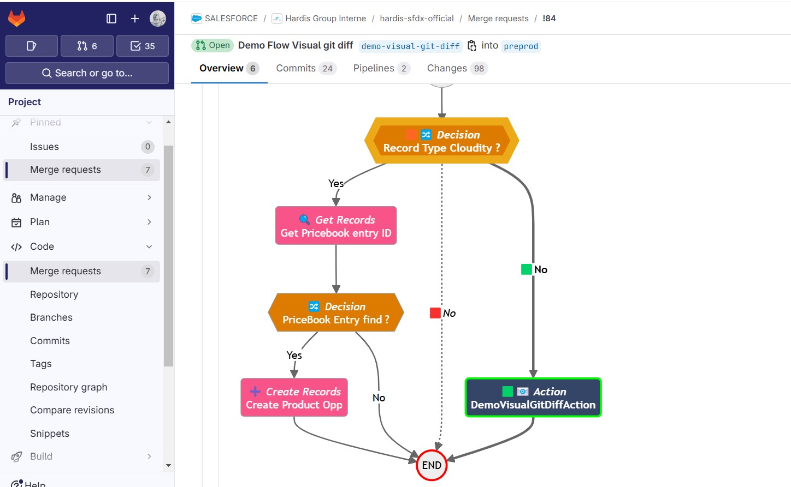
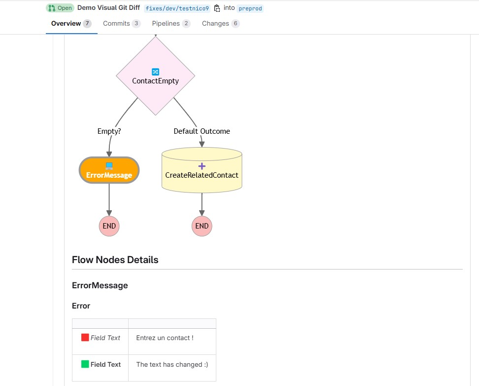

<!-- markdownlint-disable MD013 -->

# Flow Visual Git Diff

In addition to deployment tips, Deployment Agent can post **Flow Visual Git Diff** in Pull Request comments.

This helps reviewers:

- Visually inspect Flow differences in a Mermaid diagram
- Understand updates without opening raw XML metadata

## Legend

- 🟩 = added
- 🟥 = removed
- 🟧 = updated





## Disable if needed

To disable Flow Visual Git Diff in PR comments, set:

```bash
SFDX_DISABLE_FLOW_DIFF=true
```

## Related pages

- [Deployment Agent](salesforce-deployment-agent-home.md)
- [Agent deployment Hints](salesforce-deployment-agent-hints.md)
- [Setup Deployment Agent](salesforce-deployment-agent-setup.md)
