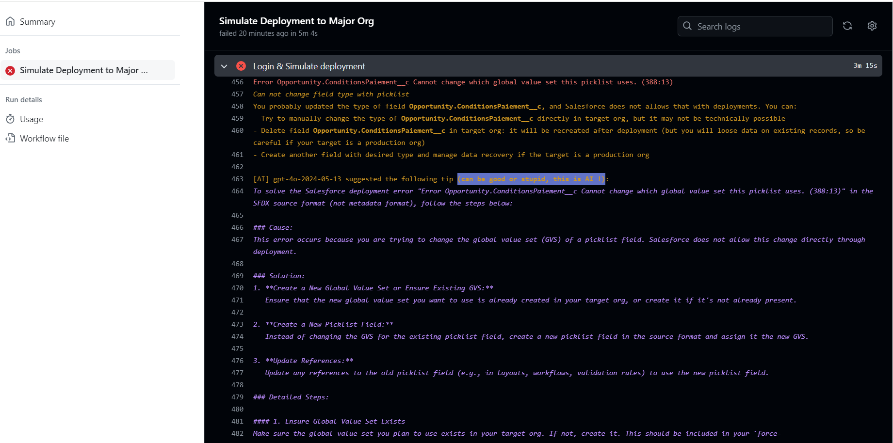

<!-- markdownlint-disable MD013 -->

# Agent deployment Hints

## Salesforce DevOps AI Integration

Deployment Agent combines a curated list of deployment troubleshooting rules with optional AI-powered guidance.

This means you can get practical, contextual deployment hints directly from your CI/CD logs and Pull Request comments, even if your pipeline is not fully based on sfdx-hardis.

## Where hints are displayed

Deployment hints are available in:

- Pull Request / Merge Request comments (GitHub, Gitlab, Azure DevOps, Bitbucket)
- Console logs

## AI providers

To enrich hints with AI-generated guidance, configure one of the supported providers in [sfdx-hardis AI setup](salesforce-ai-setup.md):

- Agentforce
- LangChain providers (OpenAI, Anthropic, Google Gemini, Ollama)
- OpenAI direct
- Codex direct

## Related pages

- [Setup Deployment Agent](salesforce-deployment-agent-setup.md)
- [Coding Agent Auto-Fix (Beta)](salesforce-deployment-agent-autofix.md)
- [Flow Visual Git Diff](salesforce-deployment-agent-flow-visual-git-diff.md)
