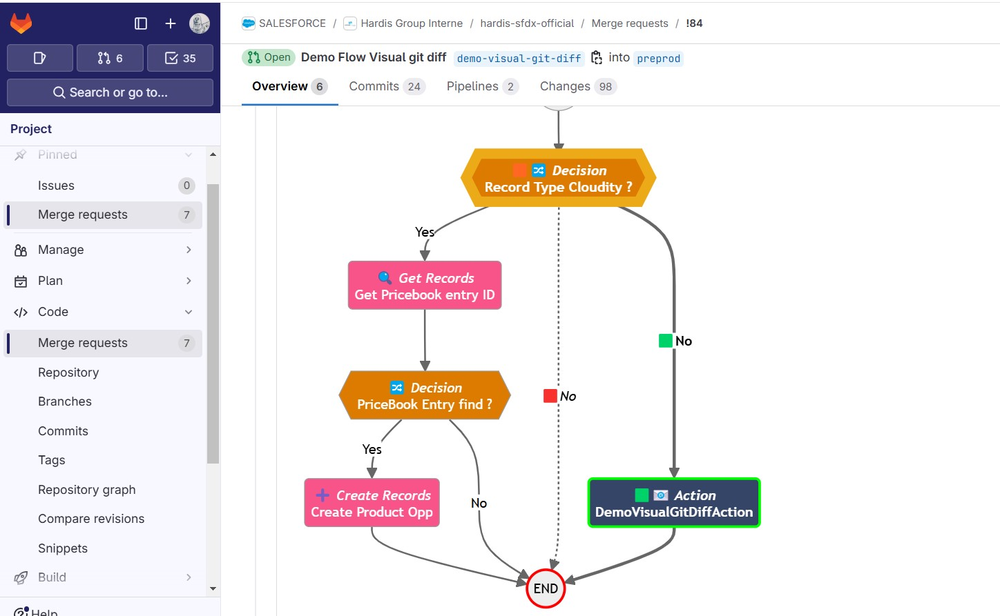
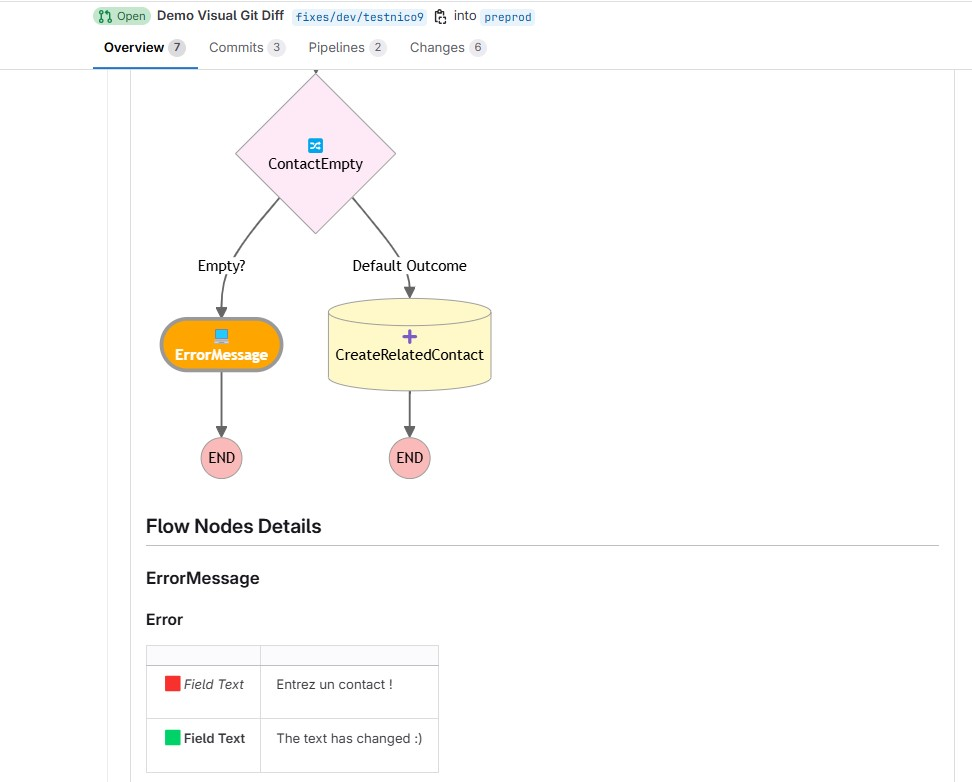
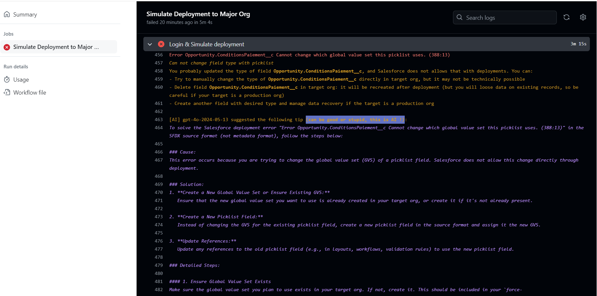

<!-- markdownlint-disable MD013 -->

# sfdx-hardis Deployment Assistant

## Salesforce DevOps AI Integration

Deployment errors are common and quite boring, right ?

Sfdx-hardis deployment assistant will help you to solve them, even if you are not using sfdx-hardis CI/CD pipelines !

The assistant contain core rules and can optionally be integrated with AI to provide you the best guidance :)

## Flow Visual Git Diff

In addition to deployment tips, comments will be posted on PRs with Visual Git Diff for Flows, that will:

- Visually show you the differences on a diagram
- Display the update details without having to open any XML !

🟩 = added

🟥 = removed

🟧 = updated

## Integrations

Deployment assistant will provide tips in Pull Request comments (GitHub, Gitlab, Azure, Bitbucket).

It will also provide tips in console log.

## Setup

Just follow the instructions to be ready in a few minutes

- [sfdx-hardis deployment assistant setup instructions](salesforce-deployment-assistant-setup.md)
- [sfdx-hardis AI setup instructions](salesforce-ai-setup.md) (requires an Openai API key)