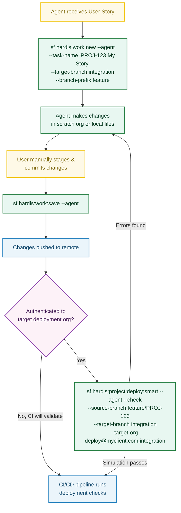

<!-- markdownlint-disable MD013 -->

# Using sfdx-hardis with AI Coding Agents

AI coding agents such as [Claude Code](https://docs.anthropic.com/en/docs/claude-code), [GitHub Copilot](https://github.com/features/copilot), or similar tools can drive sfdx-hardis commands non-interactively using the **`--agent`** flag.

This page explains how to set up agent skills (also called "tools" or "custom commands") so that your coding agent can **create a new User Story branch**, **save / push work**, **simulate a deployment**, and **write, try and recover [deployment actions](#deployment-actions-commands-hardisprojectaction)** on your behalf. [Backpromote and promotion branches](#other-agent-ready-commands) have their own guides.

---

## Prerequisites

- **sfdx-hardis** installed and configured in your Salesforce DX project ([Installation](installation.md))
- A `config/.sfdx-hardis.yml` config file with at least `availableTargetBranches` or `developmentBranch` defined
- The Salesforce CLI authenticated to your target org / Dev Hub
- Your AI coding agent installed and able to run shell commands in the project directory

---

## The `--agent` flag

Over 170 sfdx-hardis commands accept an **`--agent`** flag that switches to a fully **non-interactive** execution mode:

- All interactive prompts are disabled
- Required inputs must be provided as CLI flags
- The command fails fast with an explicit error message if any required input is missing, listing available options
- Sensible defaults are applied where possible, saving tokens and API calls

This makes the commands safe, predictable, and **token-efficient** when called by an automated agent.

---

## `hardis:work:new --agent` - Create a New User Story

Creates a Git branch (and optionally a scratch org) for a new User Story.

### Usage

```bash
sf hardis:work:new --agent --task-name "MYPROJECT-123 My User Story" --target-branch integration --branch-prefix feature
```

### Required flags in agent mode

| Flag              | Description                                                                |
|-------------------|----------------------------------------------------------------------------|
| `--task-name`     | Name of the User Story. Used to generate the branch name.                  |
| `--target-branch` | The branch to create the feature branch from (e.g. `integration`, `main`). |

### Optional flags

| Flag              | Description                                                                                                                  |
|-------------------|------------------------------------------------------------------------------------------------------------------------------|
| `--branch-prefix` | Branch prefix for the created branch. Must be in configured `branchPrefixChoices` (usually `feature`, `fix`, or `retrofit`). |
| `--open-org`      | Open the org in a browser after creation.                                                                                    |

### Behavior in agent mode

- **Branch prefix**: uses `--branch-prefix` when provided, otherwise the first configured `branchPrefixChoices` value, with `feature` as fallback.
- **Org type**: computed automatically from `allowedOrgTypes` in `config/.sfdx-hardis.yml`.
- **Scratch mode**: always creates a new scratch org (when applicable).
- **Skips**: sandbox initialization and the update of the default target branch in the user config.

### Example `config/.sfdx-hardis.yml`

```yaml
availableTargetBranches:
  - integration
  - uat
  - preprod
allowedOrgTypes:
  - sandbox
```

---

## `hardis:work:save --agent` - Save and Push Your Work

Cleans sources, updates `package.xml` / `destructiveChanges.xml`, commits, and pushes changes.

> **Important**: You must manually stage and commit your metadata changes with Git **before** running this command. The command does not pull or stage metadata on your behalf in agent mode.

### Usage

```bash
sf hardis:work:save --agent
```

Or, if the target branch cannot be auto-resolved:

```bash
sf hardis:work:save --agent --targetbranch integration
```

### Optional flags

| Flag             | Description                                                                           |
|------------------|---------------------------------------------------------------------------------------|
| `--targetbranch` | Pull Request target branch. Auto-resolved from config if omitted.                     |
| `--noclean`      | Skip automated source cleaning.                                                       |
| `--nogit`        | Skip git commit and push (useful if you only want cleaning + package.xml generation). |

### Behavior in agent mode

- **Metadata pull is skipped**: the user is expected to have manually staged and committed changes before running this command.
- **Data export is skipped**.
- **Push is always attempted** at the end (unless `--nogit` is set).
- **Target branch** is resolved from `--targetbranch` flag, or from the user config (`localStorageBranchTargets`) for the current branch. If it cannot be resolved, the command fails with a validation error.

---

## Setting Up Agent Skills

Below are examples for popular AI coding agents. Adapt the paths and flag values to your project.

### Claude Code

Add the following instructions to your project's `CLAUDE.md` file (at the repository root):

```markdown
## Salesforce User Story Workflow

When asked to start a new Salesforce User Story:
- Run: `sf hardis:work:new --agent --task-name "<TICKET-ID> <description>" --target-branch <branch> --branch-prefix <feature|fix|retrofit>`
- The target branch is usually `integration` (check config/.sfdx-hardis.yml for available branches).

When asked to save / publish Salesforce work:
- Tell the user to manually stage and commit their changes with git first.
- Then run: `sf hardis:work:save --agent`
- This will clean sources, update package.xml, and push to the remote.
```

You can also register them as [Claude Code skills](https://docs.anthropic.com/en/docs/claude-code/skills) by creating `SKILL.md` files under `.claude/skills/<skill-name>/`:

**`.claude/skills/new-user-story/SKILL.md`**

```markdown
---
name: new-user-story
description: Start a new Salesforce User Story by creating a feature branch. Use when the user wants to start working on a new feature, bug fix, or task. Use this skill even if the user says "start a new story", "create a branch", "new feature", "new task", "work on JIRA-123", "start JIRA-123" or "begin work".
argument-hint: "[TICKET-ID description]"
allowed-tools: Bash, Read, Glob, Grep, AskUserQuestion
user-invocable: true
---

Run the following command, replacing <TICKET-ID> and <description> with values from the user's request:

sf hardis:work:new --agent --task-name "<TICKET-ID> <description>" --target-branch <branch> --branch-prefix <feature|fix|retrofit>

- Check `config/.sfdx-hardis.yml` for available target branches (usually `integration`).
- Do not pass `--open-org` unless explicitly asked.

$ARGUMENTS
```

**`.claude/skills/save-work/SKILL.md`**

```markdown
---
name: save-work
description: Save and push Salesforce work by cleaning sources, updating package.xml, committing, and pushing. Use when the user asks to save, publish, or push their Salesforce changes. Use this skill even if the user says "save my work", "push changes", "publish story", "commit and push", or "save story".
argument-hint: "[optional target branch]"
allowed-tools: Bash, Read, Glob, Grep, AskUserQuestion
user-invocable: true
---

1. Remind the user to manually stage and commit any pending metadata changes with git before continuing.
2. Run: `sf hardis:work:save --agent`

This cleans sources, updates package.xml, and pushes to the remote.
If the target branch cannot be auto-resolved, add `--targetbranch <branch>`.

$ARGUMENTS
```

### Other Agents

For any agent that can execute shell commands, the pattern is the same:

1. **New User Story**: `sf hardis:work:new --agent --task-name "<name>" --target-branch <branch> --branch-prefix <feature|fix|retrofit>`
2. **Save Work**: `sf hardis:work:save --agent`

Make sure the agent has access to:

- The project directory (with `config/.sfdx-hardis.yml` configured)
- An authenticated Salesforce CLI session
- Git credentials for pushing to the remote

---

## Typical Agent Workflow

A complete agent-driven workflow looks like this:



---

## Troubleshooting

| Issue                                               | Solution                                                                                                                                                                                           |
|-----------------------------------------------------|----------------------------------------------------------------------------------------------------------------------------------------------------------------------------------------------------|
| `target-branch is required with --agent`            | Provide `--target-branch <branch>` or configure `availableTargetBranches` in `config/.sfdx-hardis.yml`.                                                                                            |
| `target-branch="X" is not an allowed target branch` | Check `availableTargetBranches` in `config/.sfdx-hardis.yml` and use one of the listed branches.                                                                                                   |
| `target branch cannot be resolved` (`work:save`)    | Provide `--targetbranch <branch>` explicitly, or make sure the current branch was created with `work:new`.                                                                                         |
| Authentication errors                               | Make sure `sf org login` has been run and a default org is set before invoking agent commands.                                                                                                     |
| `sfdx-git-delta` not found (`work:save`)            | Install the plugin: `sf plugins install sfdx-git-delta`                                                                                                                                            |
| `deploy:smart` simulation fails with wrong org      | Make sure `config/branches/.sfdx-hardis-<target-branch>.yml` exists and contains `targetUsername`. If not authenticated to the target org, skip the step: CI/CD will validate on the Pull Request. |
| `deploy:smart` simulation uses wrong branch scope   | Provide `--source-branch` explicitly; without it the local git branch is used for the delta and Pull Request scope.                                                                                |

---

## `hardis:org:retrieve:packageconfig --agent` - Retrieve and Update Package Config

Retrieves installed packages from a Salesforce org and optionally updates the local project configuration. In agent mode, this is a **two-step workflow**: first list the packages, then update config for the ones you need.

### Step 1 - List installed packages

```bash
sf hardis:org:retrieve:packageconfig --agent --target-org myOrg@example.com
```

Without `--packages` or `--update-all-config`, the command **only lists** installed packages and returns them as JSON (with `--json`). No config file is modified.

### Step 2 - Update config

Choose one of three update strategies:

**Option A**: update only specific packages by name:

```bash
sf hardis:org:retrieve:packageconfig --agent --packages "MyManagedPkg,AnotherPkg" --target-org myOrg@example.com
```

**Option B**: update only packages already present in your project config (version upgrade):

```bash
sf hardis:org:retrieve:packageconfig --agent --update-existing-config --target-org myOrg@example.com
```

This is the safest option for automation: it upgrades versions of known packages without adding new ones.

**Option C**: update config with all retrieved packages:

```bash
sf hardis:org:retrieve:packageconfig --agent --update-all-config --target-org myOrg@example.com
```

### Flags summary

| Flag                       | Description                                                                 |
|----------------------------|-----------------------------------------------------------------------------|
| `--packages`               | Comma-separated list of package names or subscriber IDs to update in config |
| `--update-existing-config` | Update only packages already in the project config (version upgrade)        |
| `--update-all-config`      | Update config with all retrieved packages (existing and new)                |
| `--target-org`             | Salesforce org to retrieve packages from (required)                         |

### Agent skill example (Claude Code)

**`.claude/skills/update-package-config/SKILL.md`**

```markdown
---
name: update-package-config
description: Sync or update installed managed package versions in the project configuration from a Salesforce org. Use when the user asks to update packages, sync package versions, or retrieve package configuration. Use this skill even if the user says "update packages", "sync packages", "upgrade managed packages", or "retrieve package config".
argument-hint: "[org alias or username]"
allowed-tools: Bash, Read, Glob, Grep, AskUserQuestion
user-invocable: true
---

1. List the installed packages to see what is available:
   `sf hardis:org:retrieve:packageconfig --agent --target-org <org> --json`

2. Review the JSON output to identify which packages to update.

3. Update config using the appropriate strategy (pick one):
   - **Specific packages**: `sf hardis:org:retrieve:packageconfig --agent --packages "<pkg1>,<pkg2>" --target-org <org>`
   - **Upgrade existing only** (safest): `sf hardis:org:retrieve:packageconfig --agent --update-existing-config --target-org <org>`
   - **All packages**: `sf hardis:org:retrieve:packageconfig --agent --update-all-config --target-org <org>`

Prefer `--update-existing-config` for safe version upgrades.
Use `--update-all-config` only if the user explicitly asks to sync all packages.
The `--target-org` flag is required.

$ARGUMENTS
```

---

## `hardis:project:deploy:smart --agent` - Simulate Deployment to Target Org *(optional)*

Runs a full smart deployment **validation** (check/simulate mode) against a target org without applying any changes. Run this **after `hardis:work:save`** so that the committed and pushed sources are used for delta scope and git diff calculations.

This step is **optional**: if the Salesforce CLI is not authenticated to the target deployment org locally, skip it: the CI/CD pipeline runs the same validation automatically when the Pull Request is opened.

### Usage

```bash
sf hardis:project:deploy:smart --agent --check \
  --source-branch feature/my-feature \
  --target-branch integration \
  --target-org deploy@myclient.com.integration
```

> **Note**: `--target-org` must be the **target deployment org** (e.g. the integration sandbox), not the developer's current working org. If you are not authenticated to it locally, skip this step: CI/CD will validate the deployment on the Pull Request.

### Required flags in agent mode

| Flag              | Description                                                                                                                                                                                  |
|-------------------|----------------------------------------------------------------------------------------------------------------------------------------------------------------------------------------------|
| `--target-org`    | The **target deployment org** to validate against (e.g. `deploy@myclient.com.integration`). Must be authenticated locally. This is a different org from the developer's current working org. |
| `--check`         | Explicit simulation flag. Implicit in agent mode but should always be passed to make the intent clear.                                                                                       |
| `--source-branch` | Source git branch. Overrides local branch detection so delta scope and Pull Request comment tracking use the correct branch.                                                                 |
| `--target-branch` | Target git branch. Sets `FORCE_TARGET_BRANCH` and loads `config/branches/.sfdx-hardis-BRANCHNAME.yml`, which provides the correct `targetUsername` for that environment automatically.       |

### Behavior in agent mode

- **Optional step**: if the Salesforce CLI is not authenticated to the target deployment org, skip this command entirely. The Pull Request CI/CD pipeline performs the same validation.
- **Always simulation**: deployment is forced into check/validate mode: `--check` is implicit but should be passed explicitly. No changes are applied to the org.
- **Target org is the deployment org**: unlike day-to-day usage where `--target-org` is the developer's sandbox, here it must point to the environment being simulated (integration, uat, etc.).
- **Target username from config**: the `targetUsername` used for deployment commands is read from the target branch config file; the `--target-org` flag provides the authenticated connection.
- **Source branch override**: sets `FORCE_SOURCE_BRANCH` so delta deployment scope uses the correct base branch.
- **Deployment actions**: pre- and post-deploy actions run in check context. If a `customUsername` authentication fails, the action is **skipped** (not failed) so the simulation can continue.

### Agent skill example (Claude Code)

**`.claude/skills/simulate-deployment/SKILL.md`**

````markdown
---
name: simulate-deployment
description: Simulate (validate) a Salesforce deployment from a feature branch to a target branch, without applying any changes. Use when the user asks to check if changes are deployable, validate a deployment, run a check deploy, or preview deployment to an org. Use this skill even if the user says "check if my changes can be deployed", "validate deployment", "simulate deploy to integration", or "will my changes break anything".
argument-hint: "[source branch] [target branch] [target org]"
allowed-tools: Bash, Read, Glob, Grep, AskUserQuestion
user-invocable: true
---

This step is **optional** and must run **after `hardis:work:save`** (the commits must exist before the simulation can use them for delta scope). If the Salesforce CLI is not authenticated to the target deployment org locally, skip it and inform the user: the CI/CD pipeline will perform the same validation when the Pull Request is opened.

1. Check whether the target deployment org is authenticated locally:
   ```bash
   sf org list --json
   ```
   If the target org username is not listed, skip the simulation and tell the user that CI/CD will validate it on the Pull Request.

2. If authenticated, run the simulation:
   ```bash
   sf hardis:project:deploy:smart --agent --check \
     --source-branch <source-branch> \
     --target-branch <target-branch> \
     --target-org <target-deployment-org>
   ```

- `--check`: always include this flag to make the simulation intent explicit.
- `--source-branch`: the feature branch being simulated (e.g. `feature/PROJ-123-my-story`). Use the current git branch if the user does not specify.
- `--target-branch`: the environment to simulate deployment to (e.g. `integration`, `uat`, `main`). Check `config/.sfdx-hardis.yml` for available target branches (`availableTargetBranches`).
- `--target-org`: the **target deployment org** username or alias (e.g. `deploy@myclient.com.integration`). This is the org that corresponds to `--target-branch`, **not** the developer's current working org.

This always runs in simulation mode (check-only). No changes are applied to the org.

$ARGUMENTS
````

---

## `hardis:project:pipeline:describe --agent` - Know the Pipeline Before Acting on It

A pipeline is not always `integration -> uat -> preprod -> main`. A project can have a core branch feeding several production orgs, a run branch next to the build ones, or a single sandbox before production. Before an agent picks a target branch, promotes a major branch, prepares a hotfix or a retrofit, it reads the pipeline the project declares instead of assuming branch names.

### Usage

```bash
sf hardis:project:pipeline:describe --agent --json
```

No flag is required. The command reads the configuration files of the current checkout: no org, no git provider token and no network are needed, and nothing is written. Run it on a branch that is up to date with the remote.

### What the result holds

| Key                          | Content                                                                                                                                              |
|------------------------------|------------------------------------------------------------------------------------------------------------------------------------------------------|
| `branches`                   | Every major branch: `name`, `instanceUrl`, `targetUsername`, `mergeTargets`, `mergeTargetsGuessed`, and `mergeSources` (the branches merged into it) |
| `steps`                      | Every `source` and `target` a merge between major branches can follow, with `promotionBranchAllowed`                                                 |
| `entryBranches`              | The major branches no other major branch is merged into: where the pipeline starts                                                                   |
| `finalBranches`              | The major branches merged into no other one (ex: production): where the pipeline ends                                                                |
| `developmentBranch`          | The default target of a new User Story                                                                                                               |
| `availableTargetBranches`    | The branches a new User Story may target                                                                                                             |
| `promotionBranches`          | `enabled` and `allowedSteps`, from `enablePromotionBranches` and `allowedPromotionSteps`                                                             |
| `warnings`                   | What is missing or was guessed in the configuration                                                                                                  |
| `mergeTargetsRecommendation` | A sentence to relay to the user when merge targets were guessed from branch names, `null` otherwise                                                  |

### Behavior in agent mode

- **Read `steps`, never assume names**: a source branch can have several targets, and there can be several entry and final branches. When a source has more than one target, ask the user which one is meant.
- **A step is always open to a full promotion**: a Pull Request from the source branch to the target one. `promotionBranchAllowed` only says whether a [promotion branch (Beta)](salesforce-devops-promotion-branches.md), which carries a subset of the User Stories, may be assembled on that step.
- **A final branch is a release**: a merge into a branch listed in `finalBranches` is the last step of the pipeline, a good moment to offer the release notes with `hardis:doc:release-notes`.
- **Relay `mergeTargetsRecommendation`**: when it is not `null`, the merge targets of some branches are not declared and were guessed from their names. Tell the user to declare `mergeTargets` explicitly in the `config/branches/.sfdx-hardis.<branch>.yml` files it names, with an empty list for a branch merged into no other one.

---

## Deployment Actions Commands (`hardis:project:action:*`)

Deployment actions are pre- or post-deployment steps stored in YAML config files and executed automatically during CI/CD pipelines. They can be scoped to the whole **project**, a specific **branch**, or a **Pull Request**. The [Deployment actions](salesforce-devops-work-on-user-story-deployment-actions.md) guide explains when they run, how their status is tracked and how to recover a failed one.

| Scope     | Config file                                 |
|-----------|---------------------------------------------|
| `project` | `config/.sfdx-hardis.yml`                   |
| `branch`  | `config/branches/.sfdx-hardis.<branch>.yml` |
| `pr`      | `scripts/actions/.sfdx-hardis.<prId>.yml`   |

Eight built-in action types are available, plus the [custom functions](salesforce-devops-work-on-user-story-custom-functions.md) of the project:

| Type                      | Required parameters                           |
|---------------------------|-----------------------------------------------|
| `command`                 | `--command`                                   |
| `apex`                    | `--apex-script`                               |
| `data`                    | `--sfdmu-project`                             |
| `publish-community`       | `--community-name`                            |
| `manual`                  | `--instructions`                              |
| `schedule-batch`          | `--class-name`, `--cron-expression`           |
| `run-batch`               | `--class-name`                                |
| `remove-packagexml-items` | `--packagexml-items`                          |
| Id of a custom function   | `--function-input name=value`, once per input |

An agent works with these commands in three ways:

| Need                                                             | Commands                                                            |
|------------------------------------------------------------------|---------------------------------------------------------------------|
| Write the actions of a User Story                                | `action:create`, `update`, `delete`, `reorder`, `link-pull-request` |
| Know what ran, in which org, and what the next promotion will do | `action:list --with-status`                                         |
| Try the actions before the merge, or recover a failed one        | `action:run`, `action:set-status`, `action:update --move-to-pr`     |

Action ids are generated by `action:create`. Never write one by hand in a YAML file: read them with `action:list --json`.

---

### `hardis:project:action:list --agent` - List Actions

```bash
sf hardis:project:action:list --agent --scope branch --when pre-deploy
sf hardis:project:action:list --agent --scope pr --pr-id 123 --when post-deploy --json
```

#### Required flags

| Flag      | Description                   |
|-----------|-------------------------------|
| `--scope` | `project`, `branch`, or `pr`  |
| `--when`  | `pre-deploy` or `post-deploy` |

#### Optional flags

| Flag       | Description                                                                 |
|------------|-----------------------------------------------------------------------------|
| `--pr-id`  | Pull Request ID (for `pr` scope). Use `current` to auto-detect from branch. |
| `--branch` | Branch name (for `branch` scope, defaults to current branch).               |

#### Read the status of the actions

With `--with-status`, the command no longer lists a config file. It returns the status of the actions of some Pull Requests in each org branch, read from their "Deployment Actions" comments: done, failed, not run because a previous action failed, moved to a fix Pull Request, waiting for a manual execution. `--scope` and `--when` are not needed, and a git provider token is.

```bash
# Status of the actions of two Pull Requests, in every org branch
sf hardis:project:action:list --agent --with-status --pr-ids 123,124 --json

# What the next promotion from uat to preprod will do with each action
sf hardis:project:action:list --agent --with-status --pr-ids 123,124 --forecast preprod --from-branch uat --json

# Also the developer orgs that ran the actions, and the CI results of the Pull Request
sf hardis:project:action:list --agent --with-status --with-backpromotes --with-workflows --pr-ids 123 --json
```

| Flag                  | Description                                                                                                                                |
|-----------------------|--------------------------------------------------------------------------------------------------------------------------------------------|
| `--pr-ids`            | Comma-separated Pull Request numbers, or `draft`                                                                                           |
| `--forecast`          | Major branch of the next promotion (ex: `preprod`). Adds what the promotion will do with each action there                                 |
| `--from-branch`       | With `--forecast`, the branch the promotion comes from (ex: `uat`). Finds the open promotion Pull Request and the Pull Requests it carries |
| `--with-backpromotes` | Adds the rows of the "Backpromotes" comments: the actions run in each developer org                                                        |
| `--with-workflows`    | Adds the validation, deployment and MegaLinter results reported in the Pull Request comments                                               |
| `--workflow-pr-ids`   | With `--with-workflows`, the Pull Requests whose comments are read (defaults to `--pr-ids`)                                                |

The forecast says, for each action: waiting for someone before the merge, a manual step to do once the promotion is deployed, done already, run by the validation job, run by the deployment job, failed there, not for that branch, or not carried by the open promotion Pull Request.

When several Pull Requests of one deployment carry the same action (same type, phase, user and parameters), the job [runs it once](salesforce-devops-work-on-user-story-deployment-actions.md#identical-actions-run-once). The copies come back with the `identical-action` reason and an `identicalTo` field naming the action that runs.

---

### `hardis:project:action:create --agent` - Create an Action

```bash
# Shell command, branch scope
sf hardis:project:action:create --agent \
  --scope branch --when pre-deploy \
  --type command --label "Disable triggers" \
  --command "sf apex run --file scripts/disable-triggers.apex"

# Data import, PR scope
sf hardis:project:action:create --agent \
  --scope pr --pr-id 123 --when post-deploy \
  --type data --label "Import test data" --sfdmu-project TestData

# Apex script, project scope, never on production and preprod
sf hardis:project:action:create --agent \
  --scope project --when post-deploy \
  --type apex --label "Reset demo data" \
  --apex-script scripts/apex/reset-demo.apex \
  --exclude-target-branches "main,preprod"

# Apex batch run once after the deployment, waiting 30 minutes at most for its result
sf hardis:project:action:create --agent \
  --scope pr --pr-id 123 --when post-deploy \
  --type run-batch --label "Recalculate crew capacity" \
  --class-name CrewCapacityBatch --run-mode wait --wait-timeout 30

# Items left out of the deployment package.xml
sf hardis:project:action:create --agent \
  --scope pr --pr-id 123 --when pre-deploy \
  --type remove-packagexml-items --label "Skip legacy classes" \
  --packagexml-items "ApexClass:MyClass1,MyClass3;Layout:MyLayout1,MyLayout2"

# Custom function of the project: its id is the type
sf hardis:project:action:create --agent \
  --scope pr --pr-id 123 --when post-deploy \
  --type notifySlack --label "Notify the release channel" \
  --function-input "channel=#releases" --function-input severity=critical \
  --function-input webhookToken=SLACK_WEBHOOK_TOKEN
```

When `--pr-id` is omitted for `pr` scope, actions are saved to a **draft file** (`scripts/actions/.sfdx-hardis.draft.yml`). Run `hardis:project:action:link-pull-request` to associate the draft with a Pull Request once it is created.

#### Required flags

| Flag      | Description                                                 |
|-----------|-------------------------------------------------------------|
| `--scope` | `project`, `branch`, or `pr`                                |
| `--when`  | `pre-deploy` or `post-deploy`                               |
| `--type`  | A built-in type, or the id of a custom function (see above) |
| `--label` | Human-readable label                                        |

Plus the type-specific flags of the table above.

#### Optional flags

| Flag                             | Default                   | Description                                                                                                                               |
|----------------------------------|---------------------------|-------------------------------------------------------------------------------------------------------------------------------------------|
| `--pr-id`                        | draft                     | Pull Request ID (for `pr` scope). `current` auto-detects from branch.                                                                     |
| `--branch`                       | current branch            | Branch name (for `branch` scope).                                                                                                         |
| `--context`                      | `process-deployment-only` | `all`, `check-deployment-only`, or `process-deployment-only`                                                                              |
| `--include-target-branches`      |                           | Comma-separated target branches the action runs on (ex: `uat,preprod`). Cannot be combined with `--exclude-target-branches`               |
| `--exclude-target-branches`      |                           | Comma-separated target branches the action is skipped on (ex: `main`)                                                                     |
| `--allow-failure`                | `false`                   | Do not block deployment if action fails                                                                                                   |
| `--run-only-once-by-org`         | `true`                    | Execute only once per target org (state tracked in the "Deployment Actions" Pull Request comment). `--no-run-only-once-by-org` to disable |
| `--custom-username`              |                           | Run action as a specific Salesforce user                                                                                                  |
| `--job-name`                     | `<className>_Schedule`    | Job name of a `schedule-batch` action                                                                                                     |
| `--run-mode`                     | `wait`                    | For `run-batch`: `wait` follows the job until it ends, `no-wait` launches it and goes on                                                  |
| `--batch-size`                   | `200`                     | For `run-batch`: batch size, 1 to 2000                                                                                                    |
| `--wait-timeout`                 | `60`                      | For `run-batch` in `wait` mode: minutes to wait for the job                                                                               |
| `--success-even-if-batch-errors` | `false`                   | For `run-batch` in `wait` mode: keep the action successful when the job completes with batches in error                                   |

Things to know:

- Without `--include-target-branches` or `--exclude-target-branches`, the action runs on every target branch. The virtual name `dev-sandboxes` matches any target that is not a major branch: a developer sandbox reached by a backpromote, or a local deployment from a feature branch.
- A `run-batch` action only runs in the `process-deployment-only` context, never during a deployment check.
- For `schedule-batch` and `run-batch`, write a global class of a managed package with its namespace: `ns.ClassName`.

---

### `hardis:project:action:update --agent` - Update an Action

First list actions to get the `--action-id` (the UUID shown in the `Id` column).

```bash
# Update label and command
sf hardis:project:action:update --agent \
  --scope branch --when pre-deploy \
  --action-id <uuid> --label "New label" --command "echo updated"

# Change context
sf hardis:project:action:update --agent \
  --scope project --when post-deploy \
  --action-id <uuid> --context check-deployment-only

# Move the action to the other deployment phase
sf hardis:project:action:update --agent \
  --scope pr --pr-id 123 --when pre-deploy \
  --action-id <uuid> --new-when post-deploy
```

#### Required flags

| Flag          | Description                                       |
|---------------|---------------------------------------------------|
| `--scope`     | `project`, `branch`, or `pr`                      |
| `--when`      | `pre-deploy` or `post-deploy`                     |
| `--action-id` | UUID of the action to update (from `action:list`) |

#### Optional flags (provide only the ones to change)

Every flag of `action:create` can be passed, including `--type`: changing the type clears the old type-specific parameters and requires the new ones. Pass an empty value to `--include-target-branches` or `--exclude-target-branches` to remove the restriction.

Three flags exist only here:

| Flag           | Description                                                                                                                                |
|----------------|--------------------------------------------------------------------------------------------------------------------------------------------|
| `--new-when`   | Move the action to the other deployment phase. `--when` still says where to find it                                                        |
| `--move-to-pr` | Move the action from the Pull Request of `--pr-id` to another one (a number, `current` or `draft`), keeping its id and setting `movedFrom` |
| `--moved-from` | Number of the Pull Request the action was moved from (`0` removes it)                                                                      |

---

### `hardis:project:action:delete --agent` - Delete an Action

```bash
sf hardis:project:action:delete --agent \
  --scope branch --when pre-deploy --action-id <uuid>
```

#### Required flags

| Flag          | Description                                       |
|---------------|---------------------------------------------------|
| `--scope`     | `project`, `branch`, or `pr`                      |
| `--when`      | `pre-deploy` or `post-deploy`                     |
| `--action-id` | UUID of the action to delete (from `action:list`) |

---

### `hardis:project:action:reorder --agent` - Reorder Actions

Two modes are available.

**Move a single action to a specific position (1-based):**

```bash
sf hardis:project:action:reorder --agent \
  --scope branch --when pre-deploy \
  --action-id <uuid> --position 2
```

**Set the complete order in one call (comma-separated UUIDs):**

```bash
sf hardis:project:action:reorder --agent \
  --scope branch --when pre-deploy \
  --order "<uuid1>,<uuid2>,<uuid3>"
```

The `--order` list must contain **every** action ID exactly once. Retrieve the current list with `action:list --json`.

#### Required flags

| Flag      | Description                   |
|-----------|-------------------------------|
| `--scope` | `project`, `branch`, or `pr`  |
| `--when`  | `pre-deploy` or `post-deploy` |

One of:

| Flag                         | Description                                                   |
|------------------------------|---------------------------------------------------------------|
| `--action-id` + `--position` | Move one action to a 1-based position                         |
| `--order`                    | Comma-separated list of all action UUIDs in the desired order |

---

### `hardis:project:action:link-pull-request --agent` - Link Draft Actions to a PR

When actions were created for `pr` scope without a specific `--pr-id`, they are saved in a draft file. This command renames the draft to the file of the target Pull Request, so the actions are picked up during CI/CD for that Pull Request.

```bash
# Link draft to PR 123
sf hardis:project:action:link-pull-request --agent --pr-id 123

# Auto-detect PR from current branch
sf hardis:project:action:link-pull-request --agent --pr-id current
```

#### Required flags in agent mode

| Flag      | Description                                                             |
|-----------|-------------------------------------------------------------------------|
| `--pr-id` | Pull Request number, or `current` to detect from the current git branch |

---

### `hardis:project:action:run --agent` - Try an Action, or Retry a Failed One

Runs deployment actions outside of a deployment job. What it does depends on the org.

**In a developer sandbox or a scratch org**, it tries the actions of a Pull Request before the merge:

```bash
# All the actions of the Pull Request, pre-deployment first, stopping at the first failure
sf hardis:project:action:run --agent --pr 123 --all --target-org my-dev-sandbox

# One action
sf hardis:project:action:run --agent --pr 123 --action-id <uuid> --target-org my-dev-sandbox

# The branch has no Pull Request yet: use the draft actions file
sf hardis:project:action:run --agent --pr draft --all --target-org my-dev-sandbox
```

The results are recorded for developer orgs only, under `dev-sandboxes`. They never count as done in a major org. Validation-only actions and `remove-packagexml-items` actions are skipped, and so is a `runOnlyOnceByOrg` action already done in that org.

**In the org of a major branch**, it retries one post-deployment action that failed, or that the failure of another one stopped. The metadata is already deployed, so the deployment job does not have to run again:

```bash
sf hardis:project:action:run --agent --pr 123 --action-id <uuid> --org-branch integration --next all
```

The result is written in the "Deployment Actions" comment of the Pull Request, with who ran it. Find the failed actions first with `action:list --with-status`.

#### Required flags in agent mode

| Flag                             | Description                                                                 |
|----------------------------------|-----------------------------------------------------------------------------|
| `--pr`                           | Pull Request number, or `draft` (developer org only)                        |
| `--action-id` or `--all`         | The action to run, or every action of the Pull Request (developer org only) |
| `--org-branch` or `--target-org` | The major branch of the org (ex: `integration`), or the org itself          |

#### Optional flags

| Flag                      | Default | Description                                                                                                 |
|---------------------------|---------|-------------------------------------------------------------------------------------------------------------|
| `--next`                  | `none`  | Once the action succeeded, run `none`, `one` or `all` of the actions its failure stopped                    |
| `--allow-branch-mismatch` | `false` | Required when the current git branch is not the branch of the org: the definition is read from the checkout |
| `--dev-org`               | `false` | Refuse to run when the org is a major org. Pass it whenever the run is meant as a try                       |

#### Behavior in agent mode

- **Refused**: a pre-deployment action in a major org (re-run the deployment job instead), an action never run or skipped in that org, and `--all` on a major org.
- **No login prompt**: an action whose `customUsername` is not authenticated on the computer fails.
- **A git provider token is required** to record the result in the Pull Request. In a developer org without one, the results stay in `config/user/deployment-actions/`.
- **Anyone authenticated to the org can retry an action, production included.** Ask the user before retrying in a major org.

---

### `hardis:project:action:set-status --agent` - Mark an Action as Done

Records an action as done by hand in an org, without running anything. Later deployments to that org skip it.

```bash
# The failed action was done by hand in integration
sf hardis:project:action:set-status --agent --pr 123 --action-id <uuid> --org-branch integration --note "Done in Setup"

# A pre-deployment manual action already done in preprod, before the promotion
sf hardis:project:action:set-status --agent --pr 123 --action-id <uuid> --org-branch preprod

# Done in a developer org
sf hardis:project:action:set-status --agent --pr 123 --action-id <uuid> --target-org my-dev-sandbox
```

It accepts an action that failed, one that was not run because a previous action failed, a manual action waiting for someone, and an action with no status yet in a major branch. Closing an action does not run the ones its failure stopped: run them with `action:run`.

#### Required flags in agent mode

| Flag                             | Description                                              |
|----------------------------------|----------------------------------------------------------|
| `--pr`                           | Pull Request number                                      |
| `--action-id`                    | The action to mark as done                               |
| `--org-branch` or `--target-org` | The major branch where it was done, or the developer org |

`--note` adds a text to the note recorded with the status. With `--json`, the result holds the status of every action of the Pull Request after the write, in the shape of `action:list --with-status`.

An agent must only mark as done what the user says was done: the command does not check the org.

---

### Recover a Failed Action

The three ways to recover, and when to use each one:

| The cause                                   | Command                                                                                                                                                                                                  |
|---------------------------------------------|----------------------------------------------------------------------------------------------------------------------------------------------------------------------------------------------------------|
| Something was missing in the org, now fixed | `sf hardis:project:action:run --agent --pr <failed PR> --action-id <uuid> --org-branch <branch> --next all`                                                                                              |
| The action definition is wrong              | From the fix branch: `sf hardis:project:action:update --agent --scope pr --pr-id <failed PR> --when post-deploy --action-id <uuid> --move-to-pr current`, then correct it and merge the fix Pull Request |
| Someone already did it by hand              | `sf hardis:project:action:set-status --agent --pr <failed PR> --action-id <uuid> --org-branch <branch>`                                                                                                  |

See [Recover a failed action](salesforce-devops-work-on-user-story-deployment-actions.md#recover-a-failed-action).

---

### Deployment Apex Test Classes (`hardis:project:action:test-class:*`)

These commands maintain `deploymentApexTestClasses`, the test classes a deployment runs, at project, branch or Pull Request scope. They require `enableDeploymentApexTestClasses: true` in `config/.sfdx-hardis.yml`, and stop with an error otherwise.

```bash
sf hardis:project:action:test-class:list --agent --scope pr --json
sf hardis:project:action:test-class:add --agent --scope pr --class-name MyTestClass_Test --class-name AnotherTest_Test
sf hardis:project:action:test-class:remove --agent --scope pr --class-name MyTestClass_Test
sf hardis:project:action:test-class:remove --agent --scope project --all-class
```

| Command             | Required in agent mode                                    |
|---------------------|-----------------------------------------------------------|
| `test-class:list`   | `--scope`                                                 |
| `test-class:add`    | `--scope`, `--class-name` (repeat it for several classes) |
| `test-class:remove` | `--scope`, and `--class-name` or `--all-class`            |

`--branch` and `--pr-id` work as for the action commands. `test-class:add` checks that each class exists in the repository sources.

---

### Agent Skill Example (Claude Code)

**`.claude/skills/manage-deployment-actions/SKILL.md`**

````markdown
---
name: manage-deployment-actions
description: Create, list, update, delete, reorder, try, retry or close deployment actions that run before or after Salesforce deployments. Actions are scoped to the whole project, a specific branch, or a Pull Request. Use when the user asks to add, modify, or remove pre-deploy or post-deploy steps, to know which actions ran in an org, or to recover a failed one. Use this skill even if the user says "add a pre-deploy action", "create a deployment step", "list actions", "delete action", "reorder steps", "link draft actions to PR", "try my actions in my sandbox", "retry the failed action" or "mark this action as done".
argument-hint: "[description of what the user wants to do]"
allowed-tools: Bash, Read, Glob, Grep, AskUserQuestion
user-invocable: true
---

Use the commands below to manage deployment actions. Always list first to understand the current state.
Never write an action id by hand: `action:create` generates it, `action:list --json` returns it.

## List actions

```bash
sf hardis:project:action:list --agent --scope <project|branch|pr> --when <pre-deploy|post-deploy> [--pr-id <id>] [--branch <name>] [--json]
```

## Read the status of the actions in each org

```bash
sf hardis:project:action:list --agent --with-status --pr-ids <id1,id2|draft> --json \
  [--forecast <target branch> --from-branch <source branch>] [--with-backpromotes] [--with-workflows]
```

## Create an action

```bash
sf hardis:project:action:create --agent \
  --scope <project|branch|pr> --when <pre-deploy|post-deploy> \
  --type <command|apex|data|publish-community|manual|schedule-batch|run-batch|remove-packagexml-items|custom function id> \
  --label "<label>" \
  [--command "<cmd>"] [--apex-script <path>] [--sfdmu-project <name>] \
  [--community-name <name>] [--instructions "<text>"] \
  [--class-name <ClassName>] [--cron-expression "<expr>"] [--job-name <name>] \
  [--run-mode wait|no-wait] [--batch-size <n>] [--wait-timeout <minutes>] [--success-even-if-batch-errors] \
  [--packagexml-items "<Type:Member1,Member2;Type2:Member3>"] \
  [--function-input <name>=<value>] \
  [--pr-id <id>] [--context all|check-deployment-only|process-deployment-only] \
  [--include-target-branches "<b1,b2>" | --exclude-target-branches "<b1,b2>"]
```

- `--context` defaults to `process-deployment-only`.
- If `--pr-id` is omitted for `pr` scope, actions go to a draft file. Run `link-pull-request` once the Pull Request is created.
- `dev-sandboxes` is the target branch name of developer sandboxes and scratch orgs.

## Update an action (provide only the flags to change)

```bash
sf hardis:project:action:update --agent \
  --scope <scope> --when <pre-deploy|post-deploy> --action-id <uuid> \
  [--label "..."] [--command "..."] [--context ...] [--new-when <pre-deploy|post-deploy>]
```

## Delete an action

```bash
sf hardis:project:action:delete --agent \
  --scope <scope> --when <pre-deploy|post-deploy> --action-id <uuid>
```

## Reorder actions

```bash
# Move one action to position N (1-based)
sf hardis:project:action:reorder --agent \
  --scope <scope> --when <pre-deploy|post-deploy> \
  --action-id <uuid> --position <N>

# Set complete order in one call (all UUIDs required)
sf hardis:project:action:reorder --agent \
  --scope <scope> --when <pre-deploy|post-deploy> \
  --order "<uuid1>,<uuid2>,<uuid3>"
```

## Link draft actions to a PR

```bash
sf hardis:project:action:link-pull-request --agent --pr-id <prId|current>
```

## Try the actions in a developer org, before the merge

```bash
sf hardis:project:action:run --agent --dev-org --pr <prId|draft> --all --target-org <dev org>
```

## Recover a failed action

Read the failed actions with `action:list --with-status`, then ask the user which of the three applies. Never retry or close an action in a major org without their answer.

```bash
# The org was fixed: retry, then run the actions the failure stopped
sf hardis:project:action:run --agent --pr <prId> --action-id <uuid> --org-branch <branch> --next all

# The definition is wrong: from the fix branch, move it to the fix Pull Request, then correct it
sf hardis:project:action:update --agent --scope pr --pr-id <failed prId> --when post-deploy --action-id <uuid> --move-to-pr current

# It was done by hand: mark it as done
sf hardis:project:action:set-status --agent --pr <prId> --action-id <uuid> --org-branch <branch>
```

Add `--allow-branch-mismatch` to `action:run` when the current git branch is not the branch of the org.

$ARGUMENTS
````

---

## Other agent-ready commands

These have their own `--agent` mode and their own guide. They are listed here so an agent knows they exist.

| Command                                    | What it does                                                                                                                                                                                                                                 | Guide                                                         |
|--------------------------------------------|----------------------------------------------------------------------------------------------------------------------------------------------------------------------------------------------------------------------------------------------|---------------------------------------------------------------|
| `hardis:work:backpromote`                  | Brings into a developer sandbox what was merged in the parent branch since the last backpromote, with one decision per file that differs. `--auto` takes every decision from the flags (Beta). Replaces the deprecated `hardis:work:refresh` | [Backpromote](salesforce-devops-backpromote.md)               |
| `hardis:project:promotion:list-candidates` | Lists, read-only, the User Stories that could be promoted from a major branch. Creates, pushes and closes nothing, so it is the safe one to call first (Beta)                                                                                | [Promotion branches](salesforce-devops-promotion-branches.md) |
| `hardis:project:promotion:create`          | Assembles a promotion branch carrying only the chosen User Stories and opens its Pull Request (Beta)                                                                                                                                         | [Promotion branches](salesforce-devops-promotion-branches.md) |

---

## See Also

- [Create New User Story](salesforce-devops-create-new-user-story.md): interactive guide
- [Publish a User Story](salesforce-devops-publish-user-story.md): interactive guide
- [Coding Agent Auto-Fix (Beta)](salesforce-deployment-agent-autofix.md): auto-fix deployment errors with coding agents
- [`hardis:work:new` command reference](hardis/work/new.md)
- [`hardis:work:save` command reference](hardis/work/save.md)
- [`hardis:project:deploy:smart` command reference](hardis/project/deploy/smart.md)
- [`hardis:project:pipeline:describe` command reference](hardis/project/pipeline/describe.md)
- [`hardis:project:action:create` command reference](hardis/project/action/create.md)
- [`hardis:project:action:list` command reference](hardis/project/action/list.md)
- [`hardis:project:action:update` command reference](hardis/project/action/update.md)
- [`hardis:project:action:delete` command reference](hardis/project/action/delete.md)
- [`hardis:project:action:reorder` command reference](hardis/project/action/reorder.md)
- [`hardis:project:action:link-pull-request` command reference](hardis/project/action/link-pull-request.md)
- [`hardis:project:action:run` command reference](hardis/project/action/run.md)
- [`hardis:project:action:set-status` command reference](hardis/project/action/set-status.md)
- [`hardis:project:action:test-class:add` command reference](hardis/project/action/test-class/add.md)
- [Deployment actions](salesforce-devops-work-on-user-story-deployment-actions.md): when they run, their status by org, and how to recover a failed one
- [`hardis:work:backpromote` command reference](hardis/work/backpromote.md)
- [`hardis:project:promotion:create` command reference](hardis/project/promotion/create.md)
- [`hardis:project:promotion:list-candidates` command reference](hardis/project/promotion/list-candidates.md)
