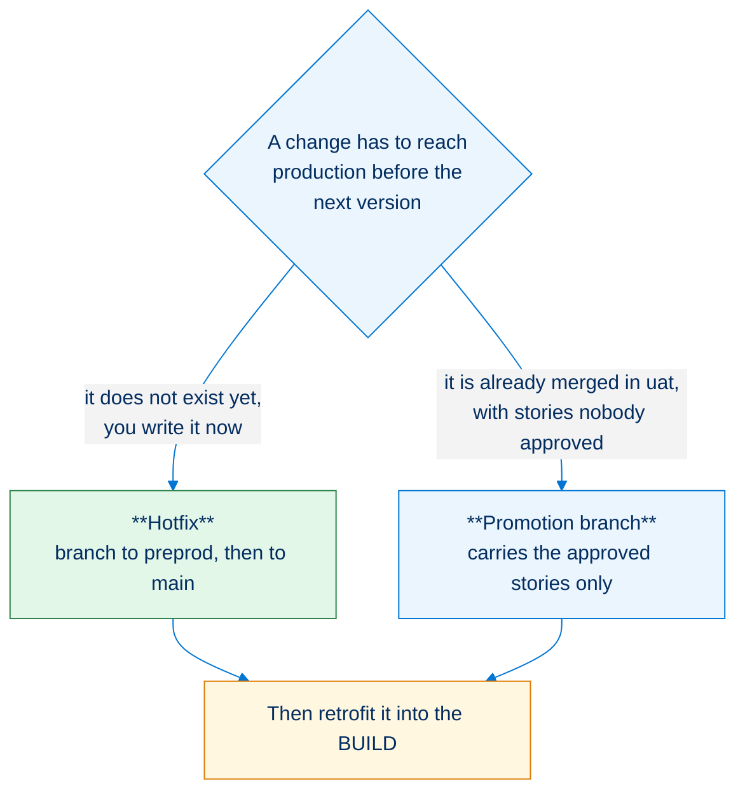
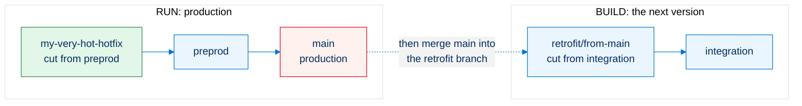

<!-- markdownlint-disable MD013 -->

## Hotfixes

Production is broken, or a fix cannot wait for the next version. A **hotfix** takes it straight to production through the RUN stream, while the BUILD stream keeps preparing the next version.

- [BUILD and RUN](#build-and-run)
- [Is a hotfix the right move?](#is-a-hotfix-the-right-move)
- [Hotfix process](#hotfix-process)
  - [1. Implement the hotfix](#1-implement-the-hotfix)
  - [2. Deploy in the RUN stream](#2-deploy-in-the-run-stream)
  - [3. Retrofit in the BUILD stream](#3-retrofit-in-the-build-stream)

___

## BUILD and RUN

Except for projects in maintenance that only have a RUN, a project is split in two streams:

- the **RUN** stream: a fast cycle, to often deploy minor changes and fixes
- the **BUILD** stream: the project cycle, to build larger features and enhancements that require User Acceptance Testing

### The BUILD

This is the stream where you prepare the **next major or minor version**.

New features go through the **integration level**, then the **uat level**, where **business users qualify and validate them**.

Once the User Acceptance Test is validated in the **uat org**, **uat is merged into preprod**. After minimal (mostly technical) tests, **preprod is merged into production**.

Major features or enhancements must **not be tested directly at preprod level**: while the next version is being validated in preprod, the RUN **cannot deploy anything into production**.

### The RUN

The daily maintenance of the production org must be very reactive: the RUN stream lets you often **deploy patch versions**.

As you usually cannot wait for the next minor or major version to reach production, you need a way to quickly deploy hotfixes. That stream is the RUN, and on [pattern A](salesforce-devops-setup-git.md#pattern-a-build-and-hotfixes) it only involves the **preprod** and **main** branches. On [pattern B](salesforce-devops-setup-git.md#pattern-b-build-run-and-hotfixes) it also has a **uat_run** branch and org, where the maintenance work that can wait is validated before reaching `preprod`.

A hotfix therefore lands in production **before** the version being prepared in the BUILD. The BUILD branches do not have it yet, so it has to be brought back down to them: that is the [retrofit](salesforce-devops-retrofit.md), and it is not optional.

___

## Is a hotfix the right move?

Not every urgent request is a hotfix. What decides is **where the fix already lives**.

- **Hotfix**: this page.
- **Promotion branch (experimental)**: do not fix it a second time, assemble a [promotion branch](salesforce-devops-promotion-branches.md) carrying the approved stories.

Either way, it ends the same way: what reached production has to come back down to the BUILD branches.

> ⚠️ **Fixing it by hand in the production org is not on this list, and never is.** A change made through Setup is in no branch, so the next deployment overwrites it and the fix is lost. Always go through a branch and a Pull Request, even when it is one field and even at 2am. If it has already happened, treat it as an incident to repair: recover it as a User Story, see [manual retrofit](salesforce-devops-retrofit.md#manual-retrofit-of-a-change-made-in-an-org).

___

## Hotfix process

Three phases: you ship the fix in the RUN, then you give it to the BUILD.

> **Note**: this page follows [pattern A](salesforce-devops-setup-git.md#pattern-a-build-and-hotfixes), where the hotfix is merged directly into `preprod`. On [pattern B](salesforce-devops-setup-git.md#pattern-b-build-run-and-hotfixes), which adds a `uat_run` branch and org for the RUN stream, a **hotfix still goes directly into `preprod`**: `uat_run` is for the maintenance work that can wait for a validation round, not for what is on fire.

### 1. Implement the hotfix

- [Start a new User Story](salesforce-devops-create-new-user-story.md) and select **preprod as target branch when prompted**. Name it `my-very-hot-hotfix`, for example
- Work on a dev sandbox that has been cloned from production

### 2. Deploy in the RUN stream

- Create a Pull Request (Merge Request on GitLab) from `my-very-hot-hotfix` to `preprod`, and merge it once the control jobs pass. It is a User Story branch like any other, so **Squash commits** and **Delete source branch after merge** are checked, as in the [merge rules](salesforce-devops-validate-merge-request.md#merge)
- Create a Pull Request from `preprod` to `main`
- Merge it once the control jobs are green: the hotfix is deployed in production

How it works behind the hood

The merge of `preprod` into `main` is a merge between two major branches, so its scope is **every Pull Request merged into `preprod` since its last promotion**, not only the hotfix. Their [deployment actions](salesforce-devops-work-on-user-story-deployment-actions.md) run in production and their Apex test classes are collected, with `runOnlyOnceByOrg` making sure an action already performed in that org is not replayed.

The DevOps Pipeline lists the hotfix Pull Request as work of its own, whatever the branch is named (`feature/`, `fix/`, `hotfix/`...). Only the Pull Requests that **move** other Pull Requests, such as the `preprod -> main` merge itself, are left out of the lists and counters.

### 3. Retrofit in the BUILD stream

The hotfix is in production but not in the BUILD branches. Bring it down to `integration` with a `retrofit/` branch, before the next version overwrites it.

**This is a separate process, on its own page: [Retrofit](salesforce-devops-retrofit.md).**

Do it **right away**, while the hotfix is still fresh: the longer the BUILD branches go without it, the bigger the conflict when they finally meet.

___

## See also

- [Retrofit](salesforce-devops-retrofit.md): bring what reached production back into the BUILD branches.
- [Promotion branches (experimental)](salesforce-devops-promotion-branches.md): ship the approved stories of `uat` without waiting for the rest.
- [Deploy to major orgs](salesforce-devops-deploy-major-branches.md): the ordinary promotion of a version.

<!-- training-links:start -->

## Learn by doing

The free [Salesforce DevOps with sfdx-hardis](https://hardisgroupcom.github.io/sfdx-hardis-training) course does this, click by click, on an org of your own:

- [Lab 3.7 - Production is broken: hotfix and retrofit](https://hardisgroupcom.github.io/sfdx-hardis-training/en/level-3-release-manager/3-7-hotfix-and-retrofit/)

<!-- training-links:end -->
