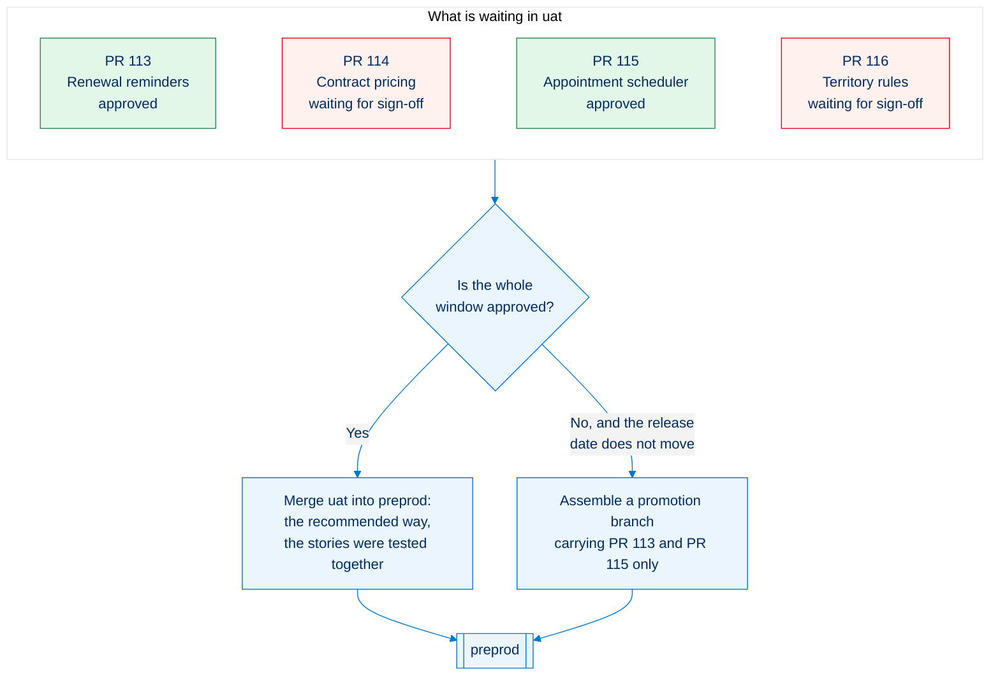
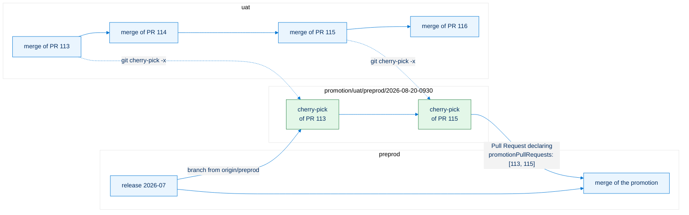
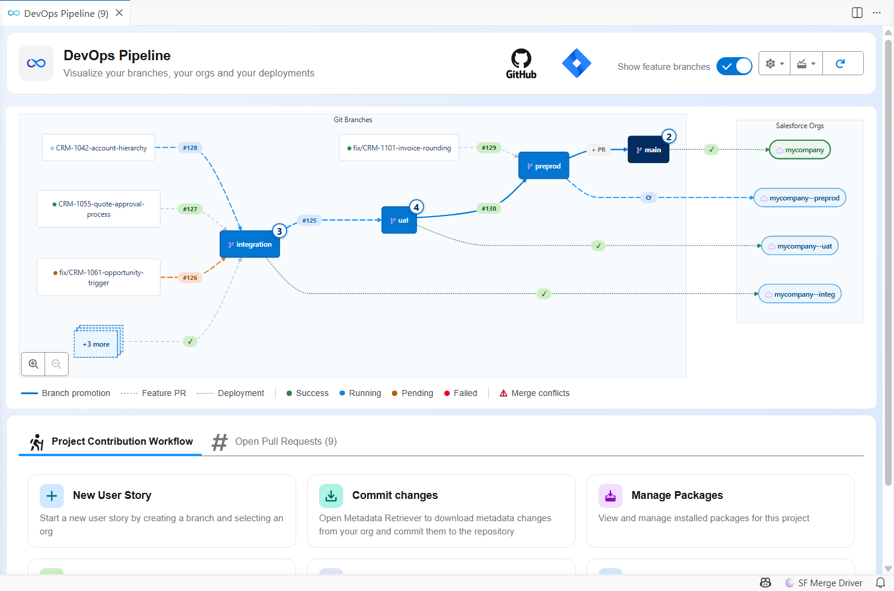
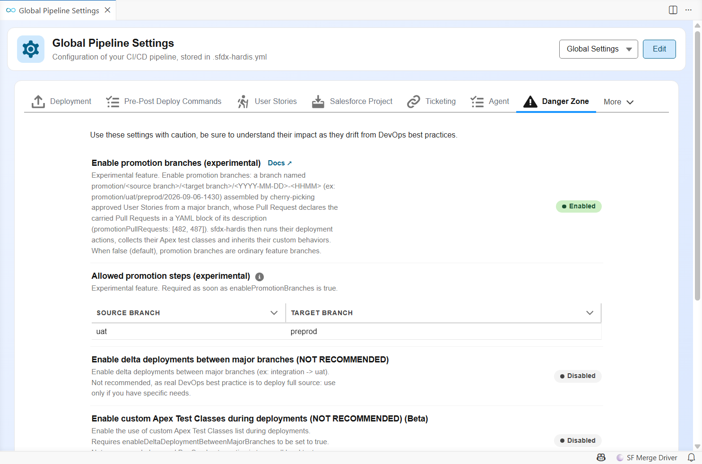
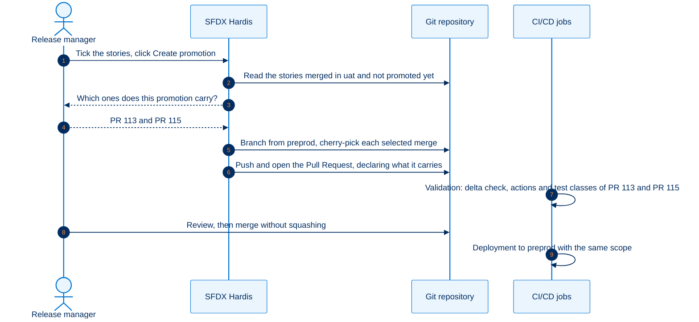
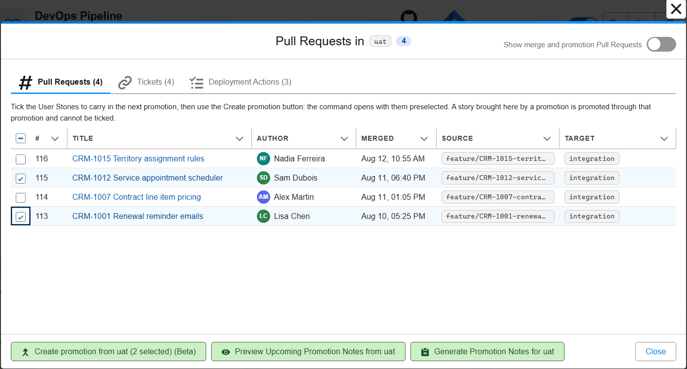
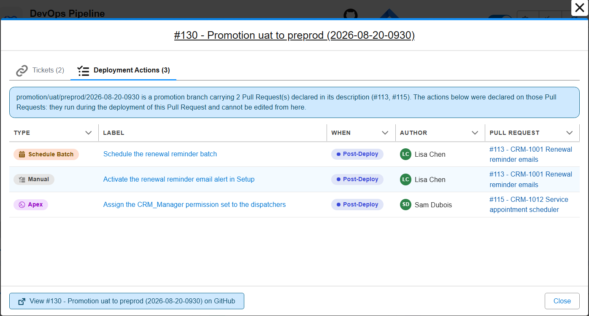

<!-- markdownlint-disable MD013 -->

## Promotion branches (Beta)

> **This feature is in Beta.** Promotion branches are switched off by default, nothing changes for a project that does not enable them, and their behavior may still change from feedback. Please report any issue or feedback on the [sfdx-hardis GitHub repository](https://github.com/hardisgroupcom/sfdx-hardis/issues).

- [When to use them](#when-to-use-them)
- [How it works](#how-it-works)
- [Configuration](#configuration)
- [Assemble a promotion branch](#assemble-a-promotion-branch)
- [What sfdx-hardis does with it](#what-sfdx-hardis-does-with-it)
- [After the promotion](#after-the-promotion)
- [Limits](#limits)

___

## When to use them

With sfdx-hardis, you promote **branches**, not features: everything merged into `uat` goes to `preprod`, then to production, as one version. This is the recommended way, because the stories of a version were tested together.

Some organizations cannot always follow it. Business sign-off happens **per User Story**, a stakeholder is on leave, a story comes back from a demo with rework, and a release date is fixed. At that moment `uat` holds a mix of approved and unapproved stories, and one unapproved story would block every other one.

A **promotion branch** is the exception path for that situation: a branch cut from the target major branch (usually `preprod`), on which the release manager cherry-picks the approved stories only, and which is merged through an ordinary Pull Request. It is not a replacement for the normal promotion of `uat`: use it when you have to, and promote `uat` as usual as soon as you can.



For urgent fixes that were never in `uat`, use [hotfixes](salesforce-devops-hotfixes.md) instead.

___

## How it works

A promotion branch is an ordinary minor branch for the deployment itself: its Pull Request to `preprod` gets a delta validation, a Quick Deploy after the merge, the overwrite management, exactly like a hotfix branch.



The promotion Pull Request **says which stories it carries**, so the deployment jobs give them everything they would have had in a normal promotion: their deployment actions run, their Apex test classes are collected, their tickets are updated and the release notes mention them.

The DevOps Pipeline of the VS Code extension draws the promotion in flight on the arrow between the two branches it goes from and to, next to the counter of the User Stories still waiting in `uat`:



<details markdown="1">
<summary>How it works behind the hood</summary>

What makes a promotion branch special is the **Pull Request scope**. sfdx-hardis finds the User Stories carried by a merge by matching merged Pull Requests with the commits of the merge. Cherry-picked commits have new SHAs, so the stories of a promotion branch would be invisible: their [deployment actions](salesforce-devops-work-on-user-story-deployment-actions.md) would not run, their Apex test classes would not be collected, and the release notes would not mention them.

With promotion branches enabled, the promotion Pull Request **declares** the stories it carries, in a YAML block of its description:

```yaml
promotionPullRequests: [482, 487, 491]
```

sfdx-hardis then treats those Pull Requests as the scope of the promotion Pull Request, on the validation job and on the deployment job.

</details>

___

## Configuration

Two settings switch the feature on, both in the **Danger Zone** of the Pipeline Settings panel of the VS Code extension:

- **Enable promotion branches** (`enablePromotionBranches`), off by default;
- **Allowed promotion steps** (`allowedPromotionSteps`), the source and target branches your release managers may assemble a promotion between. This list is **required**: sfdx-hardis refuses to assemble a promotion while it is missing, rather than assume that every major branch can be promoted to every merge target.



With `uat -> preprod` as the only allowed step, as above:

- the **Create promotion** button and the checkboxes that tick the stories to carry show up in the `uat` window only. The other branches show their Pull Requests read-only;
- the target is settled, so nothing is asked: a promotion from `uat` can only go to `preprod`;
- a promotion branch assembled outside the list all the same (by hand, or before the list was written) still deploys, and the job logs a warning naming the step and the allowed ones.

<details markdown="1">
<summary>How it works behind the hood</summary>

Both settings live in `config/.sfdx-hardis.yml` and can be edited there instead:

```yaml
enablePromotionBranches: true
allowedPromotionSteps:
  - source: uat
    target: preprod
```

Leave `target` out to allow every merge target of a source branch:

```yaml
allowedPromotionSteps:
  - source: uat            # uat to any of its merge targets
  - source: preprod
    target: main
```

A step whose target is not a merge target of its source (`mergeTargets` of the branch config) opens nothing in the DevOps Pipeline: the command could not resolve that target from the pipeline either, and would stop.

To allow everything, name every step: there is no wildcard, on purpose, so the list always reads as a decision somebody made.

Both keys are read from the **project** configuration. `hardis:project:promotion:create` runs from any branch, so a list written in a branch config file (`config/branches/.sfdx-hardis.<branch>.yml`) would be invisible to it. sfdx-hardis merges `enablePromotionBranches` with the configuration of the branch a job runs on, so setting it in a single branch file would leave the command and the other branches without it.

</details>

### Naming

A promotion branch is named after the step it serves and the minute it was assembled, so the name alone says where the stories come from and where they go:

```text
promotion/uat/preprod/2026-09-06-1430
```

The convention is not configurable, and the command is what applies it.

<details markdown="1">
<summary>How it works behind the hood</summary>

```text
promotion/<source branch>/<target branch>/<YYYY-MM-DD>-<HHMM>
```

`promotion/uat/preprod/2026-09-06-1430` is the promotion assembled on September 6th, 2026 at 14:30 UTC, from `uat` to `preprod`. The date and the time are in UTC, so the name does not depend on the time zone of the machine that assembles the promotion.

A counter is added only when that name is already taken: a second promotion of the same step in the same minute is `promotion/uat/preprod/2026-09-06-1430-2`, then `-3`... A name stays taken as long as a branch, a merge commit of the target branch or a recently merged Pull Request still carries it, so a promotion branch deleted after its merge never gives its name back. If the Pull Request targets another branch than the one in the name, the job warns about it.

Promotion branches assembled by the first releases of the feature are named `<YYYY-MM-DD>-<counter>` (ex: `promotion/uat/preprod/2026-09-06-1`). They are still recognized, so a promotion opened or merged before the upgrade keeps working.

A Pull Request is a promotion Pull Request when **all** of the following are true:

- `enablePromotionBranches` is `true`;
- its source branch follows the naming convention above;
- its description contains a `promotionPullRequests` YAML block.

Anything else is unchanged:

- when `enablePromotionBranches` is not set, the naming and the YAML key are ignored (an info line in the job log says so);
- a branch starting with `promotion/` that does not follow the convention (ex: `promotion/2026-09`) is an ordinary feature branch, even with the YAML key (a warning says so);
- a well-named promotion branch without the YAML key is an ordinary feature branch (a warning says so);
- a `promotionPullRequests` key on a `feature/` branch is ignored (a warning says so).

</details>

___

## Assemble a promotion branch

Everything below is done from the **DevOps Pipeline** of the VS Code SFDX Hardis extension: you tick, you click, and when a conflict shows up you copy a prompt into your coding agent. Nothing has to be typed in a terminal.

Never assemble a promotion branch by hand: sfdx-hardis is what guarantees the naming, the cherry-pick options and the Pull Request declaration the deployment jobs rely on.



### 1. Tick the stories to carry

Make sure they are merged into `uat` and validated there. In the DevOps Pipeline, open the window of the source branch, tick the User Stories to carry, then use **Create promotion**: it opens with them preselected, and you confirm the selection.



Only the stories waiting in that branch are offered: the target is its merge target (`preprod` for `uat`), and a story an earlier promotion already carried there is left out, so the same work is never shipped twice. A story brought into the branch by an earlier promotion is promoted through that promotion and cannot be ticked.

### 2. Let sfdx-hardis assemble the branch

It creates the branch from the target, cherry-picks the selected stories oldest first, pushes, and opens the Pull Request with a description that declares what it carries and lists the titles, authors, source branches and tickets.

<details markdown="1">
<summary>How it works behind the hood</summary>

- creates `promotion/uat/preprod/<YYYY-MM-DD>-<HHMM>` (UTC) from `origin/preprod`, with `-2`, `-3`... added only when that name is already taken;
- cherry-picks the merge commit of each selected story, oldest first, with `-x` so each commit keeps a pointer to its origin (`-m 1` on merge commits, plain on squash commits);
- pushes the branch and **creates the Pull Request** to `preprod`, with a description that declares the carried Pull Requests (`promotionPullRequests`), lists their titles, authors, source branches and tickets.

A story carried by an earlier promotion is left out of the candidate list because cherry-picked commits keep new SHAs: it would otherwise be offered again after its promotion was merged.

Only the Pull Requests that carry their own change are listed. A merge between two major branches, and a promotion Pull Request, move other work: they are never offered as candidates, never declared and never have their deployment actions run, even when they appear in the history of a selected commit (a sync of `integration` into a feature branch, for instance).

Promotion branch names have exactly four segments, so the source and target branch names must not contain a `/`. The command stops before touching git if one of them does.

The Pull Request is created through the git provider API when a token is configured, or with the `gh` CLI on GitHub. Without either, the branch is pushed and the description is saved under `hardis-report/` so you can create the Pull Request yourself. A link to the provider's own creation form, with the source branch, the target branch, the title and the description already filled in, is printed as well, so nothing has to be retyped.

The `scripts/actions/.sfdx-hardis.<PR>.yml` files of the stories travel with their commits, so their deployment actions are in the branch too.

</details>

### 3. Answer the conflicts, if any

If a cherry-pick conflicts, the story depends on another one that is not part of the promotion. You are asked what to do.

> 💡 **Recommended: pick "commit this User Story and every following conflict with their conflict markers, without asking again", then hand the conflicts to a coding agent.** A promotion window conflicts on the same files story after story, so answering once beats answering ten times. The promotion is assembled in one go, and the conflicts are all solved afterwards, on the branch, in a single pass.

Once the Pull Request is open, **copy the prompt it carries and paste it into your coding agent** (Claude Code, Codex, Copilot...). It knows which files to fix and what the resolution has to look like, and it commits the result. The same prompt is saved as a markdown file under `hardis-report/`, in case the description is not the handiest place to copy from.

The validation job fails while a conflict marker is still in the sources, so a promotion cannot reach the org half-solved.

Every tracked file of the branch is checked. If your repository holds conflict markers on purpose (documentation about merge conflicts, merge driver fixtures), list those files in `promotionConflictMarkersIgnoredFiles`, as git glob patterns relative to the repository root:

```yaml
promotionConflictMarkersIgnoredFiles:
  - labs/**/*.md
```

The four answers in full:

- **commit the story and every following conflict with their conflict markers, without asking again** (recommended): the promotion is assembled whole, conflicts and all, for the coding agent to solve;
- **commit-with-markers**: the same for this story only, so you are asked again on the next conflict;
- **skip**: leave that story out, it is listed as such in the Pull Request description;
- **abort**: stop, the branch is deleted and nothing is pushed.

The [sf-git-merge-driver](https://github.com/scolladon/sf-git-merge-driver) plugin solves many XML conflicts by itself, so install it and you will see far fewer of them.

A story whose change is already in the target branch (brought by a hotfix, a retrofit or an earlier promotion) has nothing to cherry-pick: it is left out and listed apart in the Pull Request description, without asking anything.

<details markdown="1">
<summary>How it works behind the hood</summary>

With **commit-with-markers**, the Pull Request description warns about the conflicts, lists the files to fix and embeds a ready-to-paste prompt for a coding agent, also saved in `hardis-report/promotion-conflicts-prompt-*.md`. The validation job stops with an error naming the files while a marker is still in the sources; on a provider that caps the description length (Azure DevOps stops at 4000 characters), the prompt is left out of the description and only the saved file carries it.

`--on-conflict commit-with-markers` is the equivalent of the "and all the following conflicts" answer for a non-interactive run.

The coding agent prompt asks for a commit message that explains, file by file, what was on the target side, what the story added, and what was kept: the reviewer of the promotion Pull Request reads the resolutions without opening the diff.

</details>

### 4. Review and merge

Review the Pull Request like any other, and do **not** squash it when merging: the `-x` trailers of the cherry-picks must survive in `preprod`.

The branch itself can be deleted right after the merge, by hand or by a repository that deletes the head branch of every merged Pull Request: a later promotion never takes its name back, because the name of a deleted branch is still read from the merged Pull Requests of the target branch and from its history.

> ⚠️ **A promotion branch must only be validated, never deployed.** A promotion branch is the source branch of a Pull Request, like a feature branch. Your CI must run its **validation** job, never a deployment job: deploying from the promotion branch would send the promotion to the target org before it is reviewed and merged. The deployment job stops with an error when it happens, naming the setting to fix. The usual cause is a deployment trigger that matches more than your major branches.

<details markdown="1">
<summary>How it works behind the hood</summary>

On GitLab, anchor the `DEPLOY_BRANCHES` regex of `.gitlab-ci-config.yml`:

```yaml
# promotion/integration/uat/2026-09-08-1430 matches this one
DEPLOY_BRANCHES: /(integration|uat|preprod|main)/
# it does not match this one
DEPLOY_BRANCHES: /^(integration|uat|preprod|main)$/
```

On GitHub Actions, Azure Pipelines and Bitbucket Pipelines, list your major branches explicitly in the trigger of the deployment job.

</details>

### One promotion at a time between two branches

A pipeline step holds a single promotion in flight, so the DevOps Pipeline can draw it on the arrow between the two branch nodes and there is one answer to "what is being promoted to `preprod` right now".

When a promotion from `uat` to `preprod` is already open and you assemble a new one, the open one is listed and you are asked to confirm before it is superseded. The stories it carried come straight back to the list you tick from.

<details markdown="1">
<summary>How it works behind the hood</summary>

With `--agent` (and in CI) the open promotion is closed without asking. The old Pull Request is closed only once the new one has been created, so the step is never left without a promotion. If your git platform refuses to close it, the command says which one to close by hand.

The stories of a superseded promotion are not "already promoted" any more, since the promotion that carried them is on its way out. That is the point of superseding it.

</details>

### If your working copy is not clean

Assembling a promotion switches branches and cherry-picks commits, so it needs a clean working copy. When you have local changes, they are not simply refused: they are listed, and you choose to **stash** them (to restore later) or to **commit** them on the branch you are on, with the message of your choice. Only the files you changed are touched: the reports sfdx-hardis writes under `hardis-report/` are left alone, so getting your work back does not fight with them.

<details markdown="1">
<summary>How it works behind the hood</summary>

Stashing runs `git stash`, and you get your work back with `git stash pop`.

In `--agent` mode and in CI nothing is touched: the command stops and names the files to deal with.

</details>

### For agents and automation

Agents and automation call the same command without prompts, and can ask what could be promoted without creating anything.

<details markdown="1">
<summary>How it works behind the hood</summary>

```bash
sf hardis:project:promotion:create --agent --source-branch uat --pull-requests 482,487,491
```

`hardis:project:promotion:create` lists the candidates before asking which ones to carry, but a coding agent (or anyone who only wants to know) needs that list on its own:

```bash
sf hardis:project:promotion:list-candidates --source-branch uat --json
```

[`sf hardis:project:promotion:list-candidates`](hardis/project/promotion/list-candidates.md) reads and reports, nothing else: same configuration checks, same allowed steps, same candidates, same rules about what another promotion already carries. Its JSON result holds `candidates` (Pull Request numbers, title, author, source branch, commit, date), `alreadyPromoted` and `openPromotions`, so an agent can pick the numbers and pass them to `hardis:project:promotion:create --pull-requests`.

The promotion already open between the two branches is named but left alone: only `promotion:create` closes it, once its replacement exists. The stories it carries are reported as already promoted, and they come back as candidates when it is superseded.

</details>

___

## What sfdx-hardis does with it

The promotion Pull Request carries no work of its own: its deployment actions, its Apex test classes and its tickets are those of the stories it declares. The extension shows them read-only, with the list of the Pull Requests they come from:



**Custom behaviors are inherited too.** If a carried story asked for a specific deployment behavior in its description, the promotion Pull Request inherits it, and the validation comment says which story it came from. What a story declared, it needs in every org it reaches.

<details markdown="1">
<summary>How it works behind the hood</summary>

| Job                                                              | Behavior                                                                                                                                                                                                                                                                                                                 |
|------------------------------------------------------------------|--------------------------------------------------------------------------------------------------------------------------------------------------------------------------------------------------------------------------------------------------------------------------------------------------------------------------|
| Validation of `promotion/uat/preprod/2026-09-06-1430 -> preprod` | Delta deployment of the cherry-picked changes. The scope is the declared Pull Requests: their deployment actions are listed, their pending manual actions appear as checkboxes, their Apex test classes are collected when `enableDeploymentApexTestClasses` is active.                                                  |
| Deployment of `promotion/uat/preprod/2026-09-06-1430 -> preprod` | Same scope. Actions run in `preprod` and each one is recorded on its own story Pull Request, in the "Deployment Actions" comment (`preprod` column).                                                                                                                                                                     |
| Promotion `preprod -> main`                                      | The promotion Pull Request is part of the go-live like any other merge. sfdx-hardis expands it with the stories it declares, so their actions run in production and the release notes list them.                                                                                                                         |
| Later promotion `uat -> preprod`                                 | The stories are still in the `uat` promotion window: their original merge commits have not reached `preprod`. Their metadata is redeployed as a no-op, and their actions are skipped where already performed (`runOnlyOnceByOrg`). The Pull Request comment lists them as already deployed through the promotion branch. |
| Next `sf hardis:project:promotion:create` from `uat`             | A Pull Request another promotion branch already carries to the same target is left out of the choices, so the same story is not shipped twice. `--include-already-promoted` offers it again; the cherry-pick is then empty and the story is simply listed as already in the target branch.                               |

The inherited custom behaviors are the `NO_DELTA`, `PURGE_FLOW_VERSIONS`, `DESTRUCTIVE_CHANGES_AFTER_DEPLOYMENT` and `FLOW_DELETE_INTERVIEWS` keywords of a story description.

The declared list is taken as is, with two exceptions reported as warnings: a Pull Request number that cannot be found is skipped, and a Pull Request that is not merged is skipped, since its content cannot be in the branch.

A promotion Pull Request that carries another promotion is followed down to the User Stories, however many levels there are: a `preprod -> main` promotion declaring the `uat -> preprod` one reaches the stories that one carried, and their deployment actions, Apex test classes and custom behaviors travel with them.

</details>

___

## After the promotion

Two things to do, both borrowed from the [hotfix](salesforce-devops-hotfixes.md) process:

- **Retrofit right away.** Once `preprod` (or production) contains the promotion branch, [retrofit](salesforce-devops-retrofit.md) it into `integration` with a `retrofit/` branch, exactly as after a hotfix. The cherry-picked commits then meet their originals at the next `integration -> uat` promotion instead of at the next go-live.
- **Freeze `uat -> preprod` while a promotion branch sits in `preprod`** and has not reached production yet, otherwise unapproved stories ride along. This is the RUN/BUILD rule of the hotfix process.

In the DevOps Pipeline, a promoted story leaves the window of the branch it came from and is listed in the branch it reached, so **a Pull Request number appears in a single place in the diagram**, both in the counter on the node and in the list opened by clicking it.

<details markdown="1">
<summary>How it works behind the hood</summary>

A promotion carries **commits**, not Pull Request numbers. On a pipeline where User Stories are merged into `integration` and `integration` is then merged into `uat`, every first-parent commit of `uat` is one of those syncs: they are opened up into the User Story merges they brought in, so each story is a candidate of its own and can be carried alone. What stays grouped is a single commit that really brought several Pull Requests in at once (a squashed sync, an octopus merge, a back-merge from the target branch): promoting one of them carries the others too. The command names them before cherry-picking anything, and declares them all in the Pull Request.

The lists and counters of the DevOps Pipeline leave out the Pull Requests that **move** other Pull Requests: a merge between two major branches, and a promotion Pull Request. Everything that carries its own change stays listed, whatever the branch is named (`feature/`, `fix/`, `retrofit/`, `hotfix/`...). The "Show merge and promotion Pull Requests" toggle at the top of the branch window brings the others back. The rule for major-to-major merges applies to **every** project, promotion branches or not, since such a merge is plumbing in any pipeline; a `promotion/` branch is only treated as a vehicle when the feature is enabled, exactly as the deployment jobs treat it.

The deployment jobs still see the stories in the `uat` promotion window: their original merge commits have not reached `preprod`, so their metadata is redeployed as a no-op and their already performed actions are skipped. That is a deployment concern, not a listing one.

</details>

A `uat` window that stays full of already-shipped stories is the sign that `uat` is used as the approval gate `preprod` was designed to be. Consider adding an intermediate major branch rather than assembling every version by hand.

___

## Release notes

The release notes list the User Stories a promotion Pull Request carries, not the promotion Pull Request itself: the tickets, the metadata changes, the deployment actions and the contributor counts are those of the stories. A promotion whose declared Pull Requests could not be resolved is kept in the notes, so a change never disappears from them. The same rule applies to the merges between two major branches, which are left out whether or not the project uses promotion branches.

<details markdown="1">
<summary>How it works behind the hood</summary>

`sf hardis:doc:release-notes` is the command behind them. Pass `--include-promotions` to list the promotions and the major-to-major merges next to the stories they carry.

</details>

___

## Limits

- A promotion is always assembled **from a major branch**, never from another promotion branch. A promotion carrying another promotion is fine, and the deployment jobs follow the declarations down as many levels as there are.
- Custom behaviors are inherited on the promotion Pull Request only. On the next `preprod -> main` promotion, keywords are read from that Pull Request's description, like for any promotion.
- **Save / Publish User Story** warns when run on a promotion branch: its cleaning and manifest updates are meant for User Story branches.

___

## Pull Request description cache

On Azure DevOps, sfdx-hardis and the VS Code extension have to re-read the description of every promotion Pull Request through a second API call, which dominates the run on a repository with a long history. Descriptions that can no longer change are cached locally to avoid it, and nothing has to be configured.

<details markdown="1">
<summary>How it works behind the hood</summary>

Azure DevOps truncates the description of a Pull Request returned by its **list** API at 400 characters, with no marker saying so. The `promotionPullRequests` declaration of a promotion branch sits below the navigation block and the introduction, so on a promotion carrying more than a story or two it falls past that cut: sfdx-hardis and the VS Code extension both have to read each such Pull Request again through the single Pull Request API, which returns the whole description.

That is one extra API call per Pull Request with a long description, on every job and every refresh of the DevOps Pipeline.

The description of a Pull Request that is **merged or abandoned** no longer moves, so it is cached locally:

|        |                                                                                                               |
|--------|---------------------------------------------------------------------------------------------------------------|
| Where  | `~/.sfdx/sfdx-hardis-pr-cache/<provider>__<repository>.json`, outside the repository so it is never committed |
| Key    | the normalized git remote URL of the working copy, which is what the CLI and the extension agree on           |
| What   | the full description, the terminal state it was in, and when it was cached                                    |
| Shared | a cache warmed by a CI job or a local command is read by the VS Code extension, and the other way round       |

The rules that keep it honest:

- **An open Pull Request is never cached**, in either direction: its description is exactly what people are still editing.
- An entry is used only when the Pull Request is **still in the state it was cached in**. Bitbucket reopens a declined Pull Request and Azure DevOps reactivates an abandoned one, so the state seen right now always wins.
- An entry **expires after 90 days**, because a merged description can still be edited by hand.
- A repository keeps at most **5000 entries**, the oldest going first.
- The file is merged and rewritten atomically, so a CI job and the extension writing at the same time cannot lose each other's entries.

Set `NO_CACHE=true` or `SFDX_HARDIS_NO_PR_CACHE=true` to bypass it entirely, and delete `~/.sfdx/sfdx-hardis-pr-cache/` to start again.

> Measured on a four level pipeline of 23 Pull Requests: `sf hardis:project:promotion:list-candidates` went from **74.6 s** to **40.6 s** on the second run, with identical output. The gain grows with the number of Pull Requests that carry a long description.

</details>
