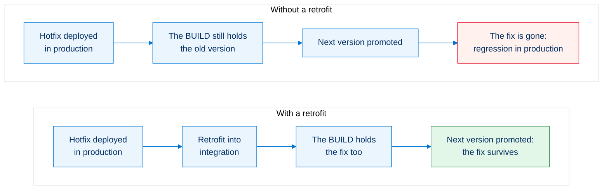
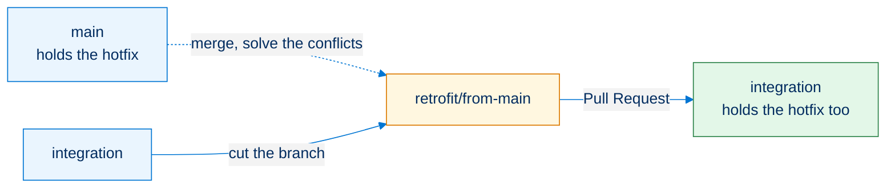

<!-- markdownlint-disable MD013 -->

## Retrofit

A **retrofit** brings back into the BUILD branches what reached production without going through them. Skip it, and the next version quietly undoes the fix.

> A retrofit is one of **two things**, and this page covers both:
>
> - **[Retrofit a branch](#retrofit-a-branch-into-the-build)**: a top branch is merged down into a lower one through a `retrofit/` branch, to give the BUILD what the RUN just shipped. This is what follows a hotfix or a promotion branch.
> - **[Manual retrofit](#manual-retrofit-of-a-change-made-in-an-org)**: somebody changed an org by hand. That must never happen; you recover the change as a User Story under `integration`, retrieved with the Metadata Retriever.

- [Why it matters](#why-it-matters)
- [When to retrofit](#when-to-retrofit)
- [Retrofit a branch into the BUILD](#retrofit-a-branch-into-the-build)
- [Manual retrofit of a change made in an org](#manual-retrofit-of-a-change-made-in-an-org)

___

## Why it matters

The BUILD branches were cut before the fix existed. They still hold the **old version of the same metadata**, and they do not know it is old. When the BUILD is promoted, it deploys what it holds, and the fix disappears from production.

To summarize, you **publish at RUN level, then also at BUILD level** (the retrofit), so that when the BUILD is later merged into the RUN, **no overwrite triggers a regression**.

___

## When to retrofit

Every time something reached production without going through the BUILD branches.

| What happened                                                                                          | What to retrofit                         | When                                                                            |
|--------------------------------------------------------------------------------------------------------|------------------------------------------|---------------------------------------------------------------------------------|
| A [hotfix](salesforce-devops-hotfixes.md) was merged into `main`                                       | `main` (or `preprod`) into `integration` | Right after the hotfix is in production                                         |
| A [promotion branch (Beta)](salesforce-devops-promotion-branches.md) was merged into `preprod` | `preprod` into `integration`             | Right after the promotion is merged                                             |
| Somebody changed an org **by hand** (which must never happen)                                          | The change, as a User Story              | As soon as you notice, see [below](#manual-retrofit-of-a-change-made-in-an-org) |

Do it **right away** in every case. A retrofit left for later is a conflict that grows: the BUILD branches keep moving on top of metadata that is already out of date in production.

> On [pattern B](salesforce-devops-setup-git.md#pattern-b-build-run-and-hotfixes), retrofit into **`uat_run` as well as `integration`**. `uat_run` also merges into `preprod` without holding the hotfix, so the next RUN promotion would overwrite it exactly like the next BUILD promotion would.

___

## Retrofit a branch into the BUILD

### 1. Activate the merge driver

Activate the [sf-git-merge-driver](https://github.com/scolladon/sf-git-merge-driver) plugin before the retrofit: it automatically solves many XML conflicts, which is most of what a retrofit produces.

### 2. Merge production down into a retrofit branch

- Create a sub-branch of `integration` named `retrofit/from-main`, for example. Keep the `retrofit/` prefix: sfdx-hardis recognizes it and carries the [deployment actions](salesforce-devops-work-on-user-story-deployment-actions.md) of every Pull Request included in the retrofit
- Using your git IDE, merge the `main` (or `preprod`) branch into `retrofit/from-main`
- If there are git conflicts, solve them before committing

### 3. Merge the retrofit into the BUILD

- Create a Pull Request from `retrofit/from-main` to `integration`
- Merge the Pull Request into `integration`: the retrofit from the RUN to the BUILD is done
  - If the retrofit has many impacts, consider refreshing the dev sandboxes

How it works behind the hood

The `retrofit/` prefix is what makes the difference. A merge from a feature branch only processes the actions of the Pull Request that has just been merged, but a merge from a `retrofit/*` branch is treated like a merge between two major branches: its scope is **every Pull Request merged since the previous merge**.

That is what lets a hotfix keep its [deployment actions](salesforce-devops-work-on-user-story-deployment-actions.md) on the way down. A Pull Request merged into an upstream branch joins the batch as soon as its commits arrive in the window, so a hotfix merged into `main` is collected when the retrofit brings it into `integration`, and its actions run there too. `runOnlyOnceByOrg` keeps an action that already ran in that org from running twice.

In the DevOps Pipeline, a `retrofit/` Pull Request is listed as work of its own: it carries its own change, unlike a merge between two major branches, which only moves other Pull Requests.

___

## Manual retrofit of a change made in an org

> ⚠️ **Changing a major org by hand must never happen.** Production, preprod, uat and integration are deployed from their branch: a change made through Setup is in no branch, nobody reviewed it, and the next deployment silently overwrites it. All work goes through a dev sandbox, a branch and a Pull Request, however small and however urgent. [Protect your major branches](salesforce-devops-setup-git.md#protect-the-major-branches) and keep the number of people with Setup access in production to a minimum.

It still happens, and pretending otherwise loses the change. What follows is the **repair**, not a way of working.

The change is live in the org, it is in no branch, and the next deployment will undo it. Bring it back into git as an ordinary User Story, from the bottom of the pipeline, so it is reviewed and then climbs the branches like anything else.

### 1. Start a User Story under integration

[Start a new User Story](salesforce-devops-create-new-user-story.md) with `integration` as its target branch, on a dev sandbox. Name it after the change you are recovering.

Start from the **bottom** of the pipeline even though the change was made at the top: what enters through `integration` reaches every branch above it on its own. Retrieving it straight into `preprod` would leave the BUILD branches without it, and you would be back to the [problem this page opens with](#why-it-matters).

### 2. Retrieve the changed metadata

Use the **Metadata Retriever** of the VS Code SFDX Hardis extension to pick exactly what was changed in the org, and nothing else.

Retrieve from the org that holds the change. Take the items you identified, not everything the retriever offers: a retrofit that drags along unrelated metadata is a deployment nobody can review.

Not sure what changed? The [Org Monitoring](salesforce-monitoring-home.md) backup gives you the git diff of the org day by day, and the Salesforce Audit Trail names who changed what.

### 3. Review and merge like any User Story

Commit, **Save / Publish**, and open the Pull Request to `integration`. From there it climbs `uat`, `preprod` and production with the next promotions, the same as any other work.

___

## See also

- [Hotfixes](salesforce-devops-hotfixes.md): ship an urgent fix to production through the RUN stream.
- [Promotion branches (Beta)](salesforce-devops-promotion-branches.md): ship the approved stories of `uat` without waiting for the rest.
- [Deployment actions](salesforce-devops-work-on-user-story-deployment-actions.md): what runs around a deployment, and the scope each kind of merge gets.

<!-- training-links:start -->

## Learn by doing

The free [Salesforce DevOps with sfdx-hardis](https://hardisgroupcom.github.io/sfdx-hardis-training) course does this, click by click, on an org of your own:

- [Lab 3.7 - Production is broken: hotfix and retrofit](https://hardisgroupcom.github.io/sfdx-hardis-training/en/level-3-release-manager/3-7-hotfix-and-retrofit/)

<!-- training-links:end -->
