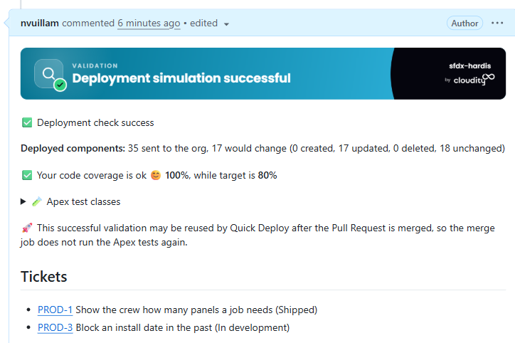
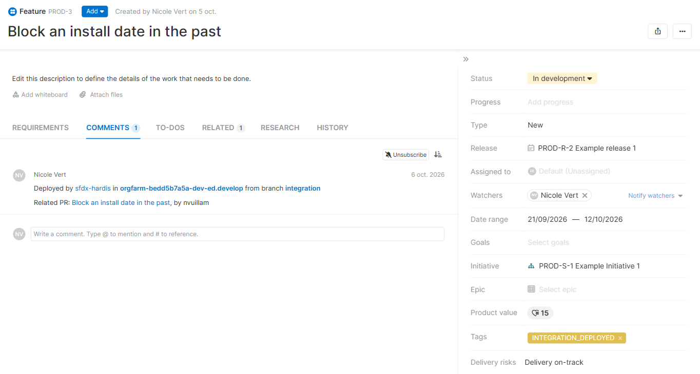
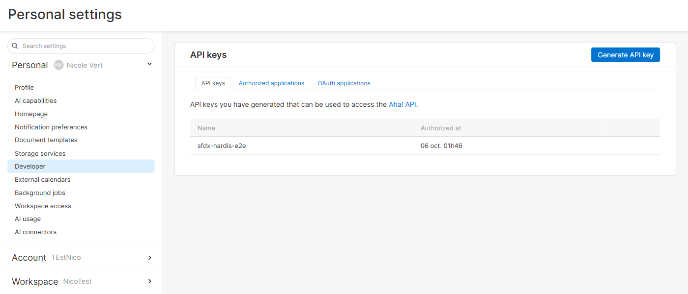
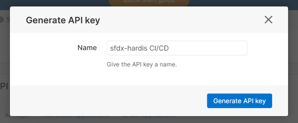
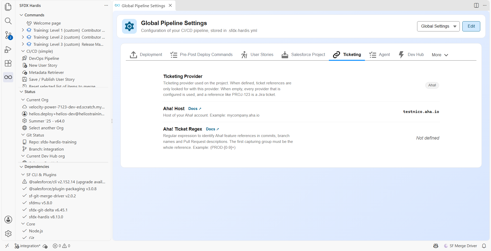
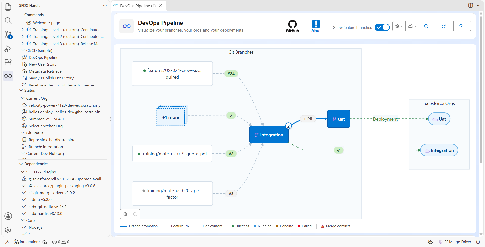
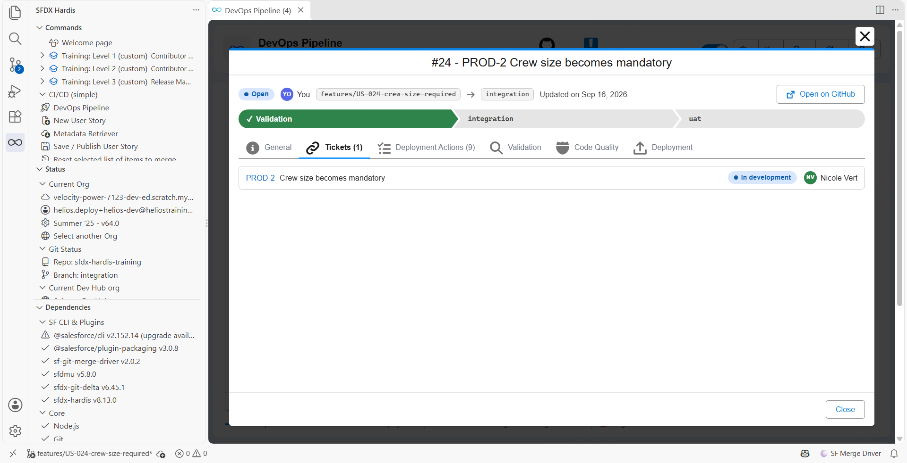

<!-- markdownlint-disable MD013 -->

- [Aha! integration](#aha-integration)
  - [For git providers](#for-git-providers)
  - [For notifications providers](#for-notifications-providers)
  - [Update Aha! features](#update-aha-features)
- [Configuration](#configuration)
  - [Select Aha! as ticketing provider](#select-aha-as-ticketing-provider)
  - [Credentials](#credentials)
  - [Identify Aha! features](#identify-aha-features)
- [In VS Code](#in-vs-code)
- [Read a single feature](#read-a-single-feature)
- [GitLab configuration](#gitlab-configuration)
- [Technical notes](#technical-notes)

## Aha! integration

If you track your work in Aha! (Aha! Roadmaps or Aha! Develop), sfdx-hardis can use it to enrich its integrations.

sfdx-hardis analyzes **commit messages, branch names and Pull Request titles and descriptions** to collect the Aha! features they mention, then reads each feature to get its name, its status and its owner.

`PROD-12` is detected on its own, and so is the link to the feature, for example `https://mycompany.aha.io/features/PROD-12`.

> Only **features** are collected. A requirement (`PROD-12-3`), an epic (`PROD-E-4`), a release (`PROD-R-2`) or an idea is left alone.

> A link to a feature of another Aha! account is ignored: only the account defined in **ahaHost** is read and written.

### For git providers

GitHub, GitLab, Azure, Bitbucket: post references to Aha! features in Pull Request comments



### For notifications providers

Slack, Microsoft Teams: add deployed Aha! features to deployment notifications

### Update Aha! features

Add a comment and a tag on Aha! features when they are deployed in a major org.

The default tag is `UPPERCASE(branch_name) + "_DEPLOYED"`.

To override it, define the environment variable **DEPLOYED_TAG_TEMPLATE**, which must contain `{BRANCH}`.

Example: `DEPLOYED_TO_{BRANCH}`

The tags a feature already has are kept, and a feature that already carries the tag is not updated again.



## Configuration

> When possible, define these properties in the **.sfdx-hardis.yml** file, so that the VS Code SFDX Hardis extension can use them for UI features.

### Select Aha! as ticketing provider

An Aha! feature reference (`PROD-12`) has the same shape as a Jira key, so sfdx-hardis needs to be told that your project uses Aha!.

Declare it in `.sfdx-hardis.yml`:

```yaml
ticketingProvider: AHA
ahaHost: mycompany.aha.io
```

> Without `ticketingProvider: AHA`, references like `PROD-12` are read as Jira tickets, even when the Aha! variables are defined.

### Credentials

Define the following variables:

- .sfdx-hardis.yml property **ahaHost** or ENV variable **AHA_HOST** (examples: `mycompany.aha.io`, `https://mycompany.euw4.aha.io`)
- ENV variable **AHA_API_KEY**, a secret of your CI/CD pipelines

An API key has the rights of the user who created it. Use a dedicated user who can read and comment on the features of the workspaces your project works with.

To create the API key:

1. Sign in to Aha! with the user that will post the deployment comments.
2. Open **Settings -> Personal -> Developer**, tab **API keys**, or go to `https://mycompany.aha.io/settings/api_keys`.

   

3. Click **Generate API key**, give it a name that says what uses it, and confirm.

   

4. Copy the key right away: Aha! displays it once. Store it as the **AHA_API_KEY** secret of your CI/CD pipelines.

To revoke a key, come back to the same page and click **Revoke** on its line. sfdx-hardis sends the key as a Bearer token, always over https, and only to the host defined in **ahaHost**.

### Identify Aha! features

- .sfdx-hardis.yml property: **ahaTicketRegex** or ENV variable **AHA_TICKET_REGEX**

Define a regular expression with a capturing group that identifies the features of your workspaces in commit and Pull Request titles and bodies, for example `(PROD-[0-9]+)`, or `((?:PROD|MOBILE)-[0-9]+)` for two workspaces.

If not defined, the default value is `(?<=[^a-zA-Z0-9_-]|^)([A-Za-z][A-Za-z0-9]{1,9}-\d{1,6})(?=[^a-zA-Z0-9_-]|$)`: a workspace prefix starting with a letter, a dash and a number.

> The default expression also matches words like `UTF-8`. A reference that is not a feature is not found in Aha!, so nothing is written to it, but it is looked up at every Pull Request. Define **ahaTicketRegex** with your workspace prefixes to avoid it.

## In VS Code

The [DevOps Pipeline](vscode-extension-devops-pipeline.md) of the VS Code extension reads the same configuration.

Select **Aha!** as Ticketing Provider and define the host of your account in **Pipeline Settings**, tab **Ticketing**.



Then click on the ticketing icon in the header of the DevOps Pipeline to connect: the extension opens the API keys page of your account, and asks for the key you generated. The key is stored in the secret storage of VS Code, and passed to the sfdx-hardis commands the extension runs.



The features of a Pull Request are listed in its **Tickets** tab, with their name, their status and their owner in Aha!.



## Read a single feature

[`sf hardis:ticket:get`](hardis/ticket/get.md) fetches one feature with its description, its comments, its requirements, its linked records and its attachments, as JSON or as a markdown extract:

```sh
sf hardis:ticket:get --id PROD-12 --agent --json
```

## GitLab configuration

If you are using GitLab, you need to update the Merge Request settings.

Go to Project -> Settings -> Merge Requests

Update **Merge Commit Message Template** and **Squash Commit Message Template** with the following value:

```sh
%{title} Merge branch '%{source_branch}' into '%{target_branch}'

%{issues}

See merge request %{reference}

%{description}

%{all_commits}
```

## Technical notes

This integration uses the following variables, which must be available from the pipelines:

- AHA_HOST
- AHA_API_KEY
- AHA_TICKET_REGEX (optional)

It calls the [Aha! REST API v1](https://www.aha.io/api), always over https: one read per feature of a Pull Request, then one comment, one read and at most one update per deployed feature. Calls are sent in parallel batches that shrink, and wait the delay Aha! asks for, when the rate limit is reached.
