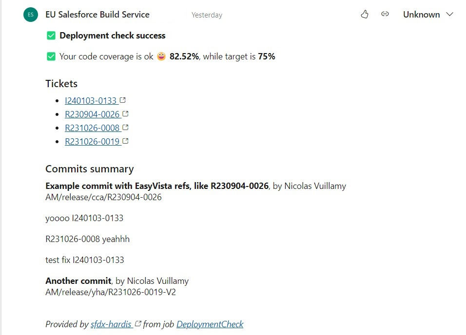

<!-- markdownlint-disable MD013 -->

- [Generic ticketing integration](#generic-ticketing-integration)
- [Configuration](#configuration)
  - [Regular Expression to identify a Ticket](#regular-expression-to-identify-a-ticket)
  - [URL Builder for Ticket Hyperlinks](#url-builder-for-ticket-hyperlinks)
  - [Ticket titles and statuses (optional)](#ticket-titles-and-statuses-optional)
- [GitLab configuration](#gitlab-configuration)
- [Technical notes](#technical-notes)

## Generic ticketing integration

If you use a ticketing system on your project, sfdx-hardis can use it to enrich its integrations.

sfdx-hardis automatically analyzes commits and Pull Request descriptions to collect tickets and build their URLs.



## Configuration

You need to define two properties in .sfdx-hardis.yml, or two environment variables in your CI/CD configuration.

> It is recommended to store these properties in .sfdx-hardis.yml, so that the VS Code SFDX Hardis extension can use them for UI features.

### Regular Expression to identify a Ticket

- .sfdx-hardis.yml property: **genericTicketingProviderRegex**
- ENV variable: **GENERIC_TICKETING_PROVIDER_REGEX**

Regular expression used to detect your ticketing system identifiers in commit and Pull Request texts.

You can use <https://regex101.com/> to check your Regular Expression.

Example: `([R|I][0-9]+-[0-9]+)` to detect EasyVista references, which can look like `I240103-0133` or
`R230904-0026`

### URL Builder for Ticket Hyperlinks

- .sfdx-hardis.yml property: **genericTicketingProviderUrlBuilder**
- ENV variable: **GENERIC_TICKETING_PROVIDER_URL_BUILDER**

Template string used to build a hyperlink from a ticket identifier.

It must contain a **{REF}** segment, which is replaced by the ticket identifier.

Example: `https://instance.easyvista.com/index.php?ticket={REF}`

### Ticket titles and statuses (optional)

- .sfdx-hardis.yml property: **genericTicketingProviderDetailsUrlBuilder**
- ENV variable: **GENERIC_TICKETING_PROVIDER_DETAILS_URL_BUILDER**
- ENV variable, only if the URL needs a token: **GENERIC_TICKETING_PROVIDER_TOKEN**, sent as `Authorization: Bearer <token>`

Without it, each ticket is a bare link. With it, sfdx-hardis reads one JSON document per ticket and writes the ticket title and status next to the link, in Pull Request comments, release notes and notifications.

It must contain a **{REF}** segment, which is replaced by the ticket identifier, and answer a JSON object:

```json
{
  "subject": "Crew size becomes mandatory",
  "status": "Ready for UAT"
}
```

- `subject` is the title. `title` or `summary` are read when `subject` is absent.
- `status` is optional. `statusLabel` is used for display when present.

Example: `https://tickets.mycompany.com/api/ticket/{REF}.json`

A static site can serve these files next to its pages. The [sfdx-hardis training](https://hardisgroupcom.github.io/sfdx-hardis-training/) does that: its backlog publishes `BACKLOG/US-021/` for people and `BACKLOG/US-021.json` for sfdx-hardis.

When a ticket cannot be read, it stays a bare link and the Pull Request comment says why.

## GitLab configuration

If you are using GitLab, you need to update the Merge Request settings.

Go to Project -> Settings -> Merge Requests

Update **Merge Commit Message Template** with the following value:

```sh
%{title} Merge branch '%{source_branch}' into '%{target_branch}'

%{issues}

See merge request %{reference}

%{description}

%{all_commits}
```

Update **Squash Commit Message Template** with the following value:

```sh
%{title} Merge branch '%{source_branch}' into '%{target_branch}'

%{issues}

See merge request %{reference}

%{description}

%{all_commits}
```

## Technical notes

This integration uses the following variables, which must be available from the pipelines or in .sfdx-hardis.yml:

- genericTicketingProviderRegex or GENERIC_TICKETING_PROVIDER_REGEX
- genericTicketingProviderUrlBuilder or GENERIC_TICKETING_PROVIDER_URL_BUILDER
- optionally genericTicketingProviderDetailsUrlBuilder or GENERIC_TICKETING_PROVIDER_DETAILS_URL_BUILDER, and GENERIC_TICKETING_PROVIDER_TOKEN

<!-- training-links:start -->

## Learn by doing

The free [Salesforce DevOps with sfdx-hardis](https://hardisgroupcom.github.io/sfdx-hardis-training) course does this, click by click, on an org of your own:

- [Lab 1.6 - Open a Pull Request, pass the deployment check, merge](https://hardisgroupcom.github.io/sfdx-hardis-training/en/level-1-contributor-basics/1-6-pull-request-deployment-check-and-merge/)

<!-- training-links:end -->
