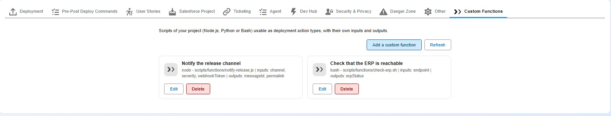
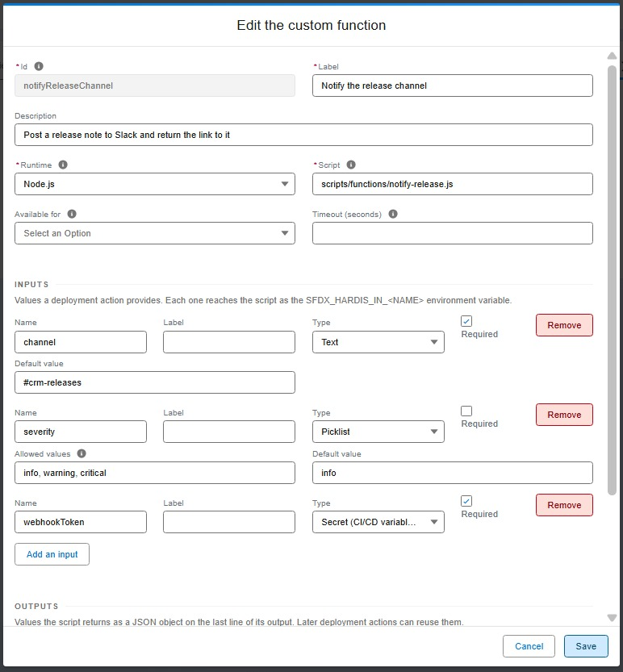
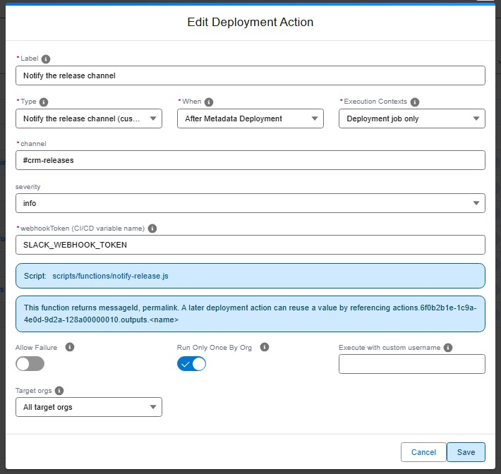

<!-- markdownlint-disable MD013 -->

## Custom functions

### What is a custom function?

The built-in [deployment actions](salesforce-devops-work-on-user-story-deployment-actions.md) cover the usual steps around a deployment: run a command, import data, run an Apex script, publish a site, schedule a batch. Sometimes your project needs something they do not do: call an internal API, post to a tool your team uses, read a value from one system and write it into another.

A **custom function** packages a script of your own behind the same interface. You declare it once, and its id becomes a deployment action type of your project, sitting next to `command`, `apex` and `data` in the action editor.

A function is:

- a **script** in your repository, written in **node**, **python** or **bash**,
- a list of **inputs** it accepts, each with a name, a type and whether it is required,
- a list of **outputs** it returns, which later actions can reuse.

Functions are declared at **project level**, in `config/.sfdx-hardis.yml`. They are not branch or Pull Request scoped: a function id is an action type, so the catalog is the same everywhere.

### Declare a function

The **Custom Functions** tab of Pipeline Settings lists the functions your project declares, with the runtime, the script and the contract of each one.



**Add a custom function** opens the editor: give the function an id and a label, pick the runtime and the script, then declare the inputs a deployment action will fill and the outputs the script returns.



The panel writes the block below for you. You can also edit it by hand, or use [hardis:project:function:create](hardis/project/function/create.md).

```yaml
# config/.sfdx-hardis.yml
customFunctions:
  - id: notifySlack
    label: Notify Slack channel
    description: Posts a message in a Slack channel when a release lands
    runtime: node
    script: scripts/functions/notify-slack.js
    when: post-deploy
    inputs:
      - name: channel
        label: Channel
        type: string
        required: true
      - name: severity
        type: select
        options: [info, warning, critical]
        default: info
      - name: webhookToken
        type: secret
        required: true
    outputs:
      - name: messageId
        type: string
```

From the command line:

```sh
sf hardis:project:function:create
```

Or headless, for an agent or a script:

```sh
sf hardis:project:function:create --agent \
  --id notifySlack --label "Notify Slack channel" \
  --runtime node --script scripts/functions/notify-slack.js \
  --inputs "channel:string:required;severity:select|info,warning,critical=info;webhookToken:secret:required" \
  --outputs "messageId"
```

### Use it as a deployment action

Once declared, the function appears in the **Type** list of the deployment action editor, next to the built-in types. The form below the common fields is built from the inputs the function declares, and an input of type `secret` asks for the name of a CI/CD variable rather than for a value. The editor also reminds you what the function returns, and how a later action can reuse it.



The action it writes looks like this, where the function id is the action `type`:

```yaml
commandsPostDeploy:
  - id: 7f3e1b84-0c2a-4f6e-9a11-6d2b8c4e5f90
    label: Notify the release channel
    type: notifySlack
    parameters:
      channel: "#releases"
      severity: critical
      webhookToken: SLACK_WEBHOOK_TOKEN
```

`hardis:project:action:create` offers your functions in the type list, and asks for each declared input with the right kind of field. In the VS Code extension, the same fields appear in the deployment action editor.

Every ordinary action setting still applies: `context`, `includeTargetBranches` / `excludeTargetBranches`, `allowFailure`, `runOnlyOnceByOrg` and `customUsername`.

### What the script receives

Everything arrives as an environment variable.

**Your declared inputs**, as `SFDX_HARDIS_IN_<NAME>` (uppercased):

```bash
echo "Posting to $SFDX_HARDIS_IN_CHANNEL with severity $SFDX_HARDIS_IN_SEVERITY"
```

**The pipeline context**, always available:

| Group        | Variables                                                                                                                                                  |
|--------------|------------------------------------------------------------------------------------------------------------------------------------------------------------|
| Git          | `SFDX_HARDIS_TARGET_BRANCH`, `SFDX_HARDIS_SOURCE_BRANCH`, `SFDX_HARDIS_CURRENT_BRANCH`, `SFDX_HARDIS_COMMIT_SHA`, `SFDX_HARDIS_REPO_URL`                   |
| Pull Request | `SFDX_HARDIS_PR_ID`, `SFDX_HARDIS_PR_TITLE`, `SFDX_HARDIS_PR_URL`, `SFDX_HARDIS_PR_AUTHOR`, `SFDX_HARDIS_PR_SOURCE_BRANCH`, `SFDX_HARDIS_PR_TARGET_BRANCH` |
| Org          | `SFDX_HARDIS_ORG_USERNAME`, `SFDX_HARDIS_ORG_INSTANCE_URL`, `SFDX_HARDIS_ORG_ID`, `SFDX_HARDIS_ORG_ALIAS`, `SFDX_HARDIS_IS_PRODUCTION`                     |
| Deployment   | `SFDX_HARDIS_CHECK_ONLY`, `SFDX_HARDIS_WHEN`, `SFDX_HARDIS_ACTION_ID`, `SFDX_HARDIS_ACTION_LABEL`, `SFDX_HARDIS_JOB_URL`, `SFDX_HARDIS_DEPLOYMENT_ID`      |

A variable that has no value in the current run (the Pull Request group during a local deployment) is an empty string, never missing, so your script can read it without guarding.

### What the script returns

When your function declares outputs, the **last non-empty line of stdout must be a JSON object** holding them. Everything printed before it is ordinary logging, and lands in the job log and the Pull Request comment.

```js
// scripts/functions/notify-slack.js
const channel = process.env.SFDX_HARDIS_IN_CHANNEL;
const token = process.env.SFDX_HARDIS_IN_WEBHOOKTOKEN;

console.log(`Posting the release notice to ${channel}...`);
const messageId = await postToSlack(channel, token);

console.log(JSON.stringify({ messageId }));
```

A non-zero exit code fails the action. A script that prints something other than a JSON object on its last line also fails, with the line it printed, so a broken contract is never silently ignored.

A function declaring no output is free to print whatever it wants.

### Reuse an output in a later action

Any action running after a function can read what it returned, with `${{ actions.<actionId>.outputs.<name> }}`. This works for every action type, not only for custom functions, and reaches across the deployment: a post-deploy action can read what a pre-deploy action produced.

```yaml
commandsPreDeploy:
  - id: findAccount
    label: Find the integration account
    type: findAccount
    parameters:
      name: Acme

commandsPostDeploy:
  - id: updateAccount
    label: Flag the account as migrated
    type: command
    command: sf data update record --sobject Account --record-id ${{ actions.findAccount.outputs.accountId }} --values "Migrated__c=true"
```

The pipeline variables are available the same way, with `${{ pipeline.targetBranch }}`, `${{ pipeline.prId }}` and the rest.

If the producing action did not run (a branch filter skipped it, it failed, it belongs to the other job), the action referencing it **fails** with the reason, rather than running with an empty value.

> An action with `runOnlyOnceByOrg: true` is skipped once it has run in an org. Its outputs are stored with that record and replayed, so a chain that depends on it keeps working on later deployments.

Only the `actions.` and `pipeline.` namespaces are resolved. Anything else written as `${{ ... }}` is left untouched, so a command already using that syntax for its own purposes keeps working.

### Secrets

An input of type `secret` **never stores a value in your configuration file**. The action stores the **name of a CI/CD variable**:

```yaml
parameters:
  webhookToken: SLACK_WEBHOOK_TOKEN
```

When the action runs, sfdx-hardis reads that variable from the environment, passes the value to your script in `SFDX_HARDIS_IN_WEBHOOKTOKEN`, and masks it in the job log, the Pull Request comment and the deployment notification.

Define the variable in the secure variables of your CI/CD workflow, the same way you define the other sfdx-hardis secrets. A variable that is not defined fails the action, so a missing secret is reported instead of producing a silent no-op.

### Runtimes

| Runtime  | Interpreter used                                                       |
|----------|------------------------------------------------------------------------|
| `node`   | The interpreter already running sfdx-hardis, so it is always available |
| `python` | `python3`, then `python`                                               |
| `bash`   | `bash` from PATH (Git Bash on Windows)                                 |

If the interpreter is missing on the machine, the action **fails** and says what it tried. Set `allowFailure: true` on the action if your pipeline can live without that step.

Check them all ahead of a deployment:

```sh
sf hardis:project:function:list --check-runtimes
```

### Timeouts

A script is killed after **600 seconds** by default, and the action fails. Give a long-running function its own budget:

```yaml
customFunctions:
  - id: longImport
    runtime: node
    script: scripts/functions/long-import.js
    timeout: 3600
```

### Restrict where a function can be used

A function can declare where it makes sense, so the action editor only offers it there:

```yaml
customFunctions:
  - id: notifySlack
    when: post-deploy
    allowedContexts: [process-deployment-only]
    defaults:
      runOnlyOnceByOrg: false
      allowFailure: true
      excludeTargetBranches: [dev-sandboxes]
```

`defaults` pre-fills an action created with this type. Each value can still be changed on the action itself.

### Commands

| Command                                                                                            | Description                                                 |
|----------------------------------------------------------------------------------------------------|-------------------------------------------------------------|
| [hardis:project:function:create](https://sfdx-hardis.cloudity.com/hardis/project/function/create/) | Declare a new custom function                               |
| [hardis:project:function:list](https://sfdx-hardis.cloudity.com/hardis/project/function/list/)     | List the functions of the project, and check their runtimes |
| [hardis:project:function:update](https://sfdx-hardis.cloudity.com/hardis/project/function/update/) | Change a function definition                                |
| [hardis:project:function:delete](https://sfdx-hardis.cloudity.com/hardis/project/function/delete/) | Remove a function, warning about the actions still using it |
