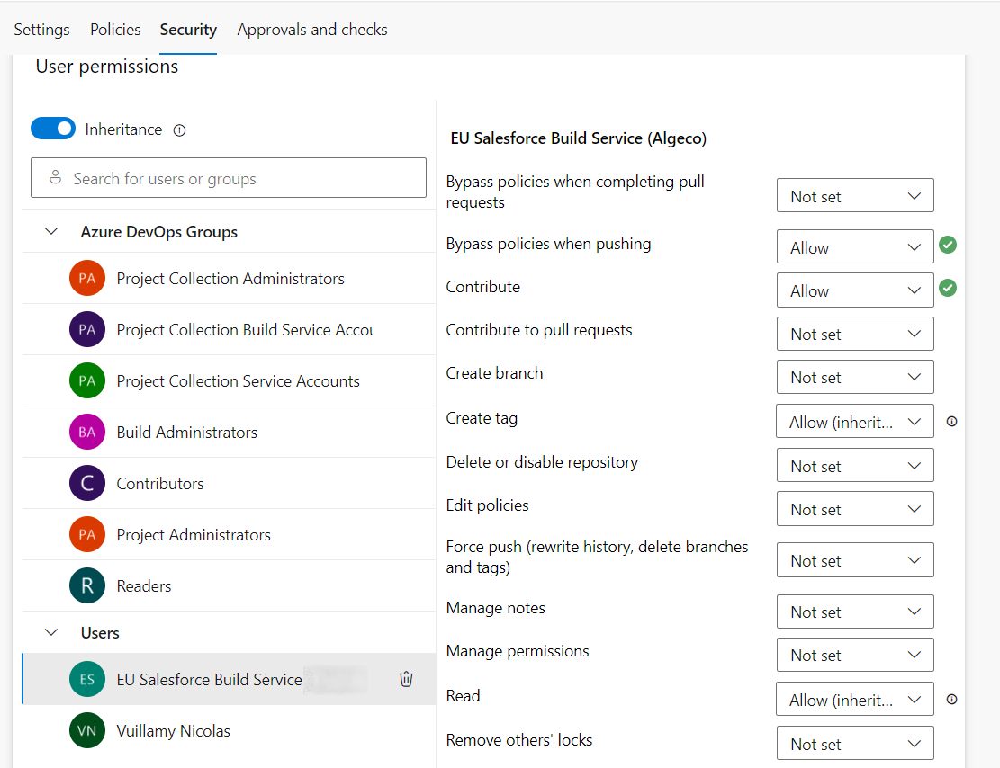
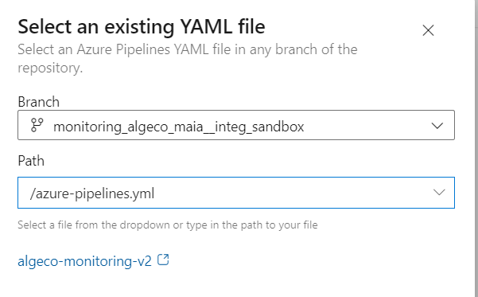
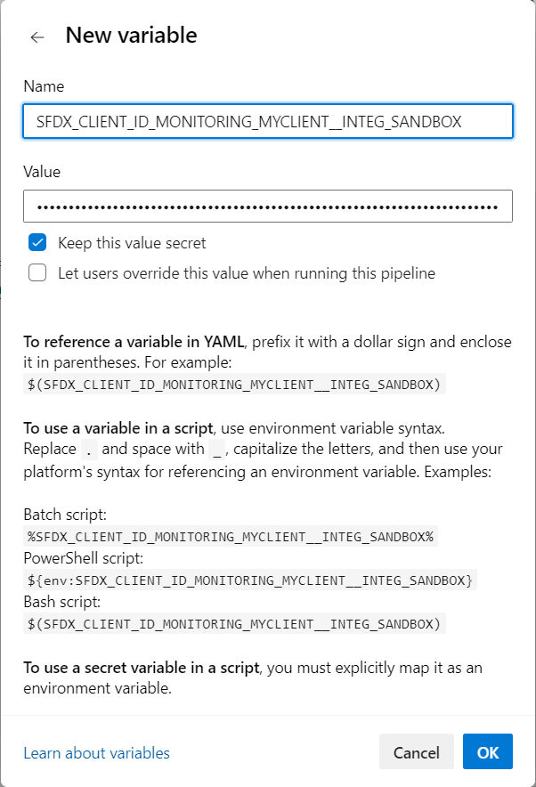

<!-- markdownlint-disable MD013 -->

- [Pre-requisites](#pre-requisites)
  - [Create access token](#create-access-token)
  - [Create CI/CD variable](#create-cicd-variable)
- [Run sfdx-hardis configuration command](#run-sfdx-hardis-configuration-command)
- [Define sfdx-hardis environment variables](#define-sfdx-hardis-environment-variables)
- [Schedule the monitoring job](#schedule-the-monitoring-job)

## Pre-requisites

### Configure a ByPass in Azure Settings

- Go to Project Settings –> Repositories –> select your repository and then click on the Security tab.

- Select your **Build Service** and set **Bypass policies when pushing** and **Contribute** to **Allowed**



## Run sfdx-hardis configuration command

- Run command **Configuration -> Configure Org Monitoring** in VsCode SFDX Hardis, then follow instructions.

- **When prompted to setup CI/CD variables, copy-paste their names and values in a notepad the continue the instructions**

## Create Pipeline

_Skip this step if you already created the pipeline for the monitoring of another org_

- Go to **Project -> Pipelines** _(you must have Azure authorizations to access this menu)_

- Click on **New pipeline**

- Where is your code -> **Azure Repos Git**

- Select your monitoring git repository: **Existing Azure Pipelines YAML file**

- Select your git branch then select **azure-pipelines.yml**

- Click on **Continue**

- Click on **Save** (contextual to the **Run** button)



## Configure CI/CD Variables

For each variable sfdx-hardis command **Configure org monitoring** told you to define, perform the following operations

### Create variable in Azure

- Go to **Project -> Pipelines**
- Select your pipeline
- Click on **Edit** , then on **Variables**
- Input variable name and value
- Don't forget to click on **save** !



### Update azure-pipelines.yml

- Open **azure-pipelines.yml** in VsCode and update all places where `MANUAL` is found
  - schedule triggers
  - environment variables

Examples:

```yaml
schedules:
- cron: "0 4 * * *" # Cron format -> https://crontab.cronhub.io/
  always: "true"
  branches:
    # MANUAL: Add your monitored branches here
    include:
    - monitoring_myclient__integ_sandbox # Name of your branch created by monitoring configuration command
```

```yaml
    env:
      # MANUAL: Add your branch related variables here
      SFDX_CLIENT_ID_MONITORING_MYCLIENT__INTEG_SANDBOX: $(SFDX_CLIENT_ID_MONITORING_MYCLIENT__INTEG_SANDBOX)
      SFDX_CLIENT_KEY_MONITORING_MYCLIENT__INTEG_SANDBOX: $(SFDX_CLIENT_KEY_MONITORING_MYCLIENT__INTEG_SANDBOX)
      CI_COMMIT_REF_NAME: $(BRANCH_NAME)
      CONFIG_BRANCH: $(BRANCH_NAME)
      ORG_ALIAS: $(BRANCH_NAME)
      CI: "true"
```

- Commit and push

## Schedule the monitoring job

- Go to **Project -> Build -> Pipeline schedules**
- Click on **New schedule**
- Input custom interval pattern as [CRON expression](https://crontab.cronhub.io/){target=blank}, for example:
  - `0 1 * * *` will run the monitoring job **every day at 1 AM**
  - `0 22 * * *` will run the monitoring job **everyday at 10 PM**
- Select the CRON TimeZone (for example `[UTC+2] Paris`)
- Select the target branch corresponding to the org you want to monitor
- Validate by clicking on **Create Pipeline Schedule**

