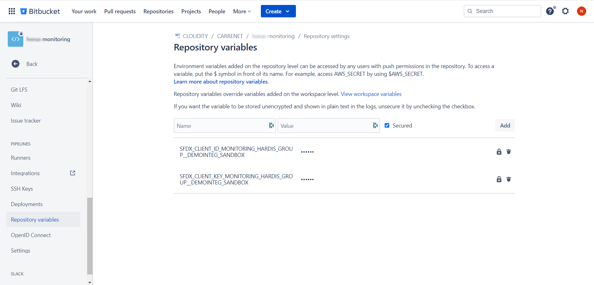

<!-- markdownlint-disable MD013 -->

## Cloning repo from VsCode

If you have issues to authenticate to Bitbucket from VsCode, [create an App Password in Bitbucket personal settings](https://support.atlassian.com/bitbucket-cloud/docs/create-an-app-password/).

## Pre-requisites

There are no pre-requisites

## Run sfdx-hardis configuration command

- Run command **Configuration -> Configure Org Monitoring** in VsCode SFDX Hardis, then follow instructions.

## Define sfdx-hardis environment variables

- Go to **Project -> Repository Settings > Repository Variables** _(you must have Bitbucket authorizations to access this menu)_
- For each variable sfdx-hardis command **Configure org monitoring** tells you to define, create with name and value given in sfdx-hardis command logs

## Schedule the monitoring job

- Go to **Project -> Pipelines -> Schedules**
- Click on **New schedule**
- Select the target branch corresponding to the org you want to monitor
- Select default pipeline
- Select Schedule **Daily** and a time slot when no one works (for example `01:00 - 02:00`)
- Validate by clicking on **Create**

