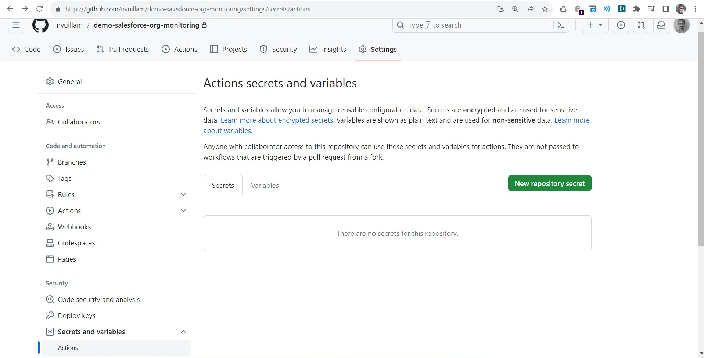
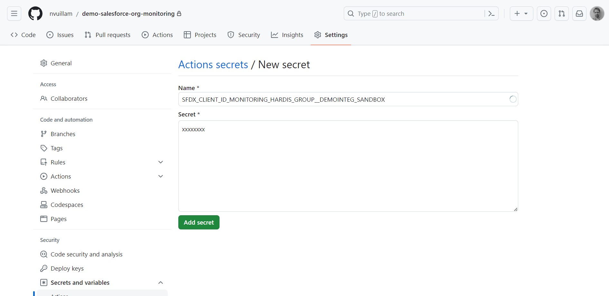

<!-- markdownlint-disable MD013 -->

- [Pre-requisites](#pre-requisites)
- [Run sfdx-hardis configuration command](#run-sfdx-hardis-configuration-command)
- [Define sfdx-hardis environment variables](#define-sfdx-hardis-environment-variables)
- [Schedule the monitoring job](#schedule-the-monitoring-job)

## Pre-requisites

None

## Run sfdx-hardis configuration command

- Run command **Configuration -> Configure Org Monitoring** in VsCode SFDX Hardis, then follow instructions.

## Define sfdx-hardis environment variables

- Go to **Repository -> Settings > Secret and variables -> Actions** _(you must have Github authorizations to access this menu)_
- For each variable sfdx-hardis command **Configure org monitoring** tells you to define, click on **New repository secret**,  with name and value given in sfdx-hardis command logs





## Update org-monitoring.yml

WARNING: Scheduling can be run only on main branch on GitHub Actions, so there is a specific config.

- Configure all your monitored org using VsCode SFDX Hardis command "Configure Org Monitoring" (jobs will fail but that's ok)
  - Reply questions, configure variables, let sfdx-hardis upload connected apps...
  - This will create one git branch per monitored org

AND ONLY THEN:

- Checkout your "main" branch, create a file `.github/workflows/org-monitoring.yml` and copy there the content of [org-monitoring.yml](https://github.com/hardisgroupcom/sfdx-hardis/blob/main/defaults/monitoring/.github/workflows/org-monitoring.yml)
  - Do a CTRL+F and look for **MANUAL**
  - Add your monitored git branches here where asked to replace
  - Add your authentication variable names where asked to replace
  - Commit & push: there should be a SINGLE GitHub Actions job (using matrix) that will run the monitoring on all orgs 

Examples:

```yaml
      env:
        # MANUAL: Update variables below !
        SFDX_CLIENT_ID_MONITORING_MY_CLIENT__INTEG_SANDBOX: ${{ secrets.SFDX_CLIENT_ID_MONITORING_MY_CLIENT__INTEG_SANDBOX}}
        SFDX_CLIENT_KEY_MONITORING_MY_CLIENT__INTEG_SANDBOX: ${{ secrets.SFDX_CLIENT_KEY_MONITORING_MY_CLIENT__INTEG_SANDBOX}}
        SFDX_DEPLOY_WAIT_MINUTES: 120 # Override if necessary
```

## Schedule the monitoring job

Schedule is already included within **org-monitoring.yml** in **main** branch.

Default is everyday at midnight, but you can update the [CRON expression](https://crontab.cronhub.io/).

```yaml
on:
  push:
  # Automatically run every day at midnight
  schedule:
    - cron: "0 0 * * *" # Cron format -> https://crontab.cronhub.io/
```