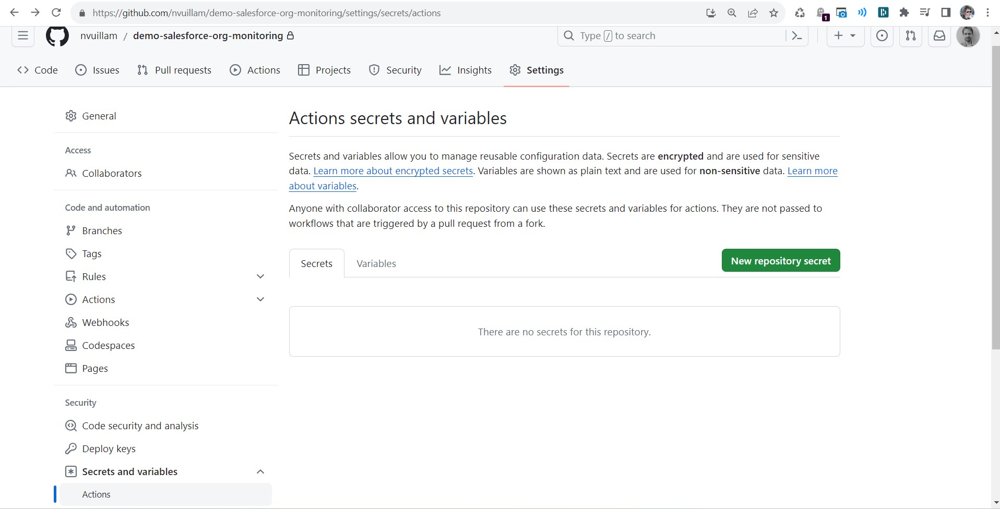
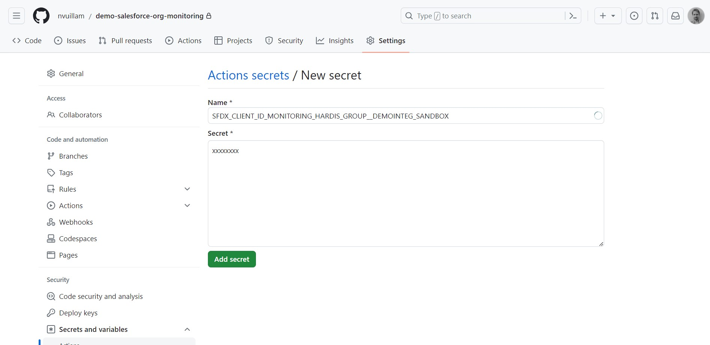

<!-- markdownlint-disable MD013 -->

- [Pre-requisites](#pre-requisites)
- [Run sfdx-hardis configuration command](#run-sfdx-hardis-configuration-command)
- [Define sfdx-hardis environment variables](#define-sfdx-hardis-environment-variables)
- [Schedule the monitoring job](#schedule-the-monitoring-job)

## Pre-requisites

None

## Run sfdx-hardis configuration command

- Run command **Configuration -> Configure Org Monitoring** in the VS Code SFDX Hardis extension, then follow the instructions.

## Define sfdx-hardis environment variables

- Go to **Repository -> Settings > Secrets and variables -> Actions** _(you must have GitHub authorizations to access this menu)_
- For each variable the sfdx-hardis command **Configure org monitoring** tells you to define, click **New repository secret** and enter the name and value given in the sfdx-hardis command logs





## Update org-monitoring.yml

Warning: on GitHub Actions, scheduled workflows only run on the main branch, so the configuration is specific.

- Configure all your monitored orgs with the VS Code SFDX Hardis extension command **Configure Org Monitoring** (the jobs will fail at this stage, which is expected)
  - Answer the questions, configure the variables, let sfdx-hardis upload the Connected Apps...
  - This creates one git branch per monitored org

Only then:

- Check out your `main` branch, create the file `.github/workflows/org-monitoring.yml` and copy into it the content of [org-monitoring.yml](https://github.com/hardisgroupcom/sfdx-hardis/blob/main/defaults/monitoring/.github/workflows/org-monitoring.yml)
  - Search (Ctrl+F) for **MANUAL**
  - Add your monitored git branches where indicated
  - Add your authentication variable names where indicated
  - Commit and push: a single GitHub Actions job (using a matrix) will run the monitoring on all orgs

Examples:

```yaml
      env:
        # MANUAL: Update variables below !
        SFDX_CLIENT_ID_MONITORING_MY_CLIENT__INTEG_SANDBOX: ${{ secrets.SFDX_CLIENT_ID_MONITORING_MY_CLIENT__INTEG_SANDBOX}}
        SFDX_CLIENT_KEY_MONITORING_MY_CLIENT__INTEG_SANDBOX: ${{ secrets.SFDX_CLIENT_KEY_MONITORING_MY_CLIENT__INTEG_SANDBOX}}
        SFDX_DEPLOY_WAIT_MINUTES: ${{ vars.SFDX_DEPLOY_WAIT_MINUTES || '120' }}
```

## Schedule the monitoring job

The schedule is already included in **org-monitoring.yml** on the **main** branch.

The default is every day at midnight, but you can update the [CRON expression](https://crontab.cronhub.io/).

```yaml
on:
  push:
  # Automatically run every day at midnight
  schedule:
    - cron: "0 0 * * *" # Cron format -> https://crontab.cronhub.io/
```