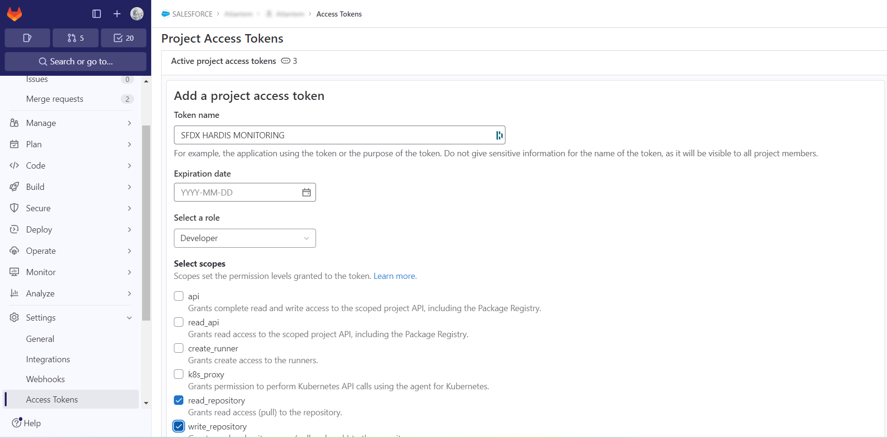
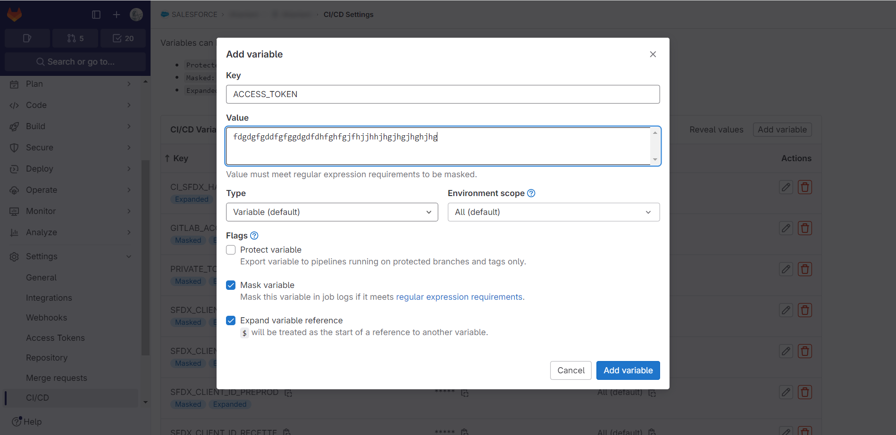
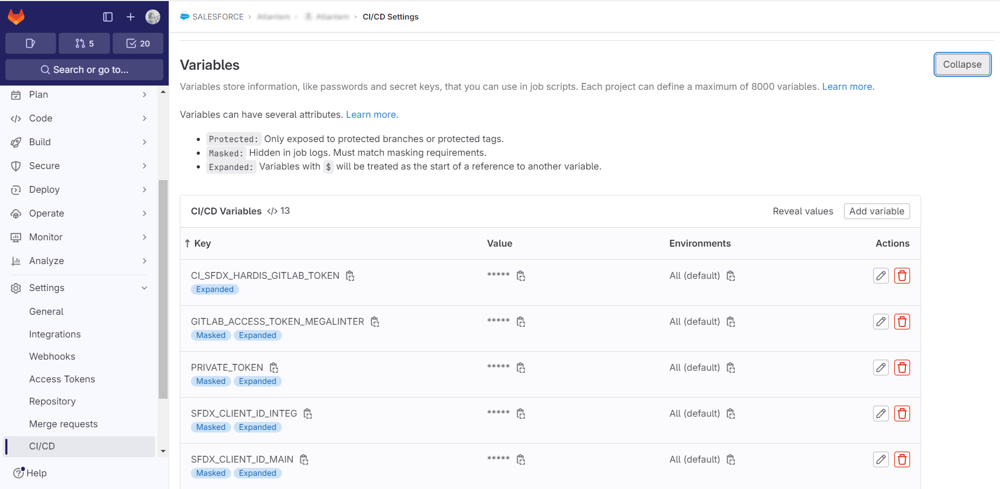
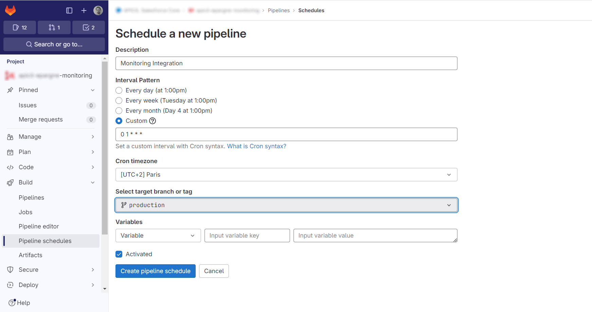

<!-- markdownlint-disable MD013 -->

- [Pre-requisites](#pre-requisites)
  - [Create access token](#create-access-token)
  - [Create CI/CD variable](#create-cicd-variable)
- [Run sfdx-hardis configuration command](#run-sfdx-hardis-configuration-command)
- [Define sfdx-hardis environment variables](#define-sfdx-hardis-environment-variables)
- [Schedule the monitoring job](#schedule-the-monitoring-job)

## Pre-requisites

### Create access token

- Go to **Project -> Settings > Access Token** _(you must have GitLab authorizations to access this menu)_
- Create an access token with the following info:
  - name: **SFDX HARDIS MONITORING**
  - role: **Developer**
  - scopes: **read_repository, write_repository**
- Copy the value of the generated token to your clipboard (Ctrl+C)

### Create CI/CD variable

- Go to **Project -> Settings > CI/CD -> Variables** _(you must have GitLab authorizations to access this menu)_
- Create the variable with the following info:
  - name: **ACCESS_TOKEN**
  - value: Paste the value that has been generated when creating the access token in the previous step
  - Select **Mask variable**
  - Unselect **Protected variable**

## Run sfdx-hardis configuration command

- Run command **Configuration -> Configure Org Monitoring** in the VS Code SFDX Hardis extension, then follow the instructions.

## Define sfdx-hardis environment variables

- Go to **Project -> Settings > CI/CD -> Variables** _(you must have GitLab authorizations to access this menu)_
- For each variable the sfdx-hardis command **Configure org monitoring** tells you to define, create it with the name and value given in the sfdx-hardis command logs

## Schedule the monitoring job

- Go to **Project -> Build -> Pipeline schedules**
- Click on **New schedule**
- Enter a custom interval pattern as a [CRON expression](https://crontab.cronhub.io/){target=blank}, for example:
  - `0 1 * * *` will run the monitoring job **every day at 1 AM**
  - `0 22 * * *` will run the monitoring job **every day at 10 PM**
- Select the CRON TimeZone (for example `[UTC+2] Paris`)
- Select the target branch corresponding to the org you want to monitor
- Validate by clicking on **Create Pipeline Schedule**

