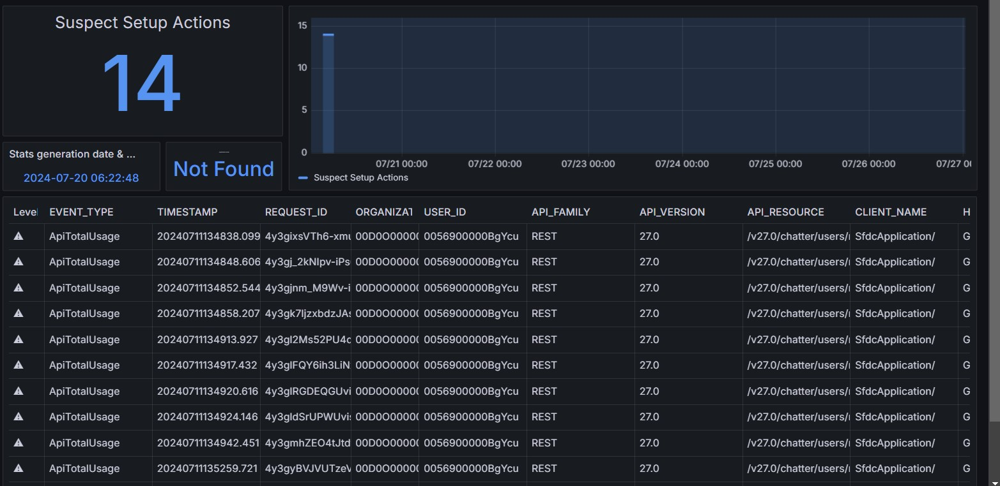

<!-- markdownlint-disable MD013 -->

## Detect calls to deprecated API versions

Will check if [legacy API versions are called by external tools](https://nicolas.vuillamy.fr/handle-salesforce-api-versions-deprecation-like-a-pro-335065f52238).

Sfdx-hardis command: [sf hardis:org:diagnose:legacyapi](https://sfdx-hardis.cloudity.com/hardis/org/diagnose/legacyapi/)

Key: **LEGACY_API**

### Grafana example

### Slack example

