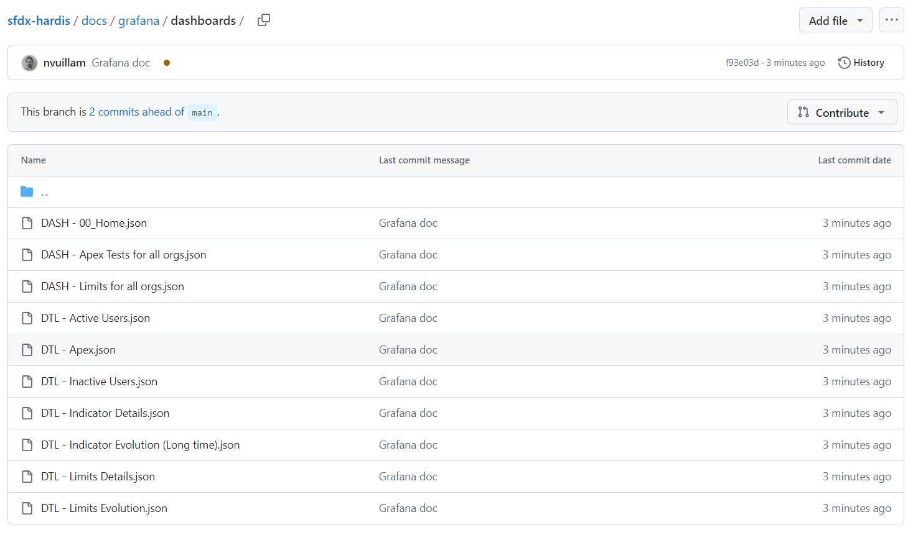
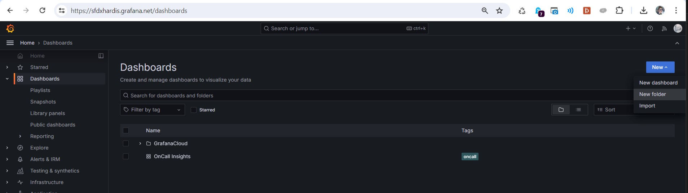
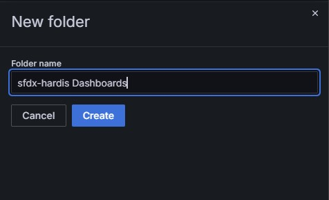
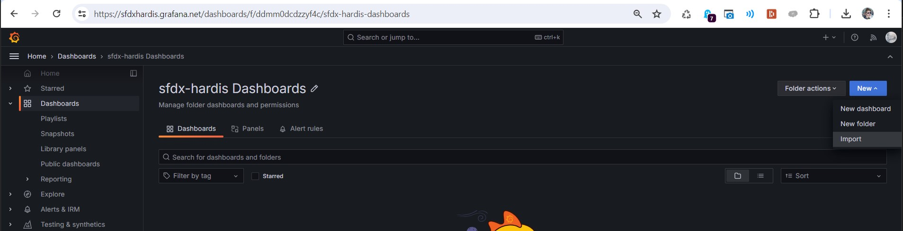
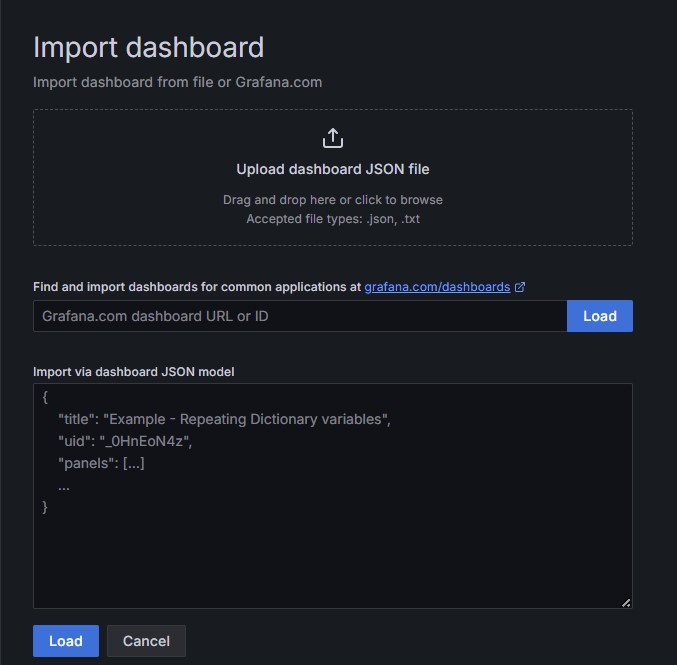
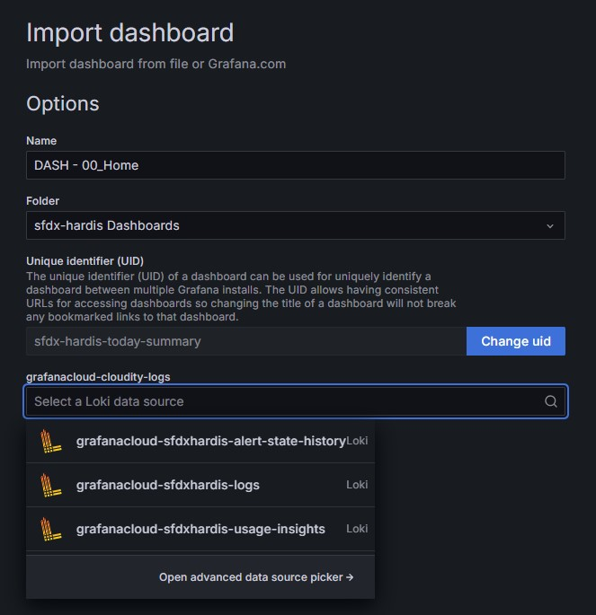
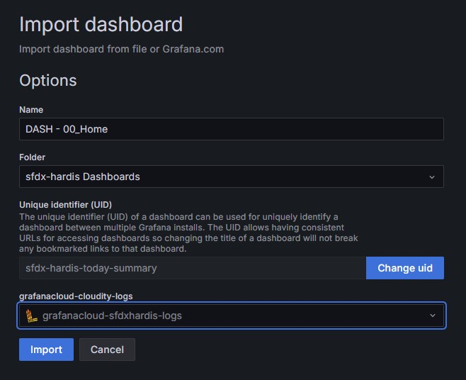
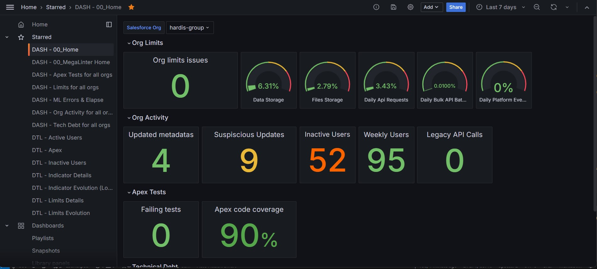

<!-- markdownlint-disable MD013 -->

# Legacy Grafana Dashboards (v1)

> **These dashboards are legacy.** They keep working but are frozen: new indicators and features only land in **[Org Monitoring by sfdx-hardis (Dashboards v2)](salesforce-monitoring-grafana-v2.md)**, which adds fleet overview, trends and averages, limit forecasts, org health score, drill-down navigation and a ready-to-enable alert pack. Use v2 for any new setup.

The v1 set uses its own Grafana folder, UIDs and JSON files, so it can coexist with v2 during a transition.

Prerequisite: the [Grafana / API integration setup](salesforce-ci-cd-setup-integration-api.md) (Loki + Prometheus endpoints configured on the monitoring repository).

## Download legacy v1 dashboards

Download all legacy Dashboard JSON files from [this sfdx-hardis repo folder](https://github.com/hardisgroupcom/sfdx-hardis/tree/main/docs/grafana/dashboards)

## Create Dashboard folder

Go to the **Dashboards** menu, then click **New** and **New folder**

___

Create folder `Sfdx-hardis Dashboards`

## Import legacy v1 Grafana Dashboards

For each downloaded Dashboard JSON file, perform the following actions.

Click **New** then **Import**

___

Click on **Upload Dashboard JSON File** and select one of the Dashboards JSON files you downloaded on your computer.

___

- Leave the default values for Name, Folder and UID
- Select your Loki or Prometheus source. They can be:
  - **grafanacloud-YOURORGNAME-logs (Loki)**
  - **grafanacloud-YOURORGNAME-prom (Prometheus)**

___

Click **Import**

___

Repeat the operation for all Dashboard JSON files, and you're all set.

## Migrating to v2

Import the v2 dashboards in a new folder by following [the v2 guide](salesforce-monitoring-grafana-v2.md): no change is needed on the monitoring pipeline side (same Loki and Prometheus data). Once your team has switched its bookmarks, delete the v1 folder in Grafana.
